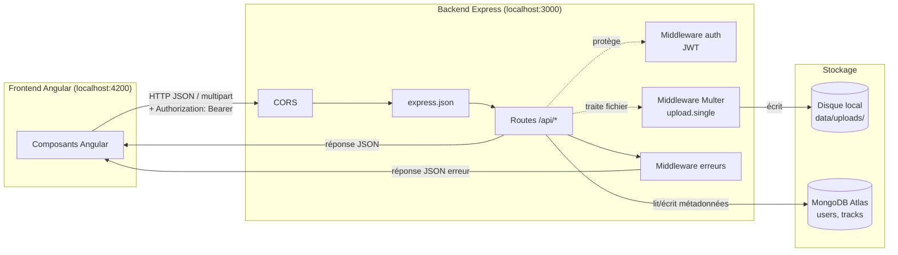
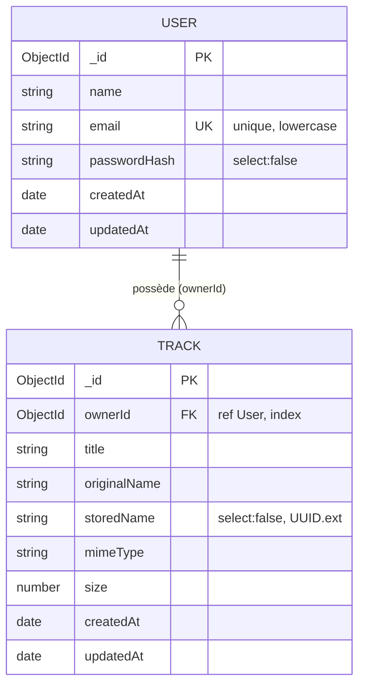
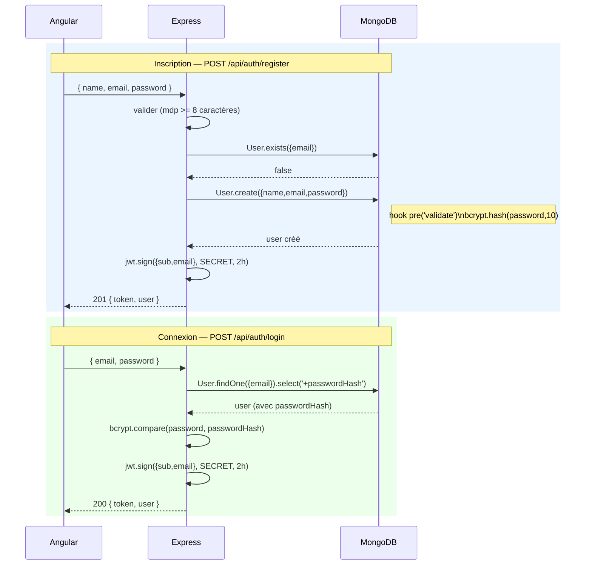
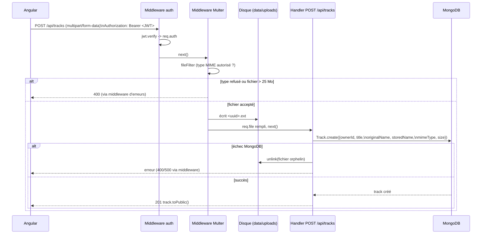
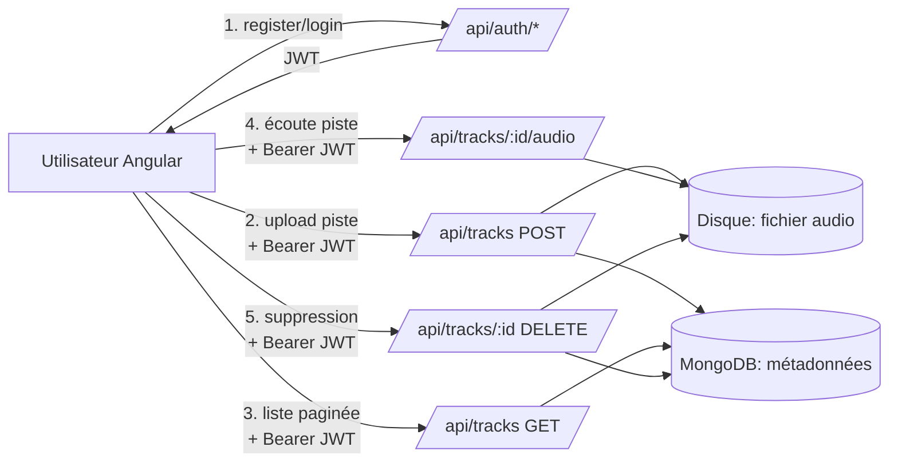

# Analyse du backend — Guitar Practice Cloud API

> Généré à partir du code source dans `backend/src/`. Ce document décrit
> l'architecture, les technologies, l'authentification, la gestion des
> uploads et les échanges avec la base de données.

## 1. Vue d'ensemble

Le backend est une **API REST** minimaliste en **Node.js / Express 5**, avec
persistance **MongoDB** (via Mongoose) et stockage des fichiers audio
**sur le disque local du serveur**. Elle sert une application Angular
(`frontend-starter/`) qui permet à un utilisateur de s'inscrire, se
connecter, et gérer ses pistes audio de pratique guitare (upload, liste
paginée, lecture, suppression).

### 1.1 Stack technique

| Domaine | Technologie | Rôle |
|---|---|---|
| Runtime | Node.js (ESM, `"type": "module"`) | Exécution du serveur |
| Framework HTTP | Express 5.1 | Routage, middlewares |
| Base de données | MongoDB Atlas (cloud) | Persistance des métadonnées |
| ODM | Mongoose 9 | Schémas, validation, requêtes |
| Authentification | jsonwebtoken (JWT) | Sessions sans état |
| Hachage mot de passe | bcryptjs | Stockage sécurisé des mots de passe |
| Upload fichiers | Multer 2 (`diskStorage`) | Réception des fichiers audio multipart |
| CORS | cors | Autoriser les appels depuis Angular (localhost:4200) |
| Tests | `node:test` + `node:assert/strict` | Tests unitaires/API légers |

### 1.2 Arborescence

```text
backend/
├── src/
│   ├── app.js            # Construction de l'app Express (routes, middlewares)
│   ├── server.js         # Point d'entrée : connexion Mongo + écoute HTTP
│   └── models/
│       ├── User.js       # Schéma Mongoose Utilisateur (+ hachage mdp)
│       └── Track.js      # Schéma Mongoose Piste audio
├── data/uploads/         # Fichiers audio stockés sur disque (hors Git)
├── test/api.test.js      # Tests (health, schémas)
├── .env                  # Secrets locaux (MONGODB_URI, JWT_SECRET, PORT)
└── package.json
```

### 1.3 Diagramme de composants



**Séparation `app.js` / `server.js`** : `createApp()` construit l'application
Express *sans ouvrir de port*, ce qui permet aux tests (`test/api.test.js`)
d'instancier la même app sans dépendre de Mongo ni d'un port fixe.
`server.js` est le seul fichier qui se connecte à MongoDB et appelle
`.listen()`.

---

## 2. Modèle de données (MongoDB / Mongoose)

### 2.1 Schémas



- **User** (`src/models/User.js`) : le mot de passe en clair n'est **jamais
  stocké**. Un champ virtuel `password` (non persisté) déclenche un hook
  `pre('validate')` qui calcule `passwordHash = bcrypt.hash(password, 10)`.
  `passwordHash` a `select: false` : il n'est renvoyé par une requête que si
  on le demande explicitement avec `.select('+passwordHash')` (utilisé au
  login).
- **Track** (`src/models/Track.js`) : `storedName` (nom du fichier sur
  disque, un UUID) a aussi `select: false` — il n'est exposé que côté
  serveur, jamais dans les réponses publiques. Un index composé
  `{ ownerId: 1, createdAt: -1 }` accélère la pagination des pistes d'un
  utilisateur triées par date décroissante.
- Chaque modèle expose une méthode `toPublic()` qui construit l'objet
  réellement envoyé au frontend (transforme `_id` en `id` string, retire les
  champs sensibles).

### 2.2 Cycle de vie d'une requête base de données

```text
requête HTTP → route Express → middleware(s) → handler async
             → appel Mongoose (User.xxx / Track.xxx) → driver MongoDB
             → réponse JSON (via toPublic() / projection .select())
```

Bonnes pratiques observées dans le code :
- `.lean()` sur les lectures de liste (`GET /api/tracks`) : retourne des
  objets JS simples plus légers, sans overhead des documents Mongoose.
- `.select("-storedName")` / `.select("+storedName")` : contrôle explicite
  des champs exposés.
- `Promise.all([...])` pour paralléliser la lecture paginée et le comptage
  total (`Track.find()` + `Track.countDocuments()`).
- Nettoyage best-effort : si l'écriture MongoDB échoue **après** l'écriture
  du fichier sur disque, le fichier orphelin est supprimé (`fsPromises.unlink`).

---

## 3. Authentification (JWT)

### 3.1 Principe

L'authentification est **sans état (stateless)** : à la connexion, le
serveur signe un JWT contenant `{ sub: userId, email }`, valable **2 heures**
(`expiresIn: "2h"`). Le frontend doit renvoyer ce token dans l'en-tête
`Authorization: Bearer <token>` pour chaque route protégée. Aucun mot de
passe ni token n'est journalisé.

### 3.2 Inscription / Connexion



### 3.3 Middleware `auth` (protection des routes)

```mermaid
flowchart TD
    A[Requête entrante] --> B{Header Authorization\nprésent et\ncommence par 'Bearer '?}
    B -- non --> C[401 Authentification requise]
    B -- oui --> D[jwt.verify(token, SECRET)]
    D -- invalide/expiré --> E[401 Jeton invalide ou expiré]
    D -- valide --> F[req.auth = payload\n(sub, email)]
    F --> G[next\ncontinue vers le handler]
```

Le middleware `auth` (src/app.js:56) est appliqué explicitement à chaque
route qui en a besoin (`/api/users/me`, `/api/tracks*`) — pas globalement —
ce qui laisse `/api/health`, `/api/auth/register` et `/api/auth/login`
publiques. L'identité utilisée dans les handlers vient **toujours de
`req.auth.sub`** (extrait du JWT vérifié), jamais d'un champ envoyé par le
client, ce qui empêche un utilisateur d'agir au nom d'un autre.

### 3.4 Routes d'authentification / utilisateur

| Méthode | Route | Protégée | Description |
|---|---|---|---|
| POST | `/api/auth/register` | non | Créer un compte, retourne `{token, user}` |
| POST | `/api/auth/login` | non | Vérifier les identifiants, retourne `{token, user}` |
| GET | `/api/users/me` | oui | Profil de l'utilisateur connecté |
| PUT | `/api/users/me` | oui | Modifier le nom de l'utilisateur connecté |

---

## 4. Upload de fichiers audio (Multer)

### 4.1 Configuration

- Stockage sur disque (`multer.diskStorage`) dans `data/uploads/`
  (`fs.mkdirSync` au démarrage si le dossier n'existe pas).
- Nom de fichier **régénéré** en UUID (`crypto.randomUUID() + extension`) —
  jamais le nom original du client — pour éviter collisions et
  path traversal.
- Limite de taille : **25 Mo** (`limits.fileSize`).
- Filtrage par type MIME (`fileFilter`) : seuls
  `audio/mpeg, audio/wav, audio/x-wav, audio/ogg, audio/mp4, audio/x-m4a`
  sont acceptés ; tout autre type déclenche une `Error` interceptée par le
  middleware d'erreurs central (400).

### 4.2 Flux d'upload — POST /api/tracks



Le fichier physique n'est écrit **qu'après** authentification et validation
du type/de la taille. Les métadonnées (titre, nom d'origine, nom stocké,
type MIME, taille) sont ensuite persistées dans MongoDB, liées au
propriétaire (`ownerId`). Le fichier binaire lui-même **ne transite jamais
par MongoDB**.

### 4.3 Lecture et suppression d'une piste

- `GET /api/tracks/:id/audio` (protégée) : recherche la piste **filtrée par
  `ownerId = req.auth.sub`** (empêche d'accéder aux pistes d'un autre
  utilisateur même en devinant un id), reconstruit le chemin disque à partir
  de `storedName`, et sert le fichier avec `res.sendFile`.
- `DELETE /api/tracks/:id` (protégée) : supprime le document Mongo
  (`findOneAndDelete` filtré par propriétaire) **puis** le fichier sur
  disque. Si la suppression disque échoue, l'API répond 500 en signalant
  explicitement le fichier orphelin (pas d'échec silencieux).
- `GET /api/tracks` (protégée) : liste paginée (`page`, `limit`, max 20 par
  page) des pistes de l'utilisateur connecté uniquement.

### 4.4 Table des routes "tracks"

| Méthode | Route | Protégée | Description |
|---|---|---|---|
| GET | `/api/tracks` | oui | Liste paginée des pistes de l'utilisateur |
| POST | `/api/tracks` | oui | Upload d'un fichier audio + métadonnées |
| GET | `/api/tracks/:id/audio` | oui | Téléchargement/lecture du fichier binaire |
| DELETE | `/api/tracks/:id` | oui | Suppression piste + fichier disque |
| GET | `/api/health` | non | Vérification que l'API répond |

---

## 5. Gestion des erreurs et journalisation

Toutes les routes utilisent `try/catch` + `next(error)`. Un middleware
d'erreurs central (fin de `app.js`) mappe les erreurs connues vers des codes
HTTP cohérents :

```mermaid
flowchart TD
    E[Erreur interceptée] --> M{Type d'erreur}
    M -- MulterError ou\n'Format audio non accepté' --> R1[400 Bad Request]
    M -- ValidationError\n(Mongoose) --> R2[400 Bad Request]
    M -- CastError\n(id MongoDB invalide) --> R3[404 Not Found]
    M -- autre --> R4[next(error)\n-> gestionnaire par défaut Express]
```

Chaque requête est aussi journalisée en fin de traitement (méthode, URL,
code de statut, durée) via un middleware placé en tête de la pile
(`res.on('finish', ...)`), sans jamais logguer les corps sensibles
(mots de passe, tokens).

---

## 6. Démarrage du serveur (`server.js`)

```mermaid
flowchart TD
    A[node src/server.js] --> B[Lire MONGODB_URI depuis .env]
    B -- absente --> X[throw Error\narrêt immédiat]
    B -- présente --> C[mongoose.connect]
    C -- échec --> X2[throw Error\narrêt immédiat]
    C -- succès --> D[Vérifier / créer\ncompte démo\ndemo@example.com]
    D --> E[createApp().listen(port)]
    E --> F[API prête\nhttp://localhost:PORT/api/health]
```

Le serveur **refuse de démarrer** sans URI MongoDB valide et sans connexion
effective — il n'accepte jamais de requêtes dans un état "base
indisponible". Un compte de démonstration (`demo@example.com`) est créé
automatiquement au premier démarrage s'il n'existe pas déjà.

---

## 7. Points d'attention relevés

- **Secrets en clair localement** : `backend/.env` contient une URI MongoDB
  Atlas complète (avec identifiants) et un `JWT_SECRET` réels. Le fichier est
  bien exclu par `.gitignore`, mais `backend/.env.example` a été supprimé
  (visible dans `git status`) — à recréer avec des valeurs factices pour
  respecter `best-practices.md` ("fournir des valeurs d'exemple dans
  `.env.example`").
- **JWT_SECRET par défaut** : si `JWT_SECRET` n'est pas défini,
  `src/app.js` retombe sur la valeur codée en dur
  `"tp1-development-secret"` — acceptable en développement uniquement.
- **Pas de rate limiting** ni de protection anti-bruteforce sur
  `/api/auth/login`.
- **`Range` non géré explicitement** sur `GET /api/tracks/:id/audio` :
  `res.sendFile` peut le supporter nativement selon Express, mais ce n'est
  pas testé/documenté ici — pertinent pour le *seek* dans un lecteur audio.
- **Aucune limite de nombre de fichiers par utilisateur** ni de quota total
  de stockage disque.

---

## 8. Résumé du flux applicatif global


