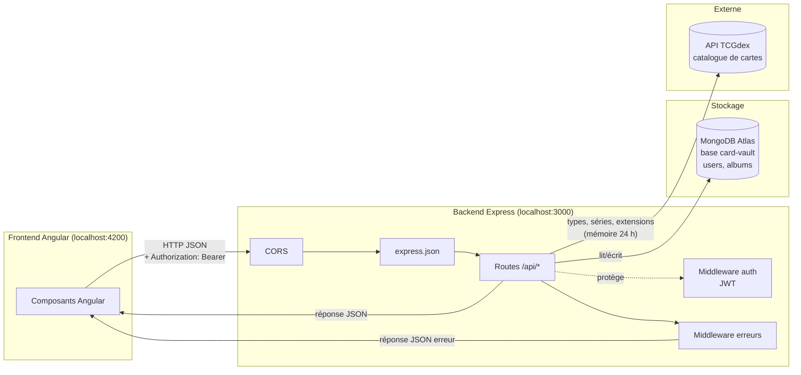
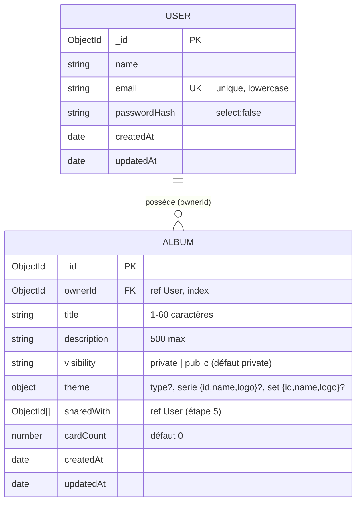
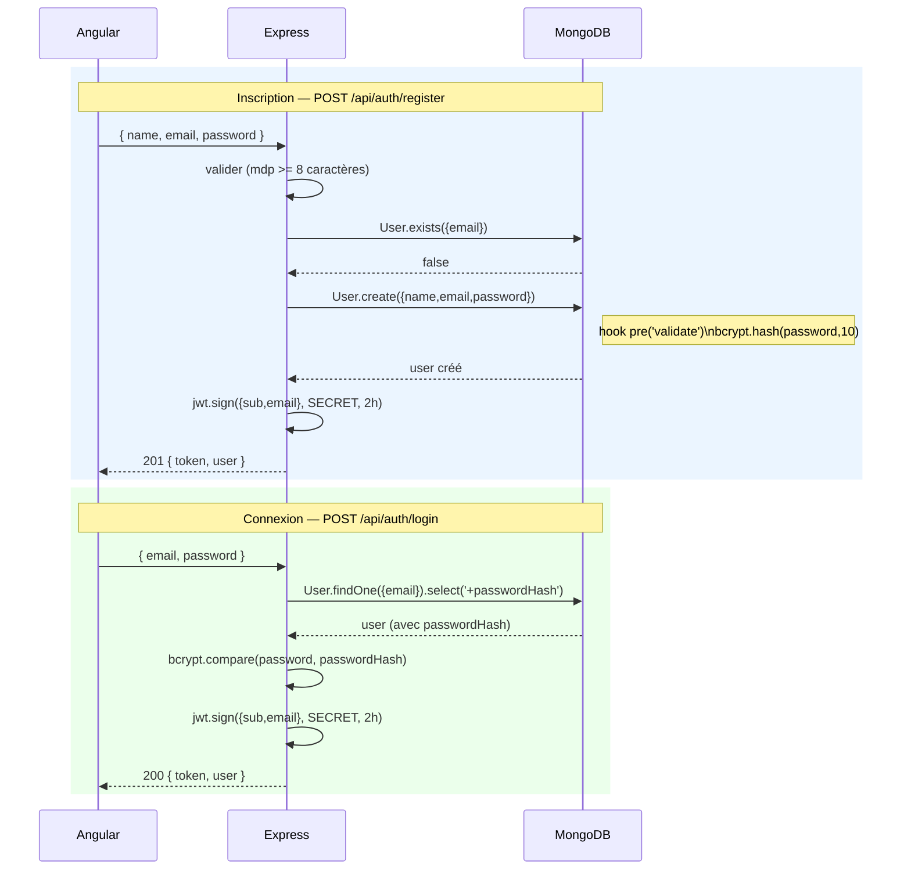
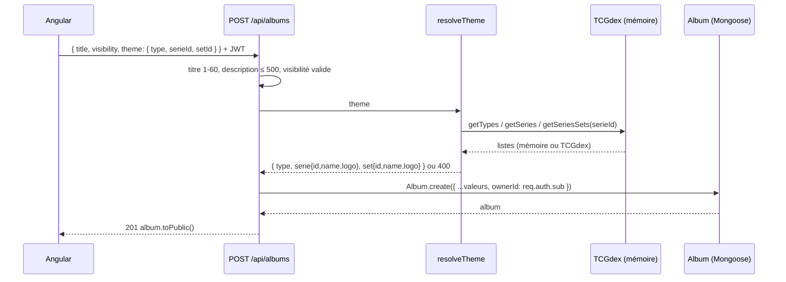
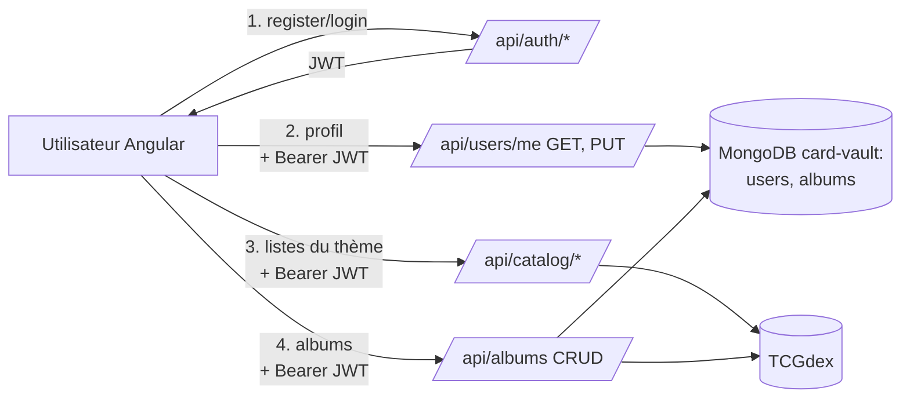

# Analyse du backend — Card Vault API

> Généré à partir du code source dans `backend/src/`. Ce document décrit
> l'architecture **actuelle**, les technologies, l'authentification et les
> échanges avec la base de données. Mis à jour à chaque étape de la V2
> (journal en §9).
>
> **01/11/2026 — V2, étape 1** : la partie audio de la V1 (modèle `Track`,
> routes `/api/tracks`, upload Multer audio) a été retirée ; sa description
> reste consultable dans la version taguée `v1.0` de ce fichier.

## 1. Vue d'ensemble

Le backend est une **API REST** minimaliste en **Node.js / Express 5**, avec
persistance **MongoDB** (via Mongoose, base `card-vault` depuis la V2).
Elle sert l'application Angular **Card Vault** (`frontend-starter/`). À
l'étape 2 de la V2, elle gère l'inscription, la connexion, le profil, les
**albums** et le **catalogue de cartes** (API publique TCGdex, interrogée par
le serveur). Les photos de cartes (stockées sur le disque local) et les
fonctions sociales arrivent aux étapes suivantes.

### 1.1 Stack technique

| Domaine | Technologie | Rôle |
|---|---|---|
| Runtime | Node.js (ESM, `"type": "module"`) | Exécution du serveur |
| Framework HTTP | Express 5.1 | Routage, middlewares |
| Base de données | MongoDB Atlas (cloud), base `card-vault` (V2) | Persistance des données |
| ODM | Mongoose 9 | Schémas, validation, requêtes |
| Authentification | jsonwebtoken (JWT) | Sessions sans état |
| Hachage mot de passe | bcryptjs | Stockage sécurisé des mots de passe |
| Upload fichiers | Multer 2 | Dépendance conservée mais **plus utilisée** depuis le retrait de l'audio (V2, étape 1) ; réutilisée pour les photos de cartes (étape 3) |
| CORS | cors | Autoriser les appels depuis Angular (localhost:4200) |
| Catalogue de cartes | API publique TCGdex (`fetch` natif de Node, délai 8 s, mémoire 24 h) | Types, séries, extensions (V2, étape 2) |
| Tests | `node:test` + `node:assert/strict` | Tests unitaires/API légers |

### 1.2 Arborescence

```text
backend/
├── src/
│   ├── app.js            # Construction de l'app Express (middlewares, auth, routes, erreurs)
│   ├── server.js         # Point d'entrée : connexion Mongo + écoute HTTP
│   ├── errors.js         # HttpError (erreur métier portant son code HTTP)
│   ├── access.js         # Règles d'accès aux albums : isOwner, canView
│   ├── models/
│   │   ├── User.js       # Schéma Mongoose Utilisateur (+ hachage mdp)
│   │   └── Album.js      # Schéma Mongoose Album (visibilité, thème, sharedWith)
│   ├── routes/
│   │   ├── albums.js     # /api/albums (Router Express)
│   │   └── catalog.js    # /api/catalog (Router Express)
│   └── services/
│       ├── tcgdex.js     # Accès au catalogue TCGdex (mémoire, exclusion Pocket, 502)
│       └── theme.js      # Validation du thème d'un album (resolveTheme)
├── data/uploads/         # Fichiers envoyés (hors Git) ; photos de cartes à l'étape 3
├── test/                 # 29 tests node:test (aucun ne touche MongoDB ni le vrai TCGdex)
│   ├── helpers.js        # serveur de test, tokens, faux TCGdex
│   ├── api.test.js       # santé, User, authentification
│   ├── access.test.js    # canView / isOwner
│   ├── catalog.test.js   # /api/catalog
│   └── albums.test.js    # /api/albums
├── .env                  # Secrets locaux (MONGODB_URI, JWT_SECRET, PORT) — jamais versionné
└── package.json
```

### 1.3 Diagramme de composants


```mermaid
flowchart LR
    subgraph Client["Frontend Angular (localhost:4200)"]
        UI[Composants Angular]
    end

    subgraph API["Backend Express (localhost:3000)"]
        MW1[CORS]
        MW2[express.json]
        MWAuth[Middleware auth\nJWT]
        Routes[Routes /api/*]
        Err[Middleware erreurs]
    end

    subgraph Storage["Stockage"]
        DB[(MongoDB Atlas\nbase card-vault\nusers, albums)]
    end

    subgraph Ext["Externe"]
        TCG[(API TCGdex\ncatalogue de cartes)]
    end

    UI -- "HTTP JSON\n+ Authorization: Bearer <JWT>" --> MW1
    MW1 --> MW2 --> Routes
    Routes -. protège .-> MWAuth
    Routes -- lit/écrit --> DB
    Routes -- "types, séries, extensions\n(mémoire 24 h)" --> TCG
    Routes --> Err
    Err -- réponse JSON erreur --> UI
    Routes -- réponse JSON --> UI
```

**Séparation `app.js` / `server.js`** : `createApp()` construit l'application
Express *sans ouvrir de port*, ce qui permet aux tests (`test/api.test.js`)
d'instancier la même app sans dépendre de Mongo ni d'un port fixe.
`server.js` est le seul fichier qui se connecte à MongoDB et appelle
`.listen()`.

---

## 2. Modèle de données (MongoDB / Mongoose)

### 2.1 Schémas


```mermaid
erDiagram
    USER {
        ObjectId _id PK
        string name
        string email UK "unique, lowercase"
        string passwordHash "select:false"
        date createdAt
        date updatedAt
    }
    ALBUM {
        ObjectId _id PK
        ObjectId ownerId FK "ref User, index"
        string title "1-60 caractères"
        string description "500 max"
        string visibility "private | public (défaut private)"
        object theme "type?, serie {id,name,logo}?, set {id,name,logo}?"
        ObjectId[] sharedWith "ref User (étape 5)"
        number cardCount "défaut 0"
        date createdAt
        date updatedAt
    }
    USER ||--o{ ALBUM : "possède (ownerId)"
```

- **User** (`src/models/User.js`) : le mot de passe en clair n'est **jamais
  stocké**. Un champ virtuel `password` (non persisté) déclenche un hook
  `pre('validate')` qui calcule `passwordHash = bcrypt.hash(password, 10)`.
  `passwordHash` a `select: false` : il n'est renvoyé par une requête que si
  on le demande explicitement avec `.select('+passwordHash')` (utilisé au
  login).
- **Album** (`src/models/Album.js`, étape 2) : le **thème est facultatif**
  (sans thème : collection libre). La série et l'extension sont stockées
  avec leur **nom et leur logo** (recopiés depuis TCGdex au moment de
  l'enregistrement) : l'affichage n'a jamais besoin du catalogue. Un index
  `{ ownerId: 1, updatedAt: -1 }` sert la liste « Mes albums ».
  `sharedWith` (amis destinataires d'un partage) est prévu pour l'étape 5
  et n'est pas exposé par `toPublic()`.
- `toPublic()` construit l'objet réellement envoyé au frontend (transforme
  `_id` en `id` string, retire les champs internes).

### 2.2 Cycle de vie d'une requête base de données

```text
requête HTTP → route Express → middleware(s) → handler async
             → appel Mongoose (User.xxx) → driver MongoDB
             → réponse JSON (via toPublic())
```

---

## 3. Authentification (JWT)

### 3.1 Principe

L'authentification est **sans état (stateless)** : à la connexion, le
serveur signe un JWT contenant `{ sub: userId, email }`, valable **2 heures**
(`expiresIn: "2h"`). Le frontend doit renvoyer ce token dans l'en-tête
`Authorization: Bearer <token>` pour chaque route protégée. Aucun mot de
passe ni token n'est journalisé.

### 3.2 Inscription / Connexion


```mermaid
sequenceDiagram
    participant FE as Angular
    participant API as Express
    participant Mongo as MongoDB

    rect rgb(235,245,255)
    note over FE,Mongo: Inscription — POST /api/auth/register
    FE->>API: { name, email, password }
    API->>API: valider (mdp >= 8 caractères)
    API->>Mongo: User.exists({email})
    Mongo-->>API: false
    API->>Mongo: User.create({name,email,password})
    note right of Mongo: hook pre('validate')\nbcrypt.hash(password,10)
    Mongo-->>API: user créé
    API->>API: jwt.sign({sub,email}, SECRET, 2h)
    API-->>FE: 201 { token, user }
    end

    rect rgb(235,255,235)
    note over FE,Mongo: Connexion — POST /api/auth/login
    FE->>API: { email, password }
    API->>Mongo: User.findOne({email}).select('+passwordHash')
    Mongo-->>API: user (avec passwordHash)
    API->>API: bcrypt.compare(password, passwordHash)
    API->>API: jwt.sign({sub,email}, SECRET, 2h)
    API-->>FE: 200 { token, user }
    end
```

### 3.3 Middleware `auth` (protection des routes)

```mermaid
flowchart TD
    A[Requête entrante] --> B{Header Authorization\nprésent et\ncommence par 'Bearer '?}
    B -- non --> C[401 Authentification requise]
    B -- oui --> D[jwt.verify(token, SECRET)]
    D -- invalide/expiré --> E[401 Jeton invalide ou expiré]
    D -- valide --> F[req.auth = payload\n(sub, email)]
    F --> G[next\ncontinue vers le handler]
```

Le middleware `auth` (src/app.js:40) est appliqué explicitement à chaque
route qui en a besoin (`/api/users/me` ; les routes d'albums et sociales des étapes suivantes) — pas globalement —
ce qui laisse `/api/health`, `/api/auth/register` et `/api/auth/login`
publiques. L'identité utilisée dans les handlers vient **toujours de
`req.auth.sub`** (extrait du JWT vérifié), jamais d'un champ envoyé par le
client, ce qui empêche un utilisateur d'agir au nom d'un autre.

### 3.4 Routes d'authentification / utilisateur

| Méthode | Route | Protégée | Description |
|---|---|---|---|
| POST | `/api/auth/register` | non | Créer un compte, retourne `{token, user}` |
| POST | `/api/auth/login` | non | Vérifier les identifiants, retourne `{token, user}` |
| GET | `/api/users/me` | oui | Profil de l'utilisateur connecté |
| PUT | `/api/users/me` | oui | Modifier le nom de l'utilisateur connecté |

---

## 4. Albums et catalogue (V2, étape 2)

### 4.1 Catalogue TCGdex (`services/tcgdex.js`)

- Le **backend** interroge TCGdex, jamais Angular : le contrôle de
  cohérence entre une carte et le thème d'un album (étape 3) doit être fait
  par le serveur, sinon un client modifié pourrait mentir.
- **Mémoire de 24 h** par chemin (`Map` en mémoire) : les listes ne changent
  qu'à la sortie d'une extension. TCGdex envoie `Cache-Control: no-store`,
  mais une mémoire serveur courte reste raisonnable pour ce type de données.
- **Délai de 8 s** (`AbortSignal.timeout`) ; TCGdex injoignable ou en erreur
  → `HttpError(502, "Catalogue de cartes indisponible")`. Une ressource
  inexistante (404 TCGdex) renvoie `null`.
- La série **Pocket** (`tcgp`, cartes numériques) est exclue ; les
  identifiants sont contrôlés (`/^[a-z0-9.-]{1,40}$/i`) **avant** d'être
  insérés dans une URL ; les logos reçoivent leur extension `.png`.

### 4.2 Validation du thème (`services/theme.js`)

```mermaid
flowchart TD
    A["resolveTheme({ type?, serieId?, setId? })"] --> B{setId sans serieId ?}
    B -- oui --> E1[400 Une extension nécessite de choisir sa série]
    B -- non --> C{type fourni ?}
    C -- oui --> C1{dans getTypes() ?}
    C1 -- non --> E2[400 Type inconnu]
    C1 -- oui --> D
    C -- non --> D{serieId fourni ?}
    D -- non --> OK["thème (éventuellement vide = collection libre)"]
    D -- oui --> D1{dans getSeries() ?\n(Pocket exclue)}
    D1 -- non --> E3[400 Série inconnue]
    D1 -- oui --> F{setId fourni ?}
    F -- non --> OK
    F -- oui --> F1{dans getSeriesSets(serieId) ?}
    F1 -- non --> E4[400 Extension inconnue pour cette série]
    F1 -- oui --> OK
```

Le thème retourné contient les noms et logos officiels, enregistrés tels
quels dans l'album.

### 4.3 Règles d'accès (`access.js`)

| Fonction | Règle (étape 2) | Utilisée par |
|---|---|---|
| `isOwner(album, userId)` | `album.ownerId` = identité du token (comparaison en chaîne, ObjectId vs string) | `PUT /albums/:id` |
| `canView(album, userId)` | propriétaire, **ou** album `public` | `GET /albums/:id` |

`DELETE` applique la même règle directement dans la requête
(`findOneAndDelete({ _id, ownerId: req.auth.sub })`). Refus = **`404`**,
jamais `403` : un utilisateur ne peut pas savoir si un album privé existe.
L'étape 5 étendra `canView` au partage (`sharedWith`).

### 4.4 Routes (`routes/albums.js`, `routes/catalog.js`)

Montées dans `app.js` par `app.use("/api/albums", albumRoutes(auth))` :
chaque fichier exporte une fonction qui reçoit le middleware `auth` et
renvoie un `express.Router()`. Détail des routes, corps et erreurs :
`../API_CONTRACT.md`.


```mermaid
sequenceDiagram
    participant A as Angular
    participant R as POST /api/albums
    participant T as resolveTheme
    participant C as TCGdex (mémoire)
    participant M as Album (Mongoose)

    A->>R: { title, visibility, theme: { type, serieId, setId } } + JWT
    R->>R: titre 1-60, description ≤ 500, visibilité valide
    R->>T: theme
    T->>C: getTypes / getSeries / getSeriesSets(serieId)
    C-->>T: listes (mémoire ou TCGdex)
    T-->>R: { type, serie{id,name,logo}, set{id,name,logo} } ou 400
    R->>M: Album.create({ ...valeurs, ownerId: req.auth.sub })
    M-->>R: album
    R-->>A: 201 album.toPublic()
```

**Upload de fichiers** : retiré à l'étape 1 (audio), réintroduit à
l'étape 3 pour les photos de cartes (`sharp`, URL signées). L'upload audio
de la V1 est décrit dans la version taguée `v1.0` de ce fichier.

---

## 5. Gestion des erreurs et journalisation

Toutes les routes utilisent `try/catch` + `next(error)`. Un middleware
d'erreurs central (fin de `app.js`) mappe les erreurs connues vers des codes
HTTP cohérents :

```mermaid
flowchart TD
    E[Erreur interceptée] --> M{Type d'erreur}
    M -- HttpError\n(src/errors.js) --> R0[son code : 400, 404, 502…]
    M -- ValidationError\n(Mongoose) --> R2[400 Bad Request]
    M -- CastError\n(id MongoDB invalide) --> R3[404 Not Found]
    M -- autre --> R4[next(error)\n-> gestionnaire par défaut Express]
```

Chaque requête est aussi journalisée en fin de traitement (méthode, URL,
code de statut, durée) via un middleware placé en tête de la pile
(`res.on('finish', ...)`), sans jamais logguer les corps sensibles
(mots de passe, tokens).

---

## 6. Démarrage du serveur (`server.js`)

```mermaid
flowchart TD
    A[node src/server.js] --> B[Lire MONGODB_URI depuis .env]
    B -- absente --> X[throw Error\narrêt immédiat]
    B -- présente --> C[mongoose.connect]
    C -- échec --> X2[throw Error\narrêt immédiat]
    C -- succès --> D[Vérifier / créer\ncompte démo\ndemo@example.com]
    D --> E[createApp().listen(port)]
    E --> F[API prête\nhttp://localhost:PORT/api/health]
```

Depuis la V2 (01/11/2026), l'URI de `.env` désigne la base **`card-vault`**
(vierge au départ) ; les données de la V1 sont restées dans la base `test`,
utilisée par défaut quand l'URI ne contient pas de nom de base.

Le serveur **refuse de démarrer** sans URI MongoDB valide et sans connexion
effective — il n'accepte jamais de requêtes dans un état "base
indisponible". Un compte de démonstration (`demo@example.com`) est créé
automatiquement au premier démarrage s'il n'existe pas déjà.

---

## 7. Points d'attention relevés

- **Secrets en clair localement** : `backend/.env` contient une URI MongoDB
  Atlas complète (avec identifiants) et un `JWT_SECRET` réels. Le fichier est
  bien exclu par `.gitignore`. `backend/.env.example` n'existe plus ; choix
  fait le 16/10/2026 : le README racine décrit directement le contenu
  attendu de `.env` au lieu de recréer ce fichier.
- **JWT_SECRET par défaut** : si `JWT_SECRET` n'est pas défini,
  `src/app.js` retombe sur la valeur codée en dur
  `"tp1-development-secret"` — acceptable en développement uniquement.
- **Pas de rate limiting** ni de protection anti-bruteforce sur
  `/api/auth/login`.
- **Aucune limite de nombre de fichiers par utilisateur** ni de quota total
  de stockage disque (à garder en tête pour les photos, étape 3).

---

## 8. Résumé du flux applicatif global


```mermaid
flowchart LR
    A[Utilisateur Angular] -->|1. register/login| B[/api/auth/*/]
    B -->|JWT| A
    A -->|2. profil\n+ Bearer JWT| C[/api/users/me GET, PUT/]
    A -->|3. listes du thème\n+ Bearer JWT| D[/api/catalog/*/]
    D --> T[(TCGdex)]
    A -->|4. albums\n+ Bearer JWT| F[/api/albums CRUD/]
    F --> T
    C --> E[(MongoDB card-vault:\nusers, albums)]
    F --> E
```

Les flux cartes (étape 3) et social (étapes 4 à 7) seront ajoutés au fil des
étapes de la V2.

---

## 9. Journal des mises à jour de ce document

- **Version initiale** (Phase 0) — analyse du backend fourni.
- **TP2** — filtre `title` sur `GET /api/tracks` ; **TP3** — tests backend.
- **01/11/2026** — V2, étape 1 : retrait de l'audio (modèle `Track`,
  routes `/api/tracks`, configuration Multer), base `card-vault`, tests
  réorientés vers `/api/users/me` (§1, §1.1, §1.2, §1.3, §2, §4, §5, §6,
  §7, §8).
- **01/11/2026** — V2, étape 2 : modèle `Album`, routes `/api/albums` et
  `/api/catalog`, service TCGdex (mémoire, 502), validation du thème,
  règles d'accès `canView`/`isOwner`, `HttpError` et gestionnaire d'erreurs,
  organisation en `routes/` et `services/`, 29 tests (§1, §1.1, §1.2, §1.3,
  §2, §4, §5, §8).
