# Compte-rendu — TP1 : Architecture Authentification et Profil

> Sujet : `../SUJET_ETUDIANT_TP1.md`. Voir aussi `../backend/analyse.md`,
> `../frontend-starter/analyse.md` et `../RAPPORT_IA_MODELE.md`.

## Préparation obligatoire (avant la séance)

> Question du sujet : « Connectez-vous et uploadez quelques fichiers audio,
> par exemple les `.mp3` disponibles dans
> `frontend-starter/fichiers-audio-de-test`. Vérifiez les requêtes dans les
> DevTools, onglet Network, filtre XHR/fetch. Où se trouvent les traces du
> backend et comment les voir ? »

**Ce que j'ai fait.** Backend lancé avec `npm run start` dans le terminal
intégré de VS Code, connexion avec le compte de démo
(`demo@example.com` / `Demo1234!`), puis upload de plusieurs fichiers `.mp3`
de test depuis la page "Backing tracks".

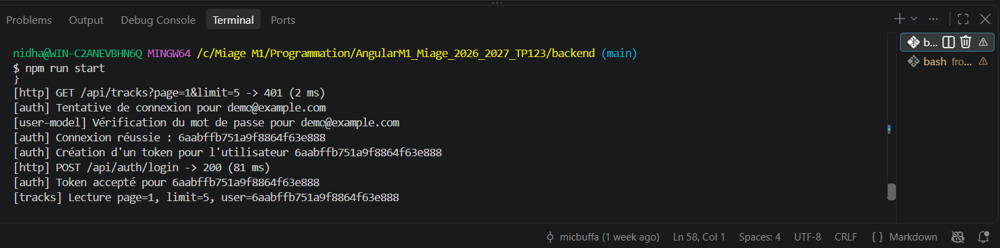

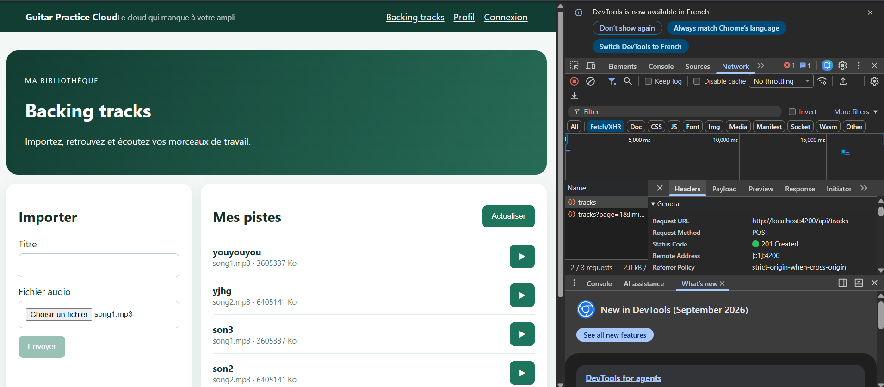

**Réponse.** Les traces du backend sont les lignes produites par les
`console.log` / `console.warn` / `console.error` placés dans
`backend/src/app.js` (préfixes `[http]`, `[auth]`, `[user-model]`,
`[tracks]`, `[multer]`, `[error]`…), à chaque étape du traitement d'une
requête — pas seulement le résultat final, mais aussi les étapes internes
(ex. `[user-model] Vérification du mot de passe`). Elles s'affichent dans le
**terminal où le processus Node a été démarré** (`npm run start`, donc
`node --env-file=.env src/server.js`), c'est-à-dire le terminal intégré de
VS Code dans mon cas — pas dans le navigateur.

Sur la première capture, on voit la séquence complète d'une connexion suivie
d'une lecture de pistes : une requête refusée avant connexion
(`GET /api/tracks... -> 401`, pas encore de token), puis
`[auth] Tentative de connexion`, `[user-model] Vérification du mot de
passe`, `[auth] Connexion réussie`, `[auth] Création d'un token`,
`[http] POST /api/auth/login -> 200`, et enfin
`[tracks] Lecture page=1, limit=5, user=...`.

La deuxième capture montre le même échange vu **côté navigateur**, dans
l'onglet Network de Chrome DevTools filtré sur `Fetch/XHR` : une requête
`POST http://localhost:4200/api/tracks` (upload d'une piste), passée par le
proxy Angular (`proxy.conf.json`, `/api` → `http://localhost:3000`), avec le
statut `201 Created`.

**Conclusion.** Les deux vues sont complémentaires et jamais interchangeables :
l'onglet Network montre uniquement ce qui transite sur le réseau (URL,
méthode, statut, en-têtes, corps, timing) tel que le navigateur le voit ;
le terminal backend montre ce qui se passe **à l'intérieur** du serveur
(vérification du mot de passe, création du token, requêtes Mongoose…), ce
que le navigateur ne peut pas voir. Pour relier les deux, il suffit de
faire correspondre le statut et l'ordre chronologique : chaque ligne
`[http] <méthode> <url> -> <code> (<durée>)` du terminal correspond
exactement à une requête de l'onglet Network avec le même statut.

## Phase 0 — Mise en place (avant Mission 0)

Avant de démarrer la cartographie, j'ai fait générer une analyse technique
complète du backend et du frontend (`backend/analyse.md`,
`frontend-starter/analyse.md`), ainsi que cette arborescence de
comptes-rendus. Détail des échanges avec l'assistant IA :
`../RAPPORT_IA_MODELE.md`, section "Phase 0".

## Mission 0 — Cartographier l'application

Cartographie faite par lecture du code, sans aucune modification.

- **Composant racine** : `AppComponent`
  (`frontend-starter/src/app/components/app/app.ts`). Standalone,
  sélecteur `app-root`, importe `RouterLink` et `RouterOutlet`. Son template
  (`app.html`) affiche l'en-tête, la navigation, et surtout `<router-outlet />`
  qui est l'endroit où Angular injecte le composant correspondant à la route
  active. C'est lui qui est passé à `bootstrapApplication()` dans `main.ts`.

- **Configuration des routes** : `frontend-starter/src/app/routes.ts`.
  Tableau `routes: Routes` avec 6 entrées : `''` (redirige vers `tracks`),
  `login`, `register` (libres), `profile` et `tracks`
  (`canActivate: [authGuard]`), et `**` (route fourre-tout → `tracks`). Le
  tableau est fourni à `provideRouter(routes)` dans `main.ts`.

- **Enregistrement de `HttpClient`** : `frontend-starter/src/main.ts`,
  dans `bootstrapApplication(AppComponent, { providers: [...] })` :
  `provideHttpClient(withInterceptors([authInterceptor]))`. C'est cette
  ligne qui active `HttpClient` dans toute l'application **et** qui branche
  `authInterceptor` sur **toutes** les requêtes sortantes, sans qu'aucun
  service n'ait besoin de le faire lui-même.

- **Modèles, services et pages** :
  - Modèles (`shared/models/`) : `User`, `Track`, `Page<T>` (pagination
    générique), `AuthResponse` — simples interfaces TypeScript, reflet des
    réponses JSON du backend (`API_CONTRACT.md`).
  - Services (`shared/services/`, tous `@Injectable({ providedIn: 'root' })`) :
    `AuthService` (état `token`/`currentUser`, login/register/profile/update/logout)
    et `TrackService` (list/upload/audio). Ce sont les **seuls** endroits du
    code qui injectent `HttpClient` — les composants n'y touchent jamais
    directement.
  - Pages (`components/`) : `login-page`, `register-page`, `profile-page`,
    `tracks-page`, plus `app` (racine/layout).

- **Mécanisme qui ajoute le JWT** : `authInterceptor`
  (`shared/interceptors/auth.interceptor.ts`). Fonction interceptor (API
  Angular ≥ 15, pas une classe). À chaque requête HTTP sortante, il lit
  `inject(AuthService).token()` (un Signal) et, s'il n'est pas `null`, clone
  la requête avec `setHeaders: { Authorization: 'Bearer ' + token }` avant de
  la transmettre à `next()`. S'il n'y a pas de token, la requête part
  inchangée (utile pour `/auth/login` et `/auth/register`, qui n'en ont pas
  besoin).

### Schéma annoté du flux "Se connecter"

```mermaid
sequenceDiagram
    participant U as Utilisateur
    participant LP as LoginPageComponent<br/>login-page.ts : submit()
    participant AS as AuthService<br/>auth.service.ts : login()
    participant HC as HttpClient
    participant AI as authInterceptor<br/>auth.interceptor.ts
    participant API as Backend<br/>POST /api/auth/login

    U->>LP: clic "Se connecter"<br/>(login-page.html : (ngSubmit)="submit()")
    LP->>AS: auth.login(email, password)
    AS->>HC: http.post('/api/auth/login', { email, password })
    HC->>AI: la requête passe par l'intercepteur global<br/>(branché dans main.ts via withInterceptors)
    AI->>AI: lit auth.token() -> null (pas encore connecté)
    AI->>API: POST /api/auth/login (sans header Authorization)
    API-->>AI: 200 { token, user }
    AI-->>HC: réponse transmise telle quelle
    HC-->>AS: réponse
    AS->>AS: tap(response => storeAuthentication(response))
    AS->>AS: localStorage.setItem('gpc_token', token)<br/>token.set(token) ; currentUser.set(user)
    AS-->>LP: Observable complété (next)
    LP->>LP: router.navigateByUrl('/tracks')
    Note over LP,AS: si erreur (401) : LP capture error.error.message<br/>et l'affiche via le Signal error(), pas de redirection
```

**Lecture du schéma** : le composant ne parle jamais à `HttpClient`
directement — tout passe par `AuthService`. L'intercepteur est invisible
pour `AuthService` et pour le composant : il agit en coulisses sur
n'importe quelle requête, à condition qu'elle passe par `HttpClient`
(c'est important pour comprendre plus tard pourquoi une URL directe dans
`<audio src>` ne reçoit pas le JWT, cf. Mission 3 du TP2). C'est
`storeAuthentication()` qui fait le lien entre la réponse HTTP et l'état
réacti  de l'app (`token`, `currentUser`) ainsi que la persistance
(`localStorage`).

### Routes publiques vs protégées (`API_CONTRACT.md`)

| Route API | Authentification | Note |
|---|---|---|
| `GET /api/health` | publique | vérification de vie |
| `POST /api/auth/register` | publique | crée le compte + renvoie un token |
| `POST /api/auth/login` | publique | seule façon d'obtenir un token |
| `GET /api/users/me` | **JWT requis** | |
| `PUT /api/users/me` | **JWT requis** | |
| `GET /api/tracks` | **JWT requis** | |
| `POST /api/tracks` | **JWT requis** | |
| `GET /api/tracks/:id/audio` | **JWT requis** | |
| `DELETE /api/tracks/:id` | **JWT requis** | bonus, mission 5 du TP3 |

Règle simple donnée par `API_CONTRACT.md` : tout est protégé **sauf**
`/health`, `/auth/register` et `/auth/login`. Côté Angular, ce découpage se
retrouve dans `routes.ts` : seules les routes `profile` et `tracks` portent
`canActivate: [authGuard]`, exactement les deux pages qui appellent des
endpoints protégés.

## Mission 1 — Inscription, Connexion et Profil

_À compléter au fur et à mesure de l'implémentation :_

- [x] Formulaires réactifs inscription/connexion
- [x] Validations et messages d'erreur compréhensibles
- [x] Appels `/api/auth/register` et `/api/auth/login`
- [x] Sauvegarde du JWT (sans l'afficher dans les logs)
- [x] Mise à jour du Signal `currentUser`
- [x] Redirection après connexion/inscription réussie
- [x] Bouton de déconnexion + nettoyage de l'état local
- [x] Chargement de `/api/users/me`
- [x] Modification du nom (`PUT /api/users/me`)
- [x] Gestion du `401` avec retour vers `/login`

### Plan — Points 1+2 : formulaires réactifs + validations/messages d'erreur

Ces deux points sont traités ensemble : ajouter des validateurs sans les
exploiter dans l'UI n'aurait aucun intérêt, et les exploiter dans l'UI
nécessite de revoir la structure des formulaires réactifs en même temps.
**Étape de cadrage uniquement : rien n'est encore implémenté à ce stade.**

**Constat de départ (preuve en capture).** En testant l'inscription avec un
mot de passe de 4 caractères, le formulaire laisse partir la requête (aucun
contrôle client), et le message affiché est celui, générique, renvoyé par
le backend :

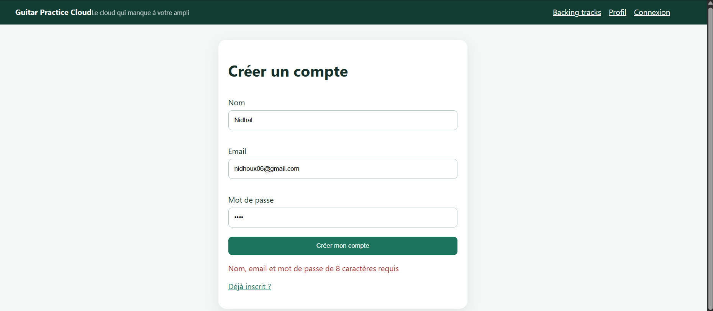

Le message "Nom, email et mot de passe de 8 caractères requis" vient de
`backend/src/app.js` (route `POST /api/auth/register`) :
```js
if (!name || !email || !password || password.length < 8) {
  return res.status(400).json({ message: "Nom, email et mot de passe de 8 caractères requis" });
}
```
Il regroupe 4 conditions différentes en un seul message : même si seul le
mot de passe était en cause (nom et email valides), le message évoque les
trois champs. Rien côté Angular ne permettait de le savoir avant l'envoi.

**Décisions de conception (verrouillées avant codage) :**

1. Ajouter `Validators.minLength(8)` sur le mot de passe **du formulaire
   d'inscription uniquement** — le backend n'exige cette longueur qu'à la
   création du compte (`/auth/register`), pas à la connexion
   (`/auth/login` compare juste un hash, quelle que soit la longueur).
2. Bloquer l'envoi si le formulaire est invalide, à deux niveaux
   (défense en profondeur, même principe que "la validation frontend
   n'annule jamais la validation backend") :
   - visuel : `[disabled]="form.invalid"` sur le bouton ;
   - code : en tête de `submit()`, `if (this.form.invalid) { this.form.markAllAsTouched(); return; }`
     — utile notamment pour la soumission au clavier (touche Entrée), et
     pour révéler d'un coup toutes les erreurs si l'utilisateur n'a jamais
     quitté un champ (`touched`).
3. Afficher un message **par champ**, uniquement une fois le champ
   `touched`, avec un texte différent selon le type d'erreur :

   | Champ | Erreur | Message affiché |
   |---|---|---|
   | Nom (register) | `required` | "Nom requis" |
   | Email (login + register) | `required` | "Email requis" |
   | Email (login + register) | `email` (format) | "Format d'email invalide" |
   | Mot de passe (login) | `required` | "Mot de passe requis" |
   | Mot de passe (register) | `required` | "Mot de passe requis" |
   | Mot de passe (register) | `minlength` | "8 caractères minimum" |

4. Pas de nouveau CSS à créer : la classe `.error` existe déjà globalement
   (`styles.css` ligne 29, `color: #a33`) et sera réutilisée pour les
   messages par champ ; le style `button:disabled { opacity: 0.45; }`
   existe déjà aussi (`styles.css` ligne 23).

**Fichiers ciblés et changement précis dans chacun :**

| Fichier | Changement prévu |
|---|---|
| `login-page.ts` | Garde `if (this.form.invalid)` en tête de `submit()` |
| `login-page.html` | `[disabled]="form.invalid"` sur le bouton ; bloc d'erreur sous `email` et sous `password` |
| `register-page.ts` | Ajouter `Validators.minLength(8)` sur le `FormControl` `password` ; même garde dans `submit()` |
| `register-page.html` | `[disabled]="form.invalid"` sur le bouton ; blocs d'erreur sous `name`, `email`, `password` |

Aucun autre fichier (pas de service, pas de modèle, pas de backend) n'est
concerné par ces deux points.

### Implémentation et vérification — Points 1+2

Le plan ci-dessus a été implémenté tel quel dans les 4 fichiers listés,
`npm run build` passe sans erreur. Test manuel sur `/register` : conforme
au plan dès la première passe.

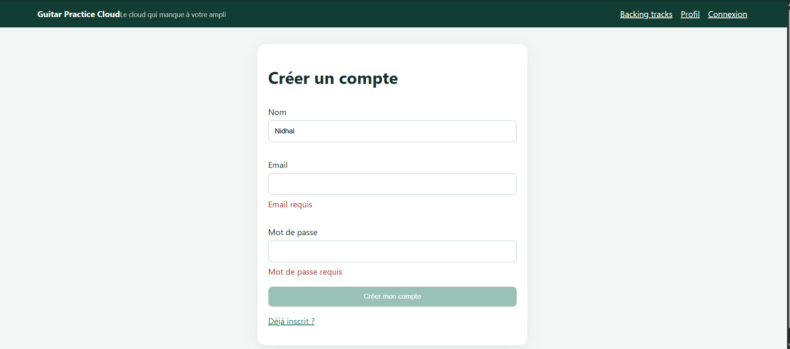

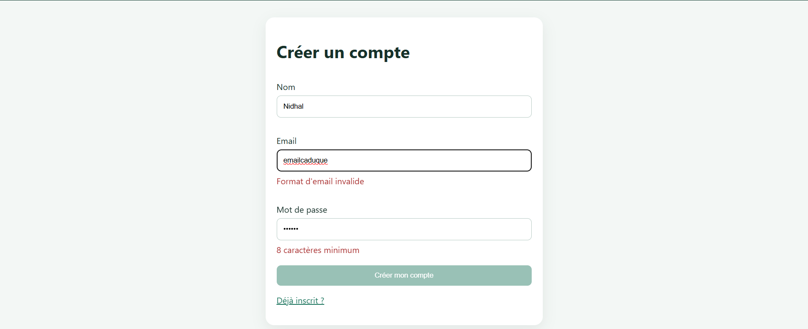

**Bug trouvé pendant le test manuel, sur `/login`.** Le mot de passe
pré-rempli (`Demo1234!`) raccourci de quelques caractères ne déclenchait
aucune erreur ni grisage — **comportement correct** : le login n'a
volontairement pas de `Validators.minLength(8)` (seule l'inscription
l'exige côté backend), donc un mot de passe non vide de longueur
quelconque reste valide côté client. En revanche, vider le champ email
grisait bien le bouton (`[disabled]="form.invalid"`, réagit immédiatement)
mais n'affichait **aucun** message "Email requis" tant que le champ
n'avait pas perdu le focus — car le message était conditionné par
`.touched` (mis à jour seulement au blur), alors que le bouton réagissait à
`form.invalid` sans cette condition. Les deux logiques étaient donc
désynchronisées.

**Correction appliquée** dans les 4 blocs d'erreur (les 2 champs de
`login-page.html`, les 3 champs de `register-page.html`) : remplacement de
la condition `control.touched` par `(control.touched || control.dirty)`.
`dirty` devient vrai dès la première frappe qui modifie la valeur, donc le
message apparaît désormais exactement au même moment que le grisage du
bouton, y compris pour un champ pré-rempli édité sans jamais être quitté.
Rebuild vérifié après correction (`npm run build`, succès).

### Vérification — Point 3 : appels `/api/auth/register` et `/api/auth/login`

Ce point n'ajoutait aucun code (les appels existaient déjà dans
`AuthService`, cf. Mission 0) : il s'agissait de vérifier, onglet Network
des DevTools, que les requêtes partent bien avec le bon corps JSON et que
la réponse `{ token, user }` est correctement récupérée.

**Mot de passe et JWT visibles en clair sur les premières captures :**
conformément à la consigne du sujet (« Ne jamais capturer ou transmettre un
mot de passe ou un JWT »), les valeurs sensibles ont été floutées avant
intégration ici — seules la structure de la requête/réponse, les statuts et
les en-têtes comptent pour cette vérification.

**Inscription (`POST /api/auth/register`)** : requête `201 Created` avec le
`Authorization` absent (route publique), corps `{ name, email, password }`
et réponse `{ token, user }`.

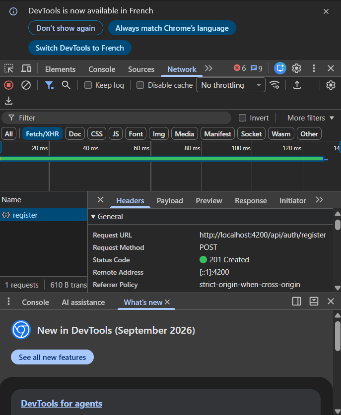

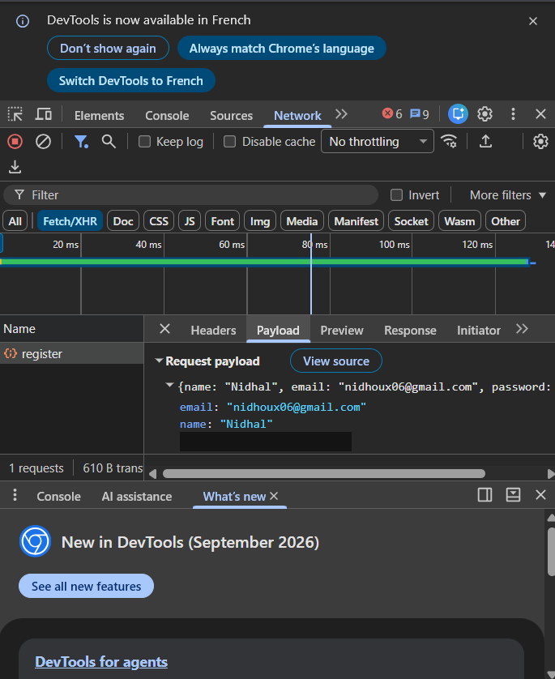

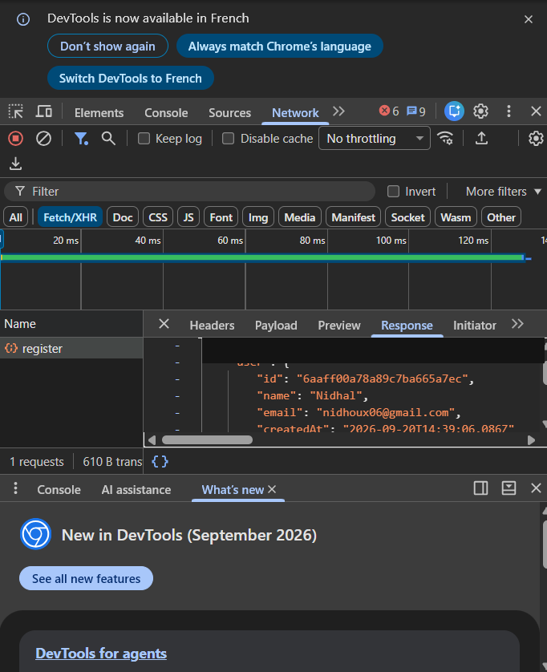

**Connexion (`POST /api/auth/login`)** : un essai avec un mauvais mot de
passe renvoie `401 Unauthorized`, un essai avec les bons identifiants
renvoie `200 OK` et `{ token, user }`.

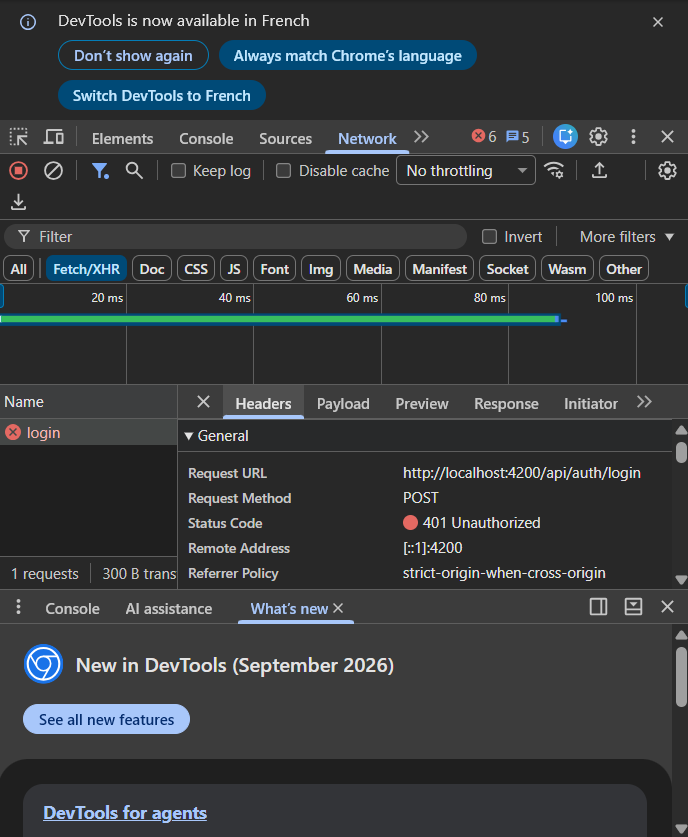

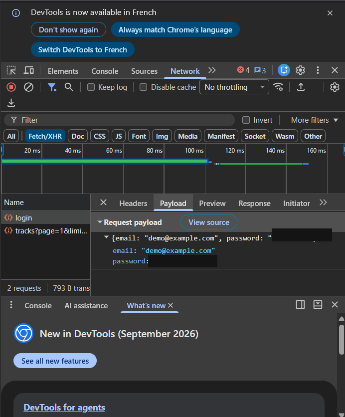

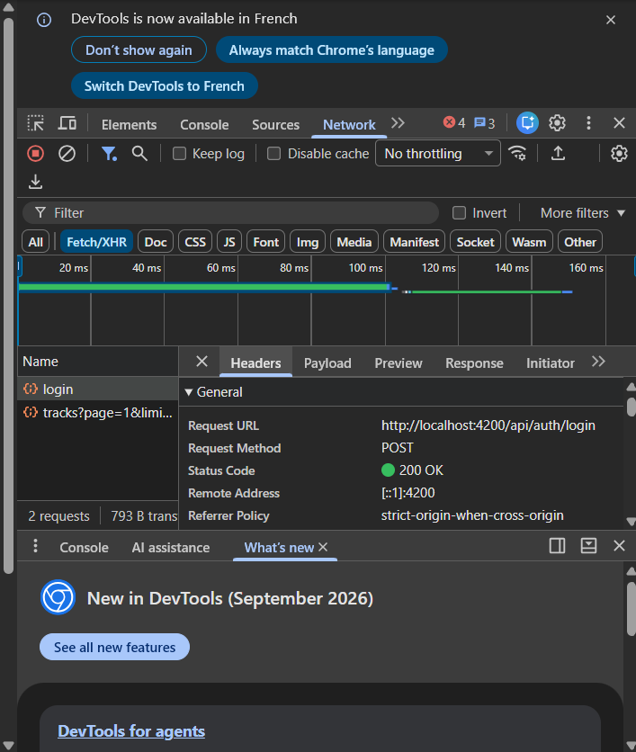

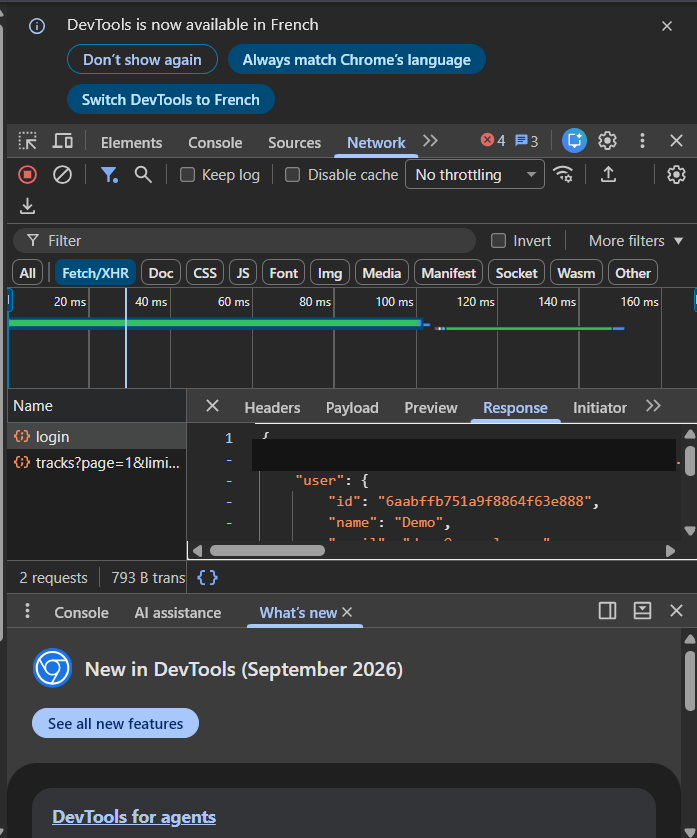

**Conclusion.** Les deux routes se comportent exactement comme documenté
dans `API_CONTRACT.md` et dans le diagramme de séquence de la Mission 0 :
aucun header `Authorization` sur ces deux appels (routes publiques), corps
JSON attendu, réponse `{ token, user }` en cas de succès. Point validé sans
modification de code.

### Vérification — Point 4 : sauvegarde du JWT sans l'afficher dans les logs

Comme pour le point 3, aucun code à écrire : ce point était déjà couvert
par le starter, vérification uniquement.

Deux exigences distinctes regroupées dans ce point :

1. **Persistance côté navigateur**, dans `AuthService.storeAuthentication()` :
   ```ts
   private storeAuthentication(response: AuthResponse): void {
     localStorage.setItem('gpc_token', response.token);
     this.token.set(response.token);
     this.currentUser.set(response.user);
   }
   ```
   `localStorage` survit à un rechargement de page (lu une seule fois au
   démarrage de l'app pour initialiser le Signal :
   `signal<string | null>(localStorage.getItem('gpc_token'))`) ; le Signal
   `token` est la copie active relue par `authInterceptor` à chaque requête
   sortante pour poser le header `Authorization`. `logout()` nettoie les
   deux à la fois (`localStorage.removeItem` + `token.set(null)`).

2. **Aucun affichage dans les logs** : recherche de `console.log`/`debug`/
   `info` mentionnant le token dans tout `frontend-starter/src` — aucun
   résultat. Le JWT ne transite donc jamais par la console du navigateur.

**Conclusion.** Les deux volets du point 4 sont satisfaits par le code
existant (`AuthService`), sans modification nécessaire.

### Vérification — Point 5 : mise à jour du Signal `currentUser`

Aucun code à écrire : les 4 endroits qui doivent faire évoluer l'identité
de l'utilisateur connecté mettent déjà tous à jour `currentUser` dans
`AuthService` :

| Action | Méthode | Effet sur `currentUser` |
|---|---|---|
| Connexion | `login()` → `storeAuthentication()` | `set(response.user)` |
| Inscription | `register()` → `storeAuthentication()` | `set(response.user)` |
| Chargement du profil | `profile()` | `set(user)` (résultat de `GET /api/users/me`) |
| Modification du nom | `update()` | `set(user)` (résultat de `PUT /api/users/me`) |
| Déconnexion | `logout()` | `set(null)` |

`profile-page.html` consomme ce Signal directement (`@if (auth.currentUser(); as user)`).

**Conclusion.** Point déjà satisfait par le starter, aucune modification
nécessaire.

#### Nuance importante : `token` et `currentUser` ne survivent pas pareil à un rechargement

Les deux Signals sont initialisés très différemment dans `AuthService` :

```ts
readonly currentUser = signal<User | null>(null);
readonly token = signal<string | null>(localStorage.getItem('gpc_token'));
```

- **`token`** est **ré-hydraté** depuis `localStorage` dès la création du
  service — donc dès le tout premier chargement de l'app, y compris après
  un F5. Une session reste donc valide après rechargement.
- **`currentUser`** démarre systématiquement à `null`, quoi qu'il arrive.
  Rien ne le recharge automatiquement depuis `localStorage` (et ça ne
  pourrait pas être aussi simple : contrairement au token, `currentUser`
  n'est pas stocké dans `localStorage`, seulement en mémoire — il ne peut
  redevenir non-`null` qu'en rappelant `profile()`, c'est-à-dire en
  refaisant une requête réseau vers `GET /api/users/me`).

**Conséquence concrète.** Juste après un F5 sur une page quelconque de
l'app (y compris une route protégée comme `/tracks`), on est dans un état
où :
- `auth.token()` est non-`null` → **`authGuard` laisse passer**, l'utilisateur
  reste bien connecté au sens API (le header `Authorization` est toujours
  posé par `authInterceptor` sur les requêtes suivantes) ;
- `auth.currentUser()` vaut `null` → **tout template qui afficherait des
  infos du profil** (nom, email...) **sans avoir explicitement rappelé
  `profile()` auparavant montrerait un utilisateur "vide"**, alors que la
  personne est bel et bien authentifiée.

Aujourd'hui, ça ne casse rien de visible : la seule page qui lit
`currentUser()` est `/profile`, et elle exige un clic manuel sur "Charger
mon profil" avant d'afficher quoi que ce soit — donc pas de faux "non
connecté" affiché par erreur. **Mais c'est un piège classique** si on
ajoute plus tard un élément d'UI qui suppose `currentUser` toujours à jour
dès qu'on est authentifié (ex. "Bonjour, {{ nom }}" dans le header de
`app.html`, ou un affichage conditionnel basé sur `currentUser()` plutôt
que sur `token()` pour savoir si on est connecté) : ça donnerait
l'impression, après un simple F5, que l'utilisateur est déconnecté ou que
son profil a disparu, alors qu'il suffirait de refaire l'appel `/me`.

**Décision à prendre plus tard, pas maintenant.** Deux options possibles
au moment d'implémenter le point 8 (chargement de `/api/users/me`) :
1. Garder le fonctionnement actuel (chargement à la demande, sur clic) —
   plus simple, mais le piège ci-dessus reste présent pour tout futur
   affichage global du profil.
2. Faire charger `profile()` automatiquement dès que `token()` est non-null
   au démarrage de l'app (par ex. dans `AppComponent` ou via un
   `APP_INITIALIZER`), pour que `currentUser` soit toujours cohérent avec
   `token` sans action de l'utilisateur.

Aucune des deux n'est exigée par le sujet du TP1 tel quel — c'est noté ici
pour ne pas être surpris plus tard, et pour trancher en connaissance de
cause au bon moment plutôt que de découvrir le problème via un bug.

### Vérification — Point 6 : redirection après connexion/inscription réussie

Aucun code à écrire ni à modifier côté UI : la redirection est déjà câblée
dans les deux composants, uniquement en cas de succès (`next`, jamais dans
`error`) :

| Action | Fichier | Redirection |
|---|---|---|
| Connexion | `login-page.ts` → `submit()` | `router.navigateByUrl('/tracks')` |
| Inscription | `register-page.ts` → `submit()` | `router.navigateByUrl('/profile')` |

```ts
this.auth.login(values.email, values.password).subscribe({
  next: () => {
    console.debug('[LoginPage] Connexion réussie');
    void this.router.navigateByUrl('/tracks');
  },
  error: (error) => { /* ... affiche error(), pas de redirection ... */ },
});
```

Les deux `console.debug(...)` présents n'affichent qu'un texte fixe (pas le
token ni le mot de passe), donc sans conflit avec le point 4.

**Conclusion.** Point déjà satisfait par le starter, aucune modification
nécessaire. Vérification faite par lecture du code (comportement
client-side, pas de requête réseau à capturer dans Network pour ce point).

### Plan et implémentation — Point 7 : bouton de déconnexion + nettoyage de l'état local

**Constat de départ.** `AuthService.logout()` existait déjà et nettoie bien
l'état (`localStorage.removeItem`, `token.set(null)`,
`currentUser.set(null)`) — seul le déclencheur UI manquait :
`AppComponent` n'injectait pas `AuthService` et le nav (`app.html`) n'avait
que 3 liens statiques, aucun bouton.

**Décision de conception validée avant codage** : après clic sur
"Déconnexion", redirection vers `/login` (sinon une page protégée comme
`/tracks` resterait affichée jusqu'au prochain clic, alors qu'elle ne
devrait plus être accessible).

**Fichiers modifiés :**

| Fichier | Changement |
|---|---|
| `app.ts` | `inject(AuthService)` + `inject(Router)` ; méthode `logout()` → `auth.logout()` puis `router.navigateByUrl('/login')` |
| `app.html` | Bouton "Déconnexion" affiché uniquement si `auth.token()` ; lien "Connexion" affiché sinon |

```ts
logout(): void {
  this.auth.logout();
  void this.router.navigateByUrl('/login');
}
```

`npm run build` : succès après implémentation.

#### Suite donnée aux retours de test manuel (3 changements)

Après test par l'utilisateur, trois ajustements complémentaires ont été
demandés, cadrés puis implémentés dans la foulée (mêmes 3 fichiers) :

**1. Incohérence de style entre le bouton et les liens du nav.** Cause
identifiée : la règle globale `button { ... }` (`styles.css`) stylise déjà
tous les `<button>` de l'app de façon identique (aucune surcharge par
composant) — ce n'est donc pas un problème de bouton-vs-bouton. Le vrai
contraste était entre le nouveau bouton "Déconnexion" (pilule verte) et les
liens `<a>` du nav, stylés uniquement en blanc sans fond
(`header a { color: white; }`). Correction : nouvelle règle
`header nav a, header nav button` donnant aux liens du nav le même
padding/fond/arrondi que le bouton — `<a>` et `<button>` restent
sémantiquement corrects en HTML (navigation vs action), seul le rendu est
unifié. Les autres `<a>` de l'app (ex. "Créer un compte" sur `/register`)
ne sont pas concernés.

**2. Afficher qui est connecté.** Ajout de
`Connecté : {{ user.name }}` dans le header (`app.html`), visible sur
toutes les pages puisque `AppComponent` est le layout commun. Ça a
nécessité de régler la nuance notée au point 5 :
`currentUser` repart à `null` à chaque démarrage de l'app (pas persisté,
contrairement au token) — sans rien faire, le nom serait resté invisible
après un simple F5. Solution retenue à ce stade (option 2 du point 5) :
`AppComponent` appelle `auth.profile()` une fois, dans son constructeur, si
un token existe déjà :
```ts
constructor() {
  if (this.auth.token()) {
    this.auth.profile().subscribe({ error: () => {} });
  }
}
```
Le `error: () => {}` est volontairement minimal à ce stade — la gestion
propre d'un token invalide/expiré est le rôle du point 10 (401 → retour
`/login`), pas encore implémenté.

**3. Cacher "Profil"/"Backing tracks" quand déconnecté.** Les deux liens
sont désormais dans le même `@if (auth.token())` que le bouton
Déconnexion ; seul "Connexion" reste visible dans le `@else`.

`npm run build` : succès après ces 3 changements.

**Rendu final (preuve en capture).**

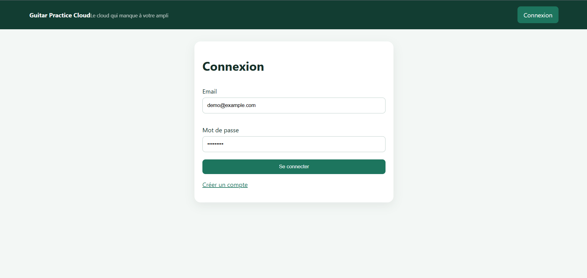

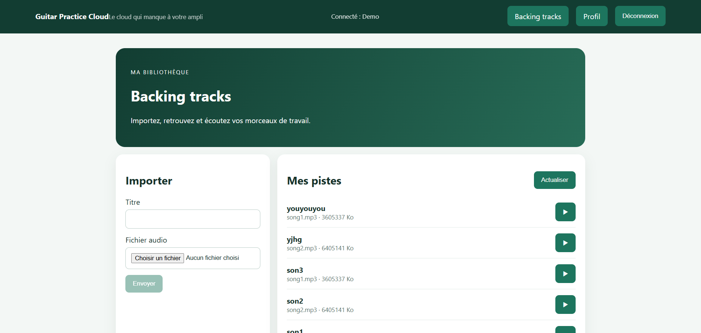

#### Question posée en test : pourquoi rien dans Network au clic sur "Déconnexion" ?

**Réponse.** C'est le comportement normal et attendu, pas un bug. Un JWT
est **stateless** : le backend ne conserve aucune trace des tokens émis
(pas de table de sessions), il se contente de vérifier la signature et
l'expiration à chaque requête — il n'y a donc rien à "annuler" côté
serveur. Confirmé par l'absence totale d'une route `logout` dans
`API_CONTRACT.md` et `backend/src/app.js`. Se déconnecter ne veut dire
qu'une chose ici : **l'app oublie son propre token** (`localStorage` +
Signal), entièrement côté client — aucune requête HTTP n'est donc émise ni
attendue.

**Limite connue, hors scope de ce TP** : un token JWT émis avant la
déconnexion reste *techniquement* valide côté serveur jusqu'à son
expiration naturelle (pas de révocation possible sans état serveur
supplémentaire) — une vraie protection viendrait d'une courte durée de vie
de token + un mécanisme de refresh token.

### Plan et implémentation — Points 8+9 : chargement et modification du profil

**Bug trouvé en test manuel (point 8).** Avant correction, `/profile`
affichait déjà les infos (nom, email, date d'inscription) sans qu'aucune
requête `GET /api/users/me` n'apparaisse dans Network — seules `login` et
`tracks?page=1&limi...` étaient présentes :


**Cause.** Dans `profile-page.ts`, le bouton "Charger mon profil" déclenche
bien `auth.profile()` (donc un vrai `GET /api/users/me`) au clic, mais le
template affiche les données via `@if (auth.currentUser(); as user)` — un
Signal **partagé globalement** par `AuthService`, déjà rempli avant même
d'arriver sur `/profile` (par la réponse du login, qui remplit
`currentUser` via `storeAuthentication()`, et/ou par le rechargement
automatique ajouté au point 7 dans `AppComponent`). Résultat : la page
affichait des données venues d'ailleurs, sans jamais avoir elle-même
"demandé" le profil — en plus de contredire l'intitulé du point, ça
empêchait de produire la capture "Lecture `/api/users/me`" exigée par le
Checkpoint du TP1.

**Correction appliquée.** Un seul fichier modifié,
`frontend-starter/src/app/components/profile-page/profile-page.ts` :
appel de `this.load()` dans le **constructeur** du composant, pour qu'un
`GET /api/users/me` parte systématiquement dès l'arrivée sur `/profile`
(cette navigation constitue le vrai "profil demandé"), sans dépendre d'un
état global déjà rempli par autre chose. Le bouton "Charger mon profil"
est conservé tel quel, comme action de rafraîchissement manuel.

```ts
constructor() {
  this.load();
}
```

`npm run build` : succès. Vérifié après correction : `GET /api/users/me`
apparaît bien systématiquement à l'arrivée sur `/profile`.


**Point 9 — modification du nom.** Aucun changement nécessaire :
`save()` appelle déjà `auth.update(name)` → `PUT /api/users/me`, confirmé
fonctionnel par le test manuel (nouveau nom "Test" envoyé, `200 OK`, et
propagé jusqu'au Signal `currentUser` — visible dans le header, "Connecté :
Test", cohérent avec le point 5) :

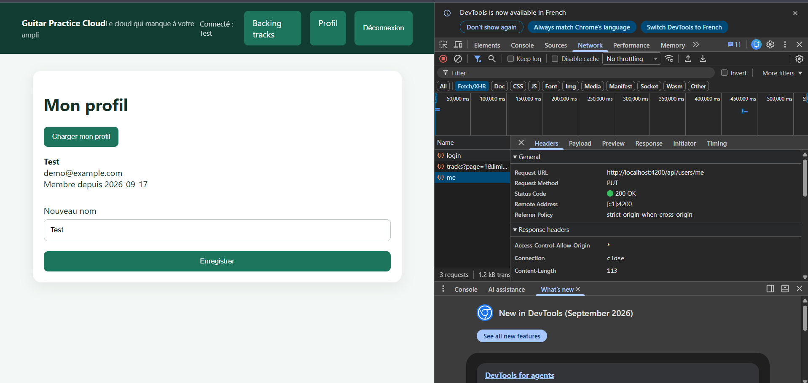

### Plan et implémentation — Point 10 : gestion d'un 401, retour vers `/login`

**Objectif.** `authGuard` vérifie uniquement que `token()` existe, jamais
qu'il est encore valide côté serveur. Sans rien de plus, un token
expiré/invalide laisse l'app dans un état incohérent : visuellement
connecté (nav, header) mais chaque appel API échoue silencieusement en
`401`. Le but : dès qu'une requête renvoie `401`, traiter ça comme une
session invalide — nettoyer l'état local et rediriger vers `/login`.

**Fichier ciblé et repérage.** `authInterceptor`
(`shared/interceptors/auth.interceptor.ts`) : seul point de passage de
**toutes** les requêtes et réponses HTTP de l'app, cohérent avec la règle
déjà en place (composant → service → HttpClient → API, jamais de logique
dupliquée par page). Il ne faisait jusqu'ici qu'ajouter le header, sans
observer la réponse.

**Point de conception important.** Un `401` sur `/api/auth/login` (mauvais
mot de passe) ne doit **pas** déclencher ce nettoyage/redirection — ce
cas est déjà géré localement par `login-page.ts` (affichage du message
d'erreur). Le critère retenu : ne réagir que si un **token était attaché**
à la requête qui a échoué (donc uniquement les routes protégées) ; un
`401` sur une requête sans token reste géré tel quel par le composant
appelant.

**Implémentation :**
```ts
export const authInterceptor: HttpInterceptorFn = (request, next) => {
  const auth = inject(AuthService);
  const router = inject(Router);
  const token = auth.token();

  const authorizedRequest = token
    ? request.clone({ setHeaders: { Authorization: `Bearer ${token}` } })
    : request;

  return next(authorizedRequest).pipe(
    catchError((error: HttpErrorResponse) => {
      if (token && error.status === 401) {
        auth.logout();
        void router.navigateByUrl('/login');
      }
      return throwError(() => error);
    }),
  );
};
```

`npm run build` : succès.

**Test manuel et point de confusion résolu.** Première tentative de test :
corrompre la valeur de `gpc_token` dans `localStorage` (DevTools) **sans
recharger la page**, puis déclencher un appel API — aucun `401` ne se
produisait, l'app restait "connectée". Ce n'était pas un bug : le Signal
`token` d'`AuthService` ne lit `localStorage` qu'**une seule fois**, à la
création du service (`signal<string | null>(localStorage.getItem('gpc_token'))`).
Modifier `localStorage` directement ne touche pas ce Signal déjà en
mémoire — toutes les requêtes continuaient donc à partir avec l'ancien
token, toujours valide. En rechargeant la page (F5), le Signal se
ré-hydrate depuis la valeur corrompue : la première requête protégée
échoue bien en `401`, l'intercepteur nettoie l'état (`token`/`currentUser`
à `null`, `localStorage` vidé) et redirige vers `/login` — confirmé par
test manuel, header repassé en mode déconnecté (plus de "Connecté : ...",
seul "Connexion" visible dans le nav).

**Conclusion.** Mission 1 (TP1) complète : les 10 points sont désormais
implémentés/vérifiés.

### Questions du sujet

**Modèle IA utilisé, suivi de consommation, conseils de choix de modèle.**
Assistant utilisé : Claude Code (CLI/extension), modèle **Claude Sonnet 5**
(`claude-sonnet-5`) — voir l'en-tête de `RAPPORT_IA_MODELE.md`. Suivi de
consommation : Claude Code affiche la taille de contexte restante en
continu dans la session (pas un compteur de coût en euros ici, puisqu'il
ne s'agit pas d'un usage direct de l'API facturée à l'usage) ; pour un
usage via l'API Anthropic, le détail tokens/coût se trouve dans la console
développeur du fournisseur (cf. `CONSEILS_POUR_UTIISER_ASSISTANT_AI.md`,
§10 "À propos des tokens consommés"). Pour choisir un modèle, ce même
document conseille de **demander conseil à l'assistant lui-même** avec un
prompt dédié (comparer les modèles disponibles pour la tâche en cours),
ou de se référer à la documentation officielle du fournisseur — pas de
règle universelle, le choix dépend de la complexité de la tâche (§10 : un
modèle rapide pour une explication simple, un modèle plus capable pour un
diagnostic ou une architecture).

**Routes backend utilisées par cette mission.**

| Route | Méthode | Auth | Utilisée pour |
|---|---|---|---|
| `/api/auth/register` | `POST` | non | Inscription (point 3) |
| `/api/auth/login` | `POST` | non | Connexion (point 3) |
| `/api/users/me` | `GET` | JWT | Chargement du profil (point 8) |
| `/api/users/me` | `PUT` | JWT | Modification du nom (point 9) |

**Où s'effectue "mise à jour du profil utilisateur" (fichiers back/front).**

- **Backend** : `backend/src/app.js`, lignes 249-268 — route
  `app.put("/api/users/me", auth, ...)`, protégée par le middleware
  `auth`. Utilise `User.findByIdAndUpdate(req.auth.sub, { $set: { name: req.body?.name } }, { new: true, runValidators: true })`
  puis renvoie `user.toPublic()`.
- **Frontend** : `profile-page.html` (`(ngSubmit)="save()"` sur le
  formulaire "Nouveau nom") → `profile-page.ts` méthode `save()` → appelle
  `AuthService.update(name)` (`auth.service.ts`) → `HttpClient.put('/api/users/me', { name })`,
  passé par `authInterceptor` (ajout du header `Authorization`) → au
  succès, `tap: currentUser.set(user)` répercute le changement partout où
  `currentUser` est affiché (formulaire, header — cf. point 5 et 7).

## Checkpoint — Onglet Network

Pour chaque capture : méthode, URL, corps JSON, statut, réponse, présence de
`Authorization`. **Ne jamais capturer un mot de passe ou un JWT en clair**
(valeurs sensibles floutées sur les captures qui en contenaient — voir
point 3). Les 3 cas demandés ont déjà été capturés au fil des points
ci-dessus plutôt que refaits à l'identique ici :

1. **Connexion réussie** (`POST /api/auth/login` → `200 OK`, sans
   `Authorization` car route publique, réponse `{ token, user }` avec
   token flouté) : voir point 3,
   [captures/tp1-mission1-point3-login-200-headers.png](captures/tp1-mission1-point3-login-200-headers.png)
   et
   [captures/tp1-mission1-point3-login-response.png](captures/tp1-mission1-point3-login-response.png).
2. **Connexion refusée** (`POST /api/auth/login` → `401 Unauthorized`,
   mauvais mot de passe) : voir point 3,
   [captures/tp1-mission1-point3-login-401-headers.png](captures/tp1-mission1-point3-login-401-headers.png).
3. **Lecture `/api/users/me`** (`GET /api/users/me` → `200 OK`, header
   `Authorization: Bearer ...` présent, déclenché automatiquement à
   l'arrivée sur `/profile`) : voir point 8,
   [captures/tp1-mission1-point8-apres-get-users-me.png](captures/tp1-mission1-point8-apres-get-users-me.png).
   **Modification** `/api/users/me` (`PUT` → `200 OK`) : voir point 9,
   [captures/tp1-mission1-point9-put-users-me.png](captures/tp1-mission1-point9-put-users-me.png).

## Livrables TP1

- [x] Code frontend complété — 10/10 points de la Mission 1
- [x] Schéma annoté du flux de connexion — diagramme de séquence "Se
      connecter" dans Mission 0, ci-dessus
- [x] Capture Network d'une requête d'authentification — voir Checkpoint
      ci-dessus et point 3
- [x] Explication Signal vs `localStorage`
- [x] `RAPPORT_IA_MODELE.md` mis à jour pour chaque mission — entrées 0.1
      à 1.10

### Signal vs `localStorage`

Les deux servent à conserver un état, mais à des niveaux différents et
pour des raisons différentes — c'est tout l'enjeu de la nuance découverte
au point 5.

**`localStorage`** est un espace de stockage **du navigateur**, sous forme
de paires clé/valeur en **texte brut**. Il survit à un rechargement de
page, à la fermeture de l'onglet, même à un redémarrage du navigateur —
seul un `localStorage.removeItem(...)`, un `clear()` manuel ou une
navigation privée le vide. Mais il n'est **pas réactif** : rien dans
Angular ne se met à jour automatiquement si sa valeur change (on l'a
constaté au point 10 — modifier `gpc_token` dans `localStorage` en direct
ne change rien tant que rien ne relit explicitement cette valeur).

**Un Signal** (`token`, `currentUser`) est une valeur **réactive**, en
mémoire uniquement : tout template qui le lit (`auth.token()`,
`auth.currentUser()`) se met à jour automatiquement dès qu'il change, sans
code de rafraîchissement manuel. Mais il ne survit à **rien** : un
rechargement de page réinitialise l'application, et donc tous les Signals
repartent de leur valeur par défaut (`null` pour `currentUser`).

**Pourquoi les deux ensemble, dans `AuthService` :**

```ts
readonly currentUser = signal<User | null>(null);
readonly token = signal<string | null>(localStorage.getItem('gpc_token'));
```

- `token` est **initialisé** depuis `localStorage` à la création du
  service (donc à chaque démarrage de l'app, y compris après un F5) — ça
  lui donne la **persistance** de `localStorage` tout en restant un Signal
  **réactif** pour le reste de l'app (`authInterceptor`, `authGuard`,
  header) pendant toute la session.
- `currentUser`, lui, n'est **pas** stocké dans `localStorage` (seulement
  les infos "sensibles" à la connexion — le token — y sont mises ; le
  profil utilisateur est reconstruit à la demande via une requête). D'où
  le besoin, découvert au point 5 et traité au point 7, de le
  ré-alimenter explicitement (`auth.profile()`) au démarrage de l'app si
  un token existe déjà, sinon il resterait `null` après un F5 alors que la
  session, elle, reste valide.

En résumé : `localStorage` = mémoire longue durée mais silencieuse (il
faut la relire soi-même) ; Signal = mémoire réactive mais volatile (elle
ne survit pas à un rechargement). Combiner les deux (persistance +
réactivité) demande une étape explicite de "ré-hydratation" au démarrage —
ce que fait `token` nativement, et ce que `currentUser` a dû apprendre à
faire via `AppComponent` et `ProfilePageComponent`.
