# Compte-rendu — TP2 : Bibliothèque Upload et Lecture Audio

> Sujet : `../SUJET_ETUDIANT_TP2.md`. Voir aussi `../backend/analyse.md`,
> `../frontend-starter/analyse.md` et `../RAPPORT_IA_MODELE.md`.

## Prérequis vérifiés

- [x] TP1 fonctionnel (connexion, profil) — 10/10 points de la Mission 1, cf. `TP1.md`
- [x] Backend lancé
- [x] `proxy.conf.json` pointe vers le bon port

## Mission 2 — Bibliothèque paginée

- [x] `TrackService.list(page, limit)` transmet réellement `page`/`limit`
- [x] Signals : `tracks`, `page`, `pages`, `loading`, erreur
- [x] Affichage `@for` / `@empty` / `@if`
- [x] Boutons Précédent/Suivant désactivés aux bornes
- [x] Une requête HTTP par changement de page (pas de découpage local)

### Bilan : ce qui était déjà là vs ce qui a été ajouté

Le sujet précise "implémenter **ou vérifier**" — l'essentiel de cette
mission était déjà fait dans le starter :

| Exigence | État |
|---|---|
| `TrackService.list(page, limit)` → `GET /api/tracks?page=&limit=` | ✅ déjà présent (`track.service.ts`, `params: { page, limit }`) |
| Signal `tracks` | ✅ déjà présent (`tracks-page.ts`) |
| Signal `page` | ✅ déjà présent |
| Signal `pages` | ✅ déjà présent |
| Signal `loading` | ✅ déjà présent |
| Signal erreur | ❌ **absent** → **ajouté** cette mission |
| `@for`/`@empty`/`@if` | ✅ déjà présent (`tracks-page.html`) |
| Boutons Préc./Suiv. désactivés aux bornes | ✅ déjà présent (`[disabled]="page() === 1"` / `pages()`) |
| Une requête HTTP par changement de page | ✅ déjà présent (`go()` → `load()`, pas de découpage local) |

**Seul ajout réel : le Signal `error`.** Avant, un échec de
`GET /api/tracks` (backend indisponible, etc.) ne faisait que passer un
`console.error(...)` — rien de visible pour l'utilisateur, la liste
restait affichée telle quelle (potentiellement obsolète) sans aucune
explication.

**Fichiers modifiés :**

| Fichier | Changement |
|---|---|
| `tracks-page.ts` | Ajout `readonly error = signal('')` ; remis à vide en début de `load()` ; rempli avec `error.error?.message` (ou message par défaut) dans le callback `error` |
| `tracks-page.html` | `@if (error()) { <p class="error">{{ error() }}</p> }` ajouté dans la card "Mes pistes", juste sous le bouton "Actualiser" — même emplacement que "Chargement…", même classe `.error` que sur `/login`/`/register` en TP1 |

```ts
load(): void {
  this.loading.set(true);
  this.error.set('');
  this.service.list(this.page()).subscribe({
    next: (response) => { ...; this.loading.set(false); },
    error: (error: { error?: { message?: string } }) => {
      console.error('[TracksPage] Chargement impossible', error);
      this.loading.set(false);
      this.error.set(error.error?.message ?? 'Chargement des pistes impossible');
    },
  });
}
```

`npm run build` : succès.

**Test manuel (preuve en capture).** Backend coupé volontairement, puis
clic sur "Actualiser" : le message "Chargement des pistes impossible"
s'affiche bien au bon endroit. Comportement noté au passage, cohérent avec
le code (`tracks.set(...)` n'est appelé que dans le callback `next`) : la
liste précédemment chargée **reste affichée** sous le message d'erreur,
plutôt que de disparaître — l'utilisateur garde accès à ses dernières
données connues plutôt que de se retrouver devant une liste vide.

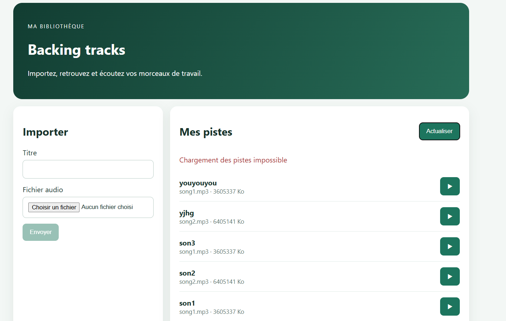

### Preuve Network — une requête HTTP par changement de page

Avec les 5 pistes de test, `limit=5` (valeur par défaut) ne produit qu'une
seule page — impossible de voir les boutons Préc./Suiv. réagir dans ce cas
(ils sont désactivés aux deux bornes en même temps, ce qui est le
comportement attendu, pas un bug). Pour vérifier concrètement le point
"une requête HTTP par changement de page", la limite a été passée
temporairement à `2` dans `tracks-page.ts` (`this.service.list(this.page(), 2)`),
le temps du test, puis remise à sa valeur par défaut (`5`) juste après —
aucune trace de ce changement ne reste dans le code final.

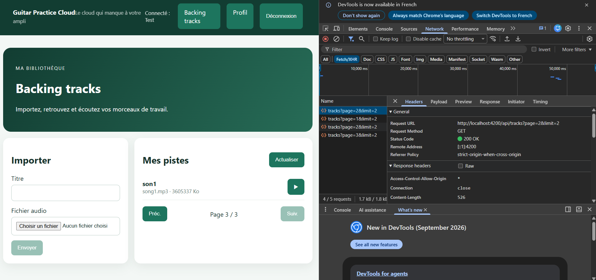

Confirmé : chaque navigation entre pages déclenche une nouvelle requête
`GET /api/tracks?page=...&limit=...` avec le bon numéro de page — aucun
découpage local d'une liste déjà téléchargée.

### AVANCÉ (facultatif)

- [x] Angular Material Paginator
- [ ] Pagination Mongoose (`aggregate-paginate-v2`) — **implique de modifier
      le backend et `API_CONTRACT.md`**

#### Implémentation — `mat-paginator`

Fait après l'installation d'Angular Material pour les cards de la Mission 3
(voir plus bas) — une fois la bibliothèque en place, autant couvrir aussi
ce bonus plutôt que de garder le pager fait maison.

`mat-paginator` est un composant **sans état propre** : il affiche ce
qu'on lui donne (`length`, `pageSize`, `pageIndex`) et émet un événement
`(page)` quand l'utilisateur change de page ou de taille de page — c'est
toujours le composant qui reste responsable de recharger les données.

```html
<mat-paginator
  [length]="total()"
  [pageSize]="limit()"
  [pageIndex]="page() - 1"
  [pageSizeOptions]="[5, 10, 20]"
  (page)="onPage($event)"
></mat-paginator>
```

```ts
// mat-paginator est en index de page 0-based (pageIndex) ; nos Signals
// restent 1-based (page) pour correspondre au contrat de l'API (?page=1).
onPage(event: PageEvent): void {
  this.page.set(event.pageIndex + 1);
  this.limit.set(event.pageSize);
  this.load();
}
```

**Nouveau Signal `total`** (le `limit` existait déjà) : `mat-paginator` a
besoin du nombre total de pistes (`response.total`, renvoyé par l'API
mais jamais récupéré jusqu'ici) pour calculer lui-même le nombre de
pages — le Signal `pages` (qu'on stockait manuellement depuis
`response.pages`) est devenu inutile et a été supprimé.

**Bonus fonctionnel par rapport à l'ancien pager** : l'utilisateur peut
maintenant choisir la taille de page (5/10/20) via le menu déroulant du
paginator, ce que les boutons Préc./Suiv. faits main ne permettaient pas.

**Fichiers modifiés :** `tracks-page.ts` (Signal `total`, suppression de
`pages` et `go()`, méthode `onPage()`) ; `tracks-page.html`
(`<mat-paginator>` à la place de `.pager`) ; `styles.css` (règles `.pager`
orphelines supprimées).

`npm run build` : succès.

#### Correctif — `mat-paginator` en anglais par défaut

Trouvé via le harnais de test automatisé mis en place plus tard dans la
session (voir "Mise en place d'un harnais de test automatisé"
ci-dessous), pas par un test manuel : `mat-paginator` affiche par défaut
ses textes en anglais ("Items per page:", "0 of 0"), alors que toute
l'app est en français. Angular Material expose `MatPaginatorIntl` pour
ça, fourni globalement dans `main.ts` (utile pour tout futur usage de
`mat-paginator` ailleurs dans l'app, pas seulement ici) :

```ts
// shared/i18n/french-paginator-intl.ts
@Injectable()
export class FrenchPaginatorIntl extends MatPaginatorIntl {
  override itemsPerPageLabel = 'Pistes par page :';
  override nextPageLabel = 'Page suivante';
  override previousPageLabel = 'Page précédente';
  override firstPageLabel = 'Première page';
  override lastPageLabel = 'Dernière page';
  override getRangeLabel = (page, pageSize, length) => { /* "X – Y sur Z" */ };
}
```
```ts
// main.ts
{ provide: MatPaginatorIntl, useClass: FrenchPaginatorIntl },
```

`npm run build` : succès. Vérifié par Claude lui-même via le harnais
Playwright — "Pistes par page :" et "0 sur 0" s'affichent bien en
français :

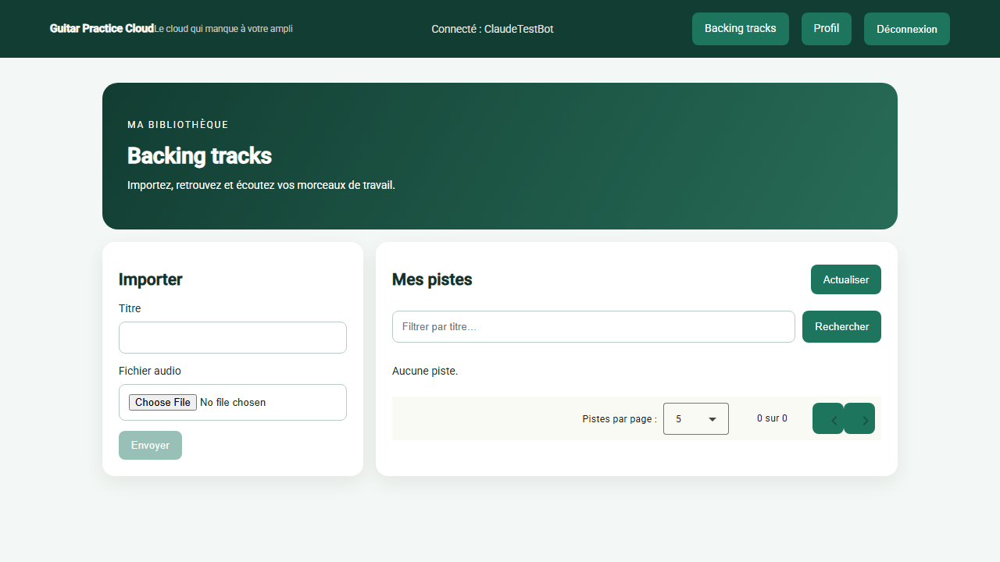

## Mission 3 — Upload et lecture audio

_Identification faite par lecture du code, avant toute modification :_

- **Choix du fichier** : `tracks-page.html:12` (`<input type="file" accept="audio/*" (change)="choose($event)">`) → `tracks-page.ts:26-29` (`choose()`, stocke `this.file`)
- **Construction du `FormData`** : `track.service.ts:17-21` (`upload()` : `body.append('audio', file); body.append('title', title)`)
- **Appel HTTP d'upload** : `track.service.ts:21` (`this.http.post<Track>('/api/tracks', body)`)
- **Récupération du `Blob`** : `track.service.ts:24-28` (`audio(id)`, `responseType: 'blob'`)
- **Création de l'`ObjectURL`** : `tracks-page.ts:67-77` (`play()`, `URL.createObjectURL(blob)`)
- **Affectation au lecteur `<audio>`** : `tracks-page.html:41` (`<audio [src]="audioUrl()" controls autoplay>`)
- **Révocation de l'ancienne URL** : `tracks-page.ts:71-72` — mais **seulement** de l'URL précédente à chaque nouvelle lecture ; **pas encore** à la destruction du composant (pas de `ngOnDestroy`, cf. checklist ci-dessous)

### Flux expliqué avec mes mots

- **Upload** : composant (`choose()` récupère le fichier depuis l'`<input>`) →
  service (`TrackService.upload()` construit le `FormData` avec exactement
  les champs `audio` et `title` attendus par le backend) → `HttpClient`
  (`post()`, passé par `authInterceptor`) → API (`POST /api/tracks`,
  `multer.single('audio')`, réponse `201` avec la piste créée).
- **Lecture** : API (`GET /api/tracks/:id/audio`, protégée par JWT,
  `res.sendFile` — streaming depuis le disque, pas un fichier en mémoire
  côté serveur) → `Blob` (`TrackService.audio()`, `responseType: 'blob'`,
  le corps de la réponse est assemblé en un objet binaire unique une fois
  la requête terminée) → `ObjectURL` (`URL.createObjectURL(blob)`, une URL
  locale `blob:...` qui pointe vers ce `Blob` en mémoire) → lecteur audio
  (`<audio [src]="audioUrl()">`, lit directement cette URL locale, sans
  requête réseau supplémentaire).
- **Intercepteur JWT sur la requête audio** : le même `authInterceptor`
  que pour toutes les requêtes — `service.audio(id)` passe par
  `HttpClient`, donc par l'intercepteur, qui ajoute
  `Authorization: Bearer <token>` avant l'envoi. Vérifié concrètement dans
  DevTools :

  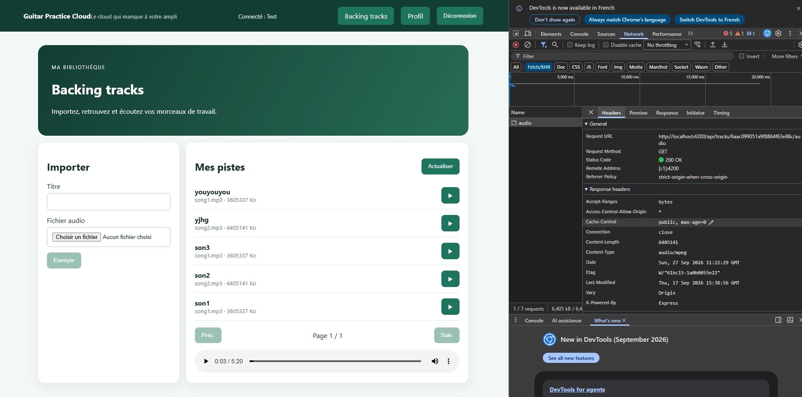

  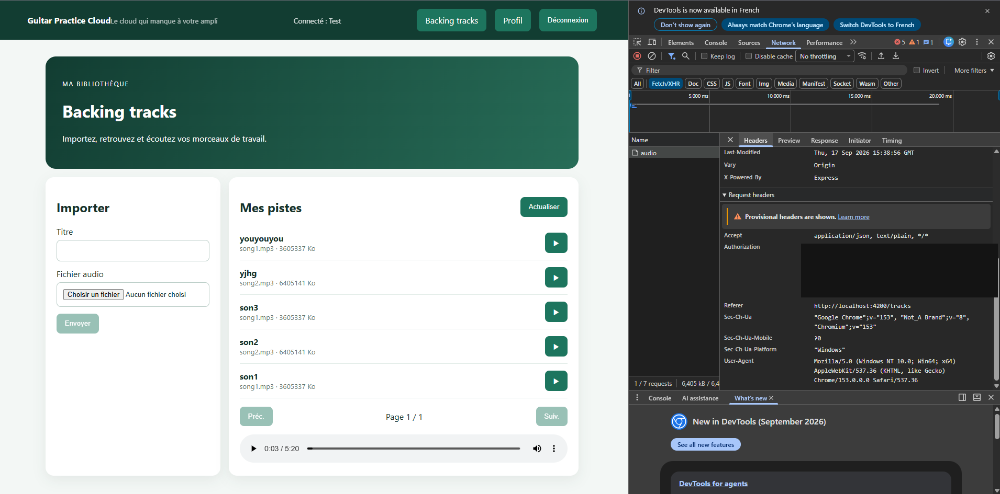

- **Pourquoi une URL directe dans `src` ne reçoit pas le header
  `Authorization`** : `authInterceptor` n'agit que sur les requêtes faites
  **via `HttpClient`**. Un `<audio src="/api/tracks/xxx/audio">` HTML
  classique déclencherait une requête faite directement par le
  **navigateur**, qui ne passe jamais par Angular ni par `HttpClient` —
  donc jamais par l'intercepteur, donc pas de header `Authorization` →
  `401`. C'est exactement pour ça que le code télécharge d'abord le
  `Blob` via `HttpClient` (avec le JWT), puis crée une URL locale que
  `<audio src>` peut utiliser directement, sans requête réseau
  supplémentaire cette fois.

### Contrôles déjà en place côté backend (`backend/src/app.js`)

| Contrôle | Ligne | Détail |
|---|---|---|
| Champ fichier obligatoire (`audio`) | 340-343 | `upload.single("audio")`, `400` si `!req.file` |
| Taille max | 31, 108 | `MAX_FILE_SIZE = 25 * 1024 * 1024` |
| Types autorisés | 34-41, 109-119 | `Set` de 6 MIME types (`audio/mpeg`, `audio/wav`, `audio/x-wav`, `audio/ogg`, `audio/mp4`, `audio/x-m4a`), rejet via `fileFilter` |
| Ownership à la lecture | 381-384 | `Track.findOne({ _id, ownerId: req.auth.sub })` → `404` sinon |
| Erreurs Multer → HTTP | 446-452 | `400` avec `error.message` |

Côté frontend, **aucune de ces vérifications n'est dupliquée avant
l'envoi** : `choose()` accepte n'importe quel fichier
(`accept="audio/*"` n'est qu'une suggestion du sélecteur, pas un
blocage), et `upload()` ne vérifie que `if (!this.file) return`.

### Checklist d'implémentation — état des lieux (avant codage)

| Exigence | État |
|---|---|
| Validation frontend du fichier (type/taille) avant l'appel HTTP | ✅ fait |
| Message d'erreur clair si fichier invalide | ✅ fait |
| État de chargement pendant l'envoi | ✅ fait |
| Bouton désactivé, anti double-soumission | ✅ fait |
| Affichage des erreurs serveur (upload) | ✅ fait |
| Message de succès | ✅ fait |
| Formulaire vidé + rechargement page 1 après succès | ✅ déjà fait (`title.setValue(''); file = undefined; page.set(1); load()`) |
| Cards responsives et accessibles | ✅ fait — refonte avec Angular Material (`mat-card`), voir section dédiée ci-dessous |
| Affichage du morceau en cours de lecture | ✅ fait |
| Erreur audio compréhensible | ✅ fait |
| Révocation de l'`ObjectURL` à la destruction du composant | ✅ fait |

**Pourquoi la validation frontend ne remplace jamais la validation
backend.** Le frontend est sous le contrôle total de l'utilisateur (ou de
n'importe quel outil comme `curl`/Postman) — rien n'empêche d'appeler
directement `POST /api/tracks` en contournant complètement Angular. La
validation côté client n'est donc qu'un **confort d'expérience**
(feedback immédiat, pas d'aller-retour réseau inutile pour une erreur
évidente) ; la validation côté serveur (`fileFilter`, `limits.fileSize`
dans `backend/src/app.js`) reste la **seule** garante de l'intégrité des
données, puisque c'est le seul endroit que l'utilisateur ne peut pas
contourner.

### Implémentation — validation frontend + message d'erreur

Les deux points étaient liés (une validation sans message n'aurait aucun
intérêt) et ont été implémentés ensemble. Mêmes règles que le backend
(`allowed`/`MAX_FILE_SIZE` dans `backend/src/app.js`), reproduites côté
client :

```ts
const ALLOWED_AUDIO_TYPES = new Set([
  'audio/mpeg', 'audio/wav', 'audio/x-wav',
  'audio/ogg', 'audio/mp4', 'audio/x-m4a',
]);
const MAX_FILE_SIZE = 25 * 1024 * 1024;

choose(event: Event): void {
  const selected = (event.target as HTMLInputElement).files?.[0];
  this.uploadError.set('');
  this.file = undefined;

  if (!selected) return;

  if (!ALLOWED_AUDIO_TYPES.has(selected.type)) {
    this.uploadError.set('Format non accepté (MP3, WAV, OGG ou M4A uniquement)');
    return;
  }
  if (selected.size > MAX_FILE_SIZE) {
    this.uploadError.set('Fichier trop volumineux (25 Mo maximum)');
    return;
  }

  this.file = selected;
}
```

**Fichiers modifiés :** `tracks-page.ts` (constantes de validation, Signal
`uploadError`, logique dans `choose()`) ; `tracks-page.html` (`@if
(uploadError())` affiché entre le champ fichier et le bouton "Envoyer").
Si le fichier est invalide, il n'est **pas** stocké dans `this.file` — le
bouton "Envoyer" reste donc désactivé grâce au `[disabled]="!file"` déjà
existant, sans logique supplémentaire à ajouter pour ça.

`npm run build` : succès.

**Correction en cours de test.** Premier message ("Format audio non
accepté") jugé incohérent quand le fichier sélectionné n'est pas du tout
un audio (ex. une image) — corrigé en un message plus générique ("Format
non accepté").

**Preuve de fonctionnement (captures).**

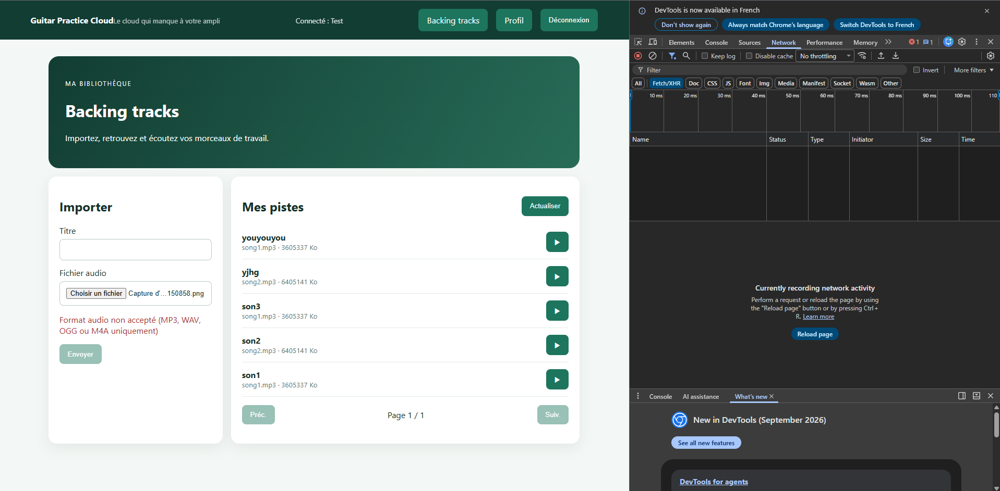

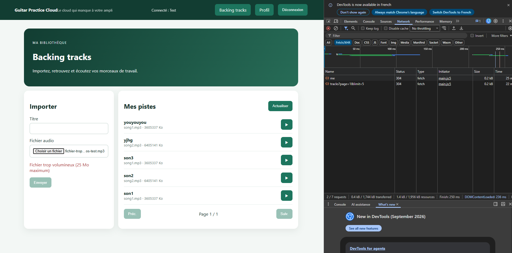

### Implémentation — état de chargement + anti double-soumission

Les deux points traités ensemble : un état de chargement sans désactiver
le bouton pendant ce temps n'aurait pas grand intérêt (l'utilisateur
pourrait cliquer une deuxième fois pendant l'envoi).

```ts
readonly uploading = signal(false);

upload(): void {
  if (!this.file || this.uploading()) return;

  this.uploading.set(true);
  this.service.upload(this.file, this.title.value || this.file.name).subscribe({
    next: (track) => {
      this.uploading.set(false);
      this.title.setValue('');
      this.file = undefined;
      this.page.set(1);
      this.load();
    },
    error: (error) => {
      console.error('[TracksPage] Envoi impossible', error);
      this.uploading.set(false);
    },
  });
}
```

**Fichiers modifiés :** `tracks-page.ts` (Signal `uploading`, garde
`if (!this.file || this.uploading())` en tête de `upload()`, mis à `false`
dans les deux callbacks) ; `tracks-page.html` (`@if (uploading())`
affichant "Envoi en cours…", bouton `[disabled]="!file || uploading()"`).

`npm run build` : succès.

**Test.** Sur `localhost`, même un fichier de plusieurs Mo s'envoie
quasi instantanément (débit local très élevé, la latence est le vrai
facteur limitant, pas la taille) — un fichier `.mp3` factice de 20 Mo
généré pour l'occasion (contenu arbitraire, seule la taille compte ici,
supprimé après le test) n'aurait montré aucun effet visible sans
throttling réseau. Combiné avec le profil "Slow 3G" de DevTools
(Network), le message "Envoi en cours…" et le bouton grisé sont bien
restés visibles le temps de l'upload.

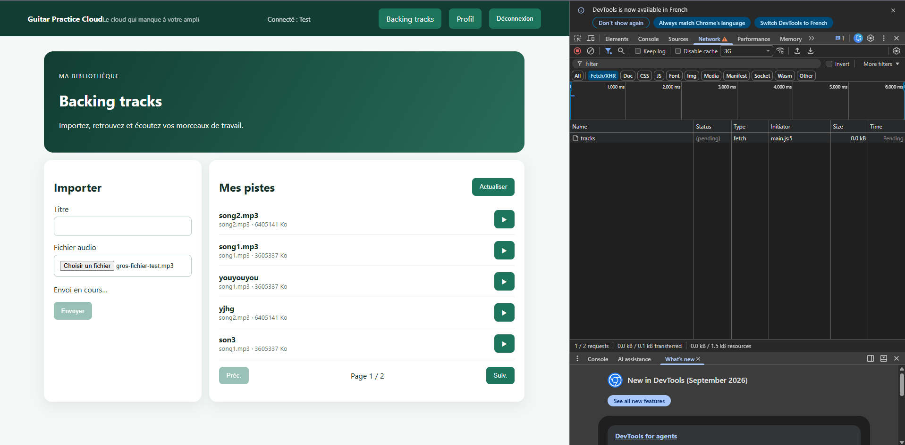

### Implémentation — message de succès + affichage des erreurs serveur

Traités ensemble : ce sont les deux issues possibles de la même action
(`upload()` réussit ou échoue), gérées dans les deux callbacks du même
`subscribe()`, au même emplacement visuel.

```ts
this.service.upload(this.file, this.title.value || this.file.name).subscribe({
  next: (track) => {
    this.uploading.set(false);
    this.uploadSuccess.set(`« ${track.title} » ajoutée avec succès.`);
    this.title.setValue('');
    this.file = undefined;
    this.page.set(1);
    this.load();
  },
  error: (error: HttpErrorResponse) => {
    console.error('[TracksPage] Envoi impossible', error);
    this.uploading.set(false);
    this.uploadError.set(serverErrorMessage(error, "Échec de l'envoi"));
  },
});
```

Signal `uploadSuccess` ajouté (réutilise `uploadError`, déjà en place
pour la validation de fichier, pour le cas erreur — même rôle, même
emplacement). Les deux sont vidés au début de chaque tentative et à
chaque nouvelle sélection de fichier.

**Bug trouvé pendant le test (pas juste un problème de texte).** Backend
coupé volontairement pour tester l'affichage des erreurs serveur : au
lieu d'un message compréhensible, l'app affichait **"Failed to fetch"**
— un message technique du navigateur, pas applicatif :

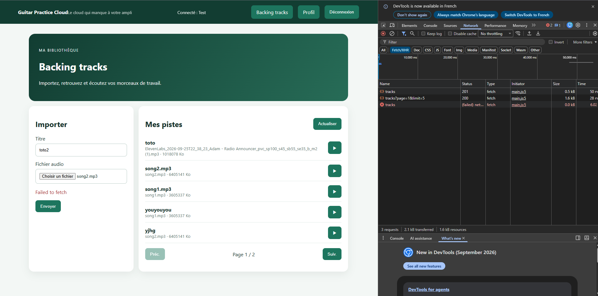

**Cause.** Le code faisait confiance à `error.error?.message` dans tous
les cas. Or `error.status === 0` signifie qu'**aucune réponse n'est
venue du serveur** (connexion refusée) — dans ce cas, `error.error` est
une erreur technique du navigateur (ex. `TypeError: Failed to fetch`),
pas le JSON `{ message: ... }` renvoyé par le backend en cas d'erreur
applicative (`400`, etc.). Une fonction `serverErrorMessage(error, fallback)`
factorise la distinction : le message du backend n'est utilisé que si
`error.status > 0` (une vraie réponse HTTP est arrivée), sinon un message
de repli fixe est affiché. **Appliquée aussi à `load()`** (Mission 2),
qui avait la même faille latente, même si elle ne s'était pas encore
manifestée visiblement.

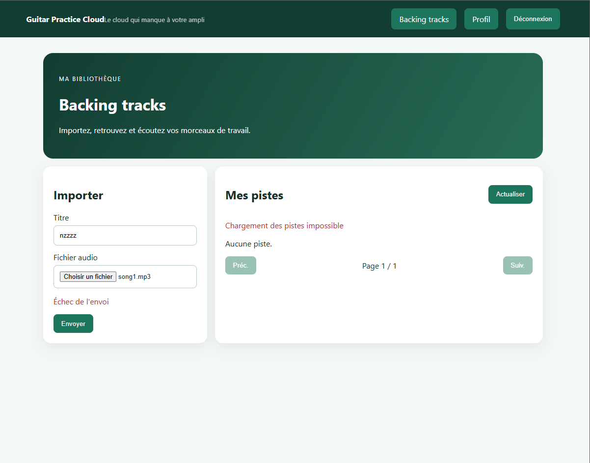

**Ajustements de forme demandés en cours de test :** message de succès
accordé au féminin ("« titre » ajoutée avec succès.", `piste` est
féminin) et couleur verte (nouvelle classe `.success` dans `styles.css`,
symétrique de `.error` déjà existant) pour le distinguer visuellement
d'une erreur.

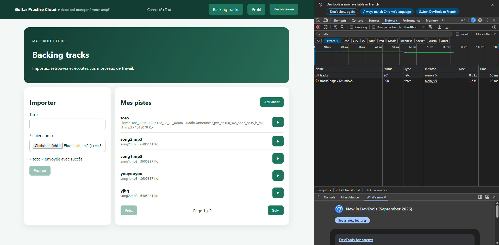

**Fichiers modifiés :** `tracks-page.ts` (fonction `serverErrorMessage()`,
Signal `uploadSuccess`, callbacks `next`/`error` de `upload()` et
`error` de `load()`) ; `tracks-page.html` (`@if (uploadSuccess())` avec
classe `success`) ; `styles.css` (règle `.success`).

`npm run build` : succès à chaque étape.

### Implémentation — affichage du morceau en cours de lecture

**Objectif.** Rien n'indiquait quelle piste correspondait au lecteur
`<audio>` affiché en bas de la liste. Sur demande de l'utilisateur, le
titre de la piste en cours est en plus affiché directement au-dessus du
lecteur, pas seulement dans la liste.

```ts
readonly playingTrack = signal<Track | null>(null);

play(track: Track): void {
  this.service.audio(track.id).subscribe({
    next: (blob) => {
      const previousUrl = this.audioUrl();
      if (previousUrl) URL.revokeObjectURL(previousUrl);
      this.audioUrl.set(URL.createObjectURL(blob));
      this.playingTrack.set(track);
    },
    error: (error) => {
      console.error('[TracksPage] Lecture impossible', error);
      this.playingTrack.set(null);
    },
  });
}
```

Signal `playingTrack` stockant la **piste entière** (pas juste son id),
pour donner accès au titre à deux endroits sans dupliquer de logique :
un badge "▶ En cours de lecture" sous le titre dans la liste
(`@if (track.id === playingTrack()?.id)`) et "Lecture : *titre*"
au-dessus du lecteur `<audio>`. Nouvelle classe CSS `.now-playing`
(texte + couleur, pas seulement une couleur, pour rester accessible aux
lecteurs d'écran).

**Fichiers modifiés :** `tracks-page.ts`, `tracks-page.html`,
`styles.css`.

`npm run build` : succès.

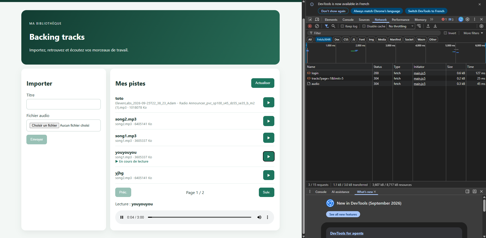

### Implémentation — erreur audio compréhensible

**Deux sources d'erreur distinctes** identifiées avant de coder : la
requête `GET /api/tracks/:id/audio` peut échouer (déjà catchée dans
`subscribe()`, mais juste loggée) ; et le fichier reçu peut être
illisible par le navigateur (événement natif `error` de l'élément
`<audio>`, qui ne passe pas du tout par notre `subscribe()`).

```ts
play(track: Track): void {
  this.audioError.set('');
  this.playbackFailed.set(false);
  this.uploadSuccess.set('');
  this.service.audio(track.id).subscribe({
    next: (blob) => { ...; this.playingTrack.set(track); },
    error: (error: HttpErrorResponse) => {
      // playingTrack n'est volontairement pas touché : si une autre piste
      // jouait déjà, elle continue, seule cette tentative-ci a échoué.
      this.audioError.set(serverErrorMessage(error, 'Lecture impossible'));
    },
  });
}

onAudioError(): void {
  this.audioError.set('Ce fichier audio ne peut pas être lu.');
  this.playbackFailed.set(true);
}
```

**Fichiers modifiés :** `tracks-page.ts` (Signaux `audioError`,
`playbackFailed`, méthode `onAudioError()`) ; `tracks-page.html`
(message d'erreur au-dessus du lecteur, `(error)="onAudioError()"` sur
`<audio>`).

**Test avec un fichier illisible.** Un `.mp3` factice de 50 Ko (contenu
aléatoire, valide pour le type/la taille donc accepté à l'upload, mais
indécodable comme audio) a été généré pour l'occasion, uploadé, puis lu.

**Deux incohérences trouvées pendant le test, corrigées (pas seulement
du texte) :**

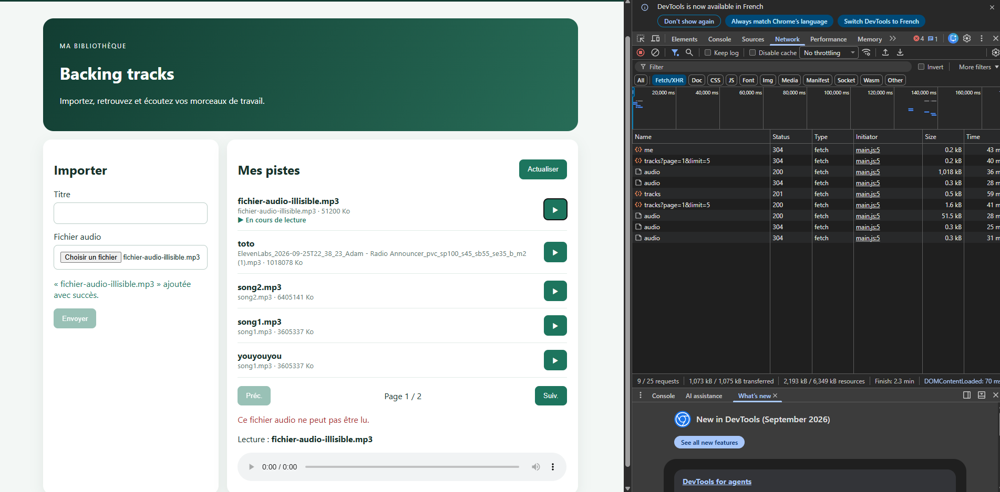

1. **Le badge restait "En cours de lecture" malgré l'échec.** `playingTrack`
   était rempli dès que le `Blob` était téléchargé, avant même de savoir
   si le navigateur pouvait le lire. Correction : nouveau Signal
   `playbackFailed`, mis à `true` uniquement par `onAudioError()` (jamais
   par l'échec HTTP, qui ne doit pas affecter une piste **différente**
   déjà en cours de lecture) ; le badge choisit entre "En cours de
   lecture" et "⚠ Erreur de lecture" selon ce Signal.
2. **Le message de succès de l'upload précédent restait affiché**, même
   après avoir cliqué ▶ sur une autre piste. Correction : `uploadSuccess`
   vidé en tout début de `load()` **et** de `play()` — donc dès qu'une
   autre action se produit (Actualiser, pagination, lecture). A nécessité
   d'inverser l'ordre dans `upload()` (`load()` appelé **avant** de fixer
   le message de succès, sinon `load()` l'aurait effacé lui-même
   aussitôt).

`npm run build` : succès à chaque étape.

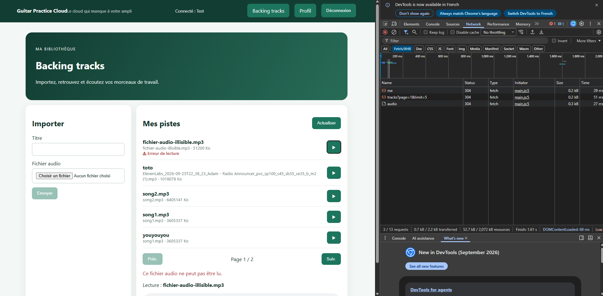

### Implémentation — révocation de l'`ObjectURL` à la destruction du composant

**Objectif.** `play()` révoque déjà l'ObjectURL **précédente** à chaque
nouvelle lecture, mais la **dernière** créée restait en mémoire si
l'utilisateur quittait `/tracks` sans relire une autre piste —
`URL.createObjectURL` garde le `Blob` référencé jusqu'à révocation
explicite, indépendamment du cycle de vie du composant Angular.

```ts
export class TracksPageComponent implements OnDestroy {
  ...
  ngOnDestroy(): void {
    const url = this.audioUrl();
    if (url) URL.revokeObjectURL(url);
  }
}
```

`npm run build` : succès.

**Test (une révocation ne se voit pas à l'écran, vérifié via la
console).** Lecture d'une piste sur `/tracks`, récupération de l'URL du
lecteur (`document.querySelector('audio').src`), puis navigation vers
`/profile`, puis tentative de `fetch()` sur cette même URL depuis la
console :

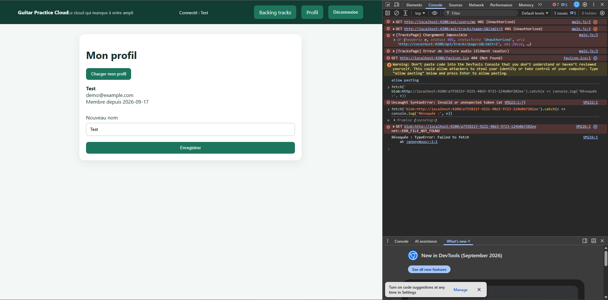

**Fichiers modifiés :** `tracks-page.ts` (`implements OnDestroy`,
méthode `ngOnDestroy()`).

### Implémentation — cards responsives et accessibles (Angular Material)

**Première version, CSS fait maison.** Chaque piste transformée en
mini-card empilée (`<ul>`/`<li>` sémantique plutôt qu'une pile de
`<div>`, métadonnées complètes : format lisible MP3/WAV/OGG/M4A, taille
convertie Ko/Mo, date d'ajout via `DatePipe`). Bug corrigé au passage :
la taille affichait les octets bruts étiquetés "Ko"
(`3605337 Ko` pour un fichier de 3,4 Mo) — nouvelle fonction
`formatFileSize()`.

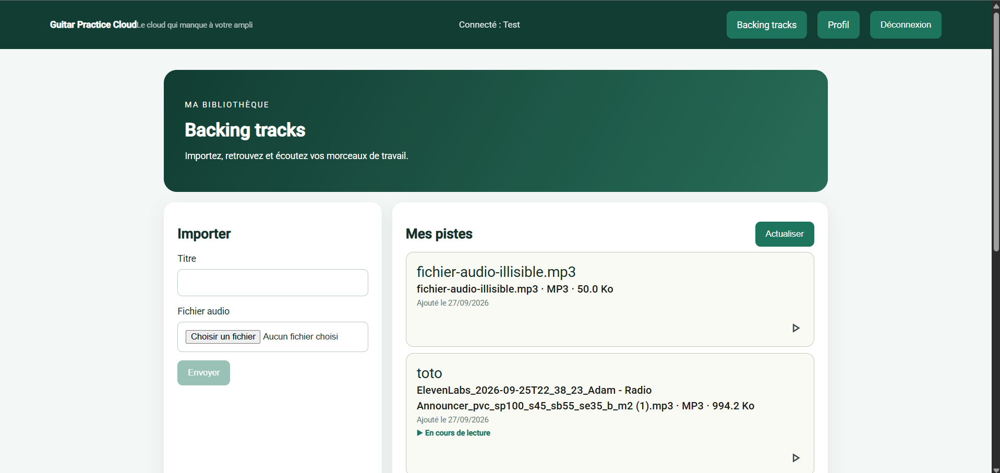

**Passage à Angular Material.** Sur demande explicite de l'utilisateur
("on peut pas utiliser un composant de la bibliothèque graphique
angular ?"), décision prise après consultation (`@angular/material`
n'était pas installé — nouvelle dépendance, donc vraie décision de
projet, pas juste un ajustement de style) :
```
ng add @angular/material --theme=custom --typography --animations=enabled
```
- `@angular/material` + `@angular/cdk` (22.2.1) installés ; **dépendance
  manquante trouvée et corrigée** : `@angular/animations` n'était pas
  installé du tout (`ng add` ne l'ajoute pas automatiquement dans cette
  version), le build échouait (`Could not resolve
  "@angular/animations/browser"`) — ajouté en `22.1.4`, aligné sur le
  reste du projet.
- `provideAnimationsAsync()` ajouté dans `main.ts` (nécessaire pour les
  interactions Material comme le ripple).
- `src/material-theme.scss` (thème Material 3, tokens CSS modernes) :
  palette changée de `mat.$azure-palette` (bleu par défaut) à
  `mat.$green-palette` pour coller au vert de marque.
- **Conflits avec le CSS existant corrigés** : la règle globale
  `button { background: #1d755e; ... }` s'appliquait à *tous* les
  boutons y compris les nouveaux boutons Material — restreinte avec
  `:not([mat-icon-button])` etc. Le fond de page risquait aussi de
  changer (Material pose son propre `background-color` sur `body`) —
  fixé explicitement dans `styles.css`.
- Chaque piste devient un `<mat-card appearance="outlined">`
  (`mat-card-title`/`mat-card-subtitle` pour le texte, bouton de lecture
  en `mat-mini-fab` avec icône Material `play_arrow`).

**Incohérence de couleur trouvée et corrigée.** Le vert "primary" généré
par Material à partir de `mat.$green-palette` ne correspond pas
exactement au vert de marque (`#1d755e`) :

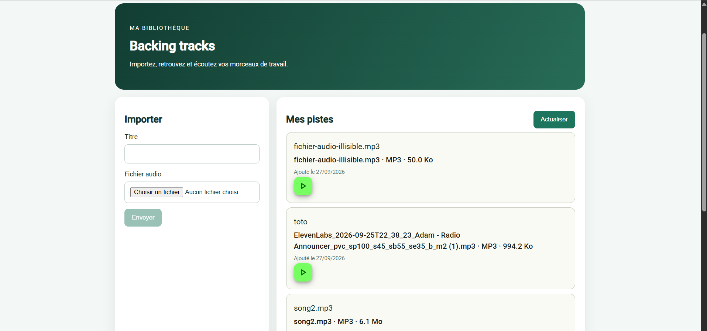

Corrigé en fixant les couleurs directement plutôt que de passer par
`color="primary"` :
```css
/* !important nécessaire pour l'emporter sur les variables CSS internes
   du composant mat-mini-fab. */
.play-fab {
  background-color: #f8faf9 !important;
  color: #1d755e !important;
}
```

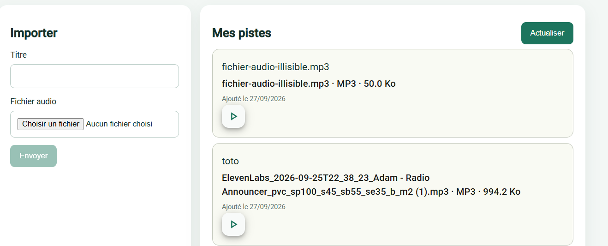

**Espacement corrigé.** Le découpage initial en `mat-card-header` +
`mat-card-content` + `mat-card-actions` séparés laissait un grand vide
vertical (paddings Material empilés). Remplacé par un seul
`mat-card-content` en flex-row (texte à gauche, boutons à droite),
retrouvant la compacité du layout précédent tout en gardant le look
Material.

**Lecteur audio déplacé dans la card correspondante.** Dernier
ajustement demandé : le lecteur `<audio>`, affiché au départ dans un
bloc unique sous la liste ("Lecture : *titre*" + lecteur), a été déplacé
**dans la card de la piste concernée** :
```html
@if (track.id === playingTrack()?.id && audioUrl()) {
  <audio class="track-audio" [src]="audioUrl()" controls autoplay (error)="onAudioError()"></audio>
}
```
Le bloc "Lecture : titre" en bas de liste supprimé (redondant avec le
badge "▶ En cours de lecture" déjà présent dans la card et le lecteur
désormais intégré directement).

**Fichiers modifiés :** `tracks-page.ts`, `tracks-page.html`,
`styles.css`, `main.ts`, `material-theme.scss`, `package.json`
(`@angular/material`, `@angular/cdk`, `@angular/animations`).

`npm run build` : succès à chaque étape.

**11/11 points de la checklist Mission 3 traités — Mission 3 complète.**

### Questions — mémoire, buffering, streaming

**1. Le backend envoie-t-il le fichier entier en mémoire ou
progressivement depuis le disque ?**

Progressivement, en streaming. `backend/src/app.js:394` —
`res.sendFile(audioPath, callback)`. Cette méthode Express utilise en
interne `fs.createReadStream()` et pipe directement ce flux vers la
réponse HTTP, morceau par morceau, plutôt que de charger tout le fichier
en mémoire avant de l'envoyer (ce qu'aurait fait un
`res.send(fs.readFileSync(audioPath))`). Preuve concrète : la réponse
contient l'en-tête `Accept-Ranges: bytes`, ajouté automatiquement par
`res.sendFile` — visible dans la capture Network de la Mission 3
([tp2-mission3-audio-response-headers.png](captures/tp2-mission3-audio-response-headers.png)).
Le callback de `sendFile` ne s'exécute qu'une fois le transfert terminé,
cohérent avec un envoi étalé dans le temps.

**2. Avec `HttpClient` et `responseType: "blob"`, à quel moment le
composant reçoit-il généralement le fichier ?**

Seulement une fois le téléchargement **entièrement terminé**.
`track.service.ts:24-28` (`audio()`) n'active pas `reportProgress: true`
— sans cette option, `HttpClient` assemble toute la réponse en un seul
`Blob` côté navigateur avant de déclencher quoi que ce soit. Dans
`play()` (`tracks-page.ts`), `next: (blob) => ...` ne s'exécute qu'**une
seule fois**, avec le fichier déjà complet — pas de callback progressif
par paquet reçu. Le streaming vu à la question 1 se passe "en transit"
réseau ; côté Angular, le composant n'a aucune visibilité intermédiaire.

**3. Si la bibliothèque contient 100 morceaux, les 100 fichiers audio
sont-ils chargés en mémoire dès l'affichage de la liste ? Justifier à
partir du code.**

Non. Deux garanties dans le code :
- `TrackService.list()` (`track.service.ts:11-15`) ne récupère que du
  JSON de métadonnées (`GET /api/tracks` → titre, nom original, taille,
  id…), jamais de fichier binaire. Le `@for` de `tracks-page.html`
  n'affiche que ces champs texte ; aucun appel à `play()`/`service.audio()`
  n'est déclenché par le simple affichage, seulement par le `(click)` sur
  le bouton ▶ d'une piste précise.
- Même pour la piste effectivement jouée, une seule à la fois reste en
  mémoire : dans `play()`, l'ancienne `ObjectURL` est révoquée
  (`URL.revokeObjectURL(previousUrl)`) **avant** que la nouvelle ne
  remplace le Signal `audioUrl` (qui ne contient qu'une seule valeur, pas
  un tableau).

Conclusion : avec 100 morceaux, 0 fichier audio chargé tant qu'aucun clic
n'a eu lieu, et au maximum 1 en mémoire à tout instant, quel que soit le
nombre total de pistes.

**4. Quelle différence y aurait-il avec 100 éléments `<audio>` utilisant
directement une URL HTTP ?**

Deux différences, dont une bloquante pour cette app précisément :
- **Nombre de requêtes** : avec des `<audio src="...">` directs, le
  navigateur commence à faire des requêtes dès l'affichage (comportement
  natif, pas forcément le fichier entier selon `preload`), au lieu de 0
  requête tant que rien n'est cliqué avec l'approche actuelle.
- **Rupture fonctionnelle totale (pas qu'une question de perf) :**
  `authInterceptor` n'agit que sur les requêtes passées par `HttpClient`.
  Un `<audio src="...">` HTML déclenche une requête faite **directement
  par le navigateur**, qui ne passe jamais par l'intercepteur — donc
  jamais de header `Authorization`. Or la route est protégée
  (`app.get("/api/tracks/:id/audio", auth, ...)` dans
  `backend/src/app.js`) : les 100 requêtes échoueraient toutes en
  `401 Unauthorized`. C'est la vraie raison du passage par
  `HttpClient` + `Blob` + `ObjectURL` : pas une question d'élégance, la
  **seule façon que ça fonctionne** avec des routes protégées par JWT.
  (Bonus, si l'auth n'était pas un problème : les navigateurs limitent les
  connexions simultanées par domaine (~6), donc 100 requêtes d'un coup se
  mettraient en file d'attente au chargement de la page.)

**5. Pourquoi l'URL créée par `URL.createObjectURL` doit-elle être
révoquée ?**

Parce que `URL.createObjectURL(blob)` enregistre une correspondance
**interne au navigateur** entre la chaîne `blob:...` et l'objet `Blob`,
qui maintient ce `Blob` vivant en mémoire tant que le document est
chargé — **indépendamment de toute référence JavaScript**. Écraser la
variable qui pointait vers l'ancienne URL (`this.audioUrl.set(nouvelle)`)
ne suffit donc pas à libérer l'ancien `Blob` : le garbage collector
habituel ne peut rien faire ici, puisque le navigateur garde volontairement
cette référence par conception. `URL.revokeObjectURL()` est le **seul**
moyen de casser ce lien.

Deux endroits de révocation dans le code, pour deux fuites différentes
sans ça :
- `play()` révoque l'ancienne URL à chaque nouvelle lecture (fuite à
  chaque changement de piste sinon) ;
- `ngOnDestroy()` révoque la dernière URL encore active en quittant
  `/tracks` (fuite à chaque navigation hors de la page sinon) — vérifié
  concrètement en testant un `fetch()` sur l'URL après navigation : échec
  (`TypeError: Failed to fetch`), confirmant la révocation
  (`compte-rendu/captures/tp2-mission3-objecturl-revoquee.png`).

## Améliorations facultatives

- [ ] Barre de progression de l'upload
- [x] Suppression avec confirmation
- [x] Rafraîchissement après suppression (regroupé avec le point précédent, même action)
- [x] Formatage lisible taille/date (fait avec les cards, Mission 3 — `formatFileSize()`, `DatePipe`)
- [x] Filtre par titre
- [ ] AVANCÉ — image de couverture (upload ou recherche via tags ID3 / web service)

### Implémentation — suppression avec confirmation + rafraîchissement

**Contrat backend déjà en place**, pas de backend à toucher
(`backend/src/app.js:409-434`) : `DELETE /api/tracks/:id` → `204` si
réussi, `404` si la piste n'existe pas/pas la sienne, `500` si le
fichier physique n'a pas pu être supprimé après la métadonnée.

```ts
// track.service.ts
delete(id: string) {
  return this.http.delete<void>(`/api/tracks/${id}`);
}
```

**Confirmation via `MatDialog`** plutôt qu'un `window.confirm()` basique
— cohérent avec le reste de la page maintenant en Material. Pas de
composant séparé : un `<ng-template>` dans `tracks-page.html`, ouvert
via `MatDialog.open()` :

```html
<ng-template #confirmDeleteDialog let-data>
  <h2 mat-dialog-title>Supprimer « {{ data.track.title }} » ?</h2>
  <mat-dialog-content>
    Cette action est définitive : le fichier audio et ses métadonnées seront supprimés.
  </mat-dialog-content>
  <mat-dialog-actions align="end">
    <button mat-button [mat-dialog-close]="false">Annuler</button>
    <button mat-flat-button color="warn" [mat-dialog-close]="true">Supprimer</button>
  </mat-dialog-actions>
</ng-template>
```

```ts
confirmDelete(track: Track): void {
  this.dialog
    .open(this.confirmDeleteDialog, { data: { track } })
    .afterClosed()
    .subscribe((confirmed) => {
      if (confirmed) this.performDelete(track);
    });
}
```

**Rafraîchissement + nettoyage, regroupés car c'est la même action
(`204` reçu) :**
- si la piste supprimée était celle en cours de lecture, nettoyage du
  lecteur (`URL.revokeObjectURL` + `audioUrl`/`playingTrack` remis à
  vide) plutôt que de laisser "jouer" un fichier qui n'existe plus
  côté serveur ;
- si c'était la **dernière piste d'une page non-1**, recul d'une page
  avant de recharger, pour ne pas atterrir sur une page vide ;
- dans tous les cas, `load()` relance un `GET /api/tracks` à jour.

Bouton désactivé pendant la suppression en cours (Signal
`deletingId`), message d'erreur dédié (`deleteError`, même fonction
`serverErrorMessage()` que pour les autres appels) en cas d'échec
serveur.

**Fichiers modifiés :** `track.service.ts` (`delete()`) ;
`tracks-page.ts` (Signaux `deleteError`/`deletingId`, méthodes
`confirmDelete()`/`performDelete()`, import `MatDialog`) ;
`tracks-page.html` (bouton icône `delete`, `<ng-template>` du
dialogue) ; `styles.css` (`.track-actions`).

`npm run build` : succès. Test manuel confirmé par l'utilisateur :
suppression normale, et suppression de la dernière piste d'une page
non-1 (recul de page vérifié).

### Implémentation — filtre par titre

Demandé explicitement "avec la requête backend" — **premier changement
backend de toute la session** (TP1 et TP2 étaient restés 100% frontend
jusqu'ici), signalé avant de s'y mettre.

**Backend (`backend/src/app.js`).** `GET /api/tracks` accepte un
paramètre `title` optionnel : recherche par sous-chaîne, insensible à la
casse (`$regex` Mongo, `$options: "i"`), combinée au filtre `ownerId`
déjà en place.

```js
const title = typeof req.query.title === "string" ? req.query.title.trim() : "";
const filter = { ownerId: req.auth.sub };

if (title) {
  filter.title = { $regex: escapeRegExp(title), $options: "i" };
}
```

L'entrée utilisateur est échappée (`escapeRegExp()`) avant d'être injectée
dans la regex — sans ça, un titre recherché comme `.*` ou un pattern
pathologique pourrait soit tout matcher, soit faire exploser le temps de
calcul côté serveur (ReDoS). `API_CONTRACT.md` mis à jour dans la même
modification (règle du `CLAUDE.md` backend). Tests backend existants
toujours au vert (`npm test`, 2/2).

**Frontend.** `TrackService.list(page, limit, title)` — `title` ajouté
aux query params seulement s'il est non vide. Champ de recherche au-dessus
de la liste, Signal `titleFilter` (`FormControl`), méthode `applyFilter()`
qui remet `page` à 1 avant de recharger.

**Bug trouvé en test, pas lié au backend.** Premier essai avec un
`<form (ngSubmit)="applyFilter()">` : la recherche ne filtrait jamais,
alors que la requête partait bien (confirmé via DevTools Network :
`GET /api/tracks?page=1&limit=5`, sans `title`). Diagnostic : `ngSubmit`
n'est fourni que par les directives `NgForm` (module `FormsModule`) ou
`FormGroupDirective` (`[formGroup]`, `ReactiveFormsModule`) — le
composant n'importe que `ReactiveFormsModule`, sans `[formGroup]` sur ce
`<form>`. Résultat : `(ngSubmit)` ne se liait à rien côté Angular, et le
clic sur "Rechercher" déclenchait la soumission **native** du navigateur,
qui rechargeait toute la page (donc le champ de recherche repartait à
zéro) — d'où la requête sans filtre observée, qui n'était en fait qu'un
tout nouveau chargement initial après rechargement complet de l'app.

**Correction.** Suppression du `<form>`, remplacé par des handlers
directs :
```html
<input [formControl]="titleFilter" (keyup.enter)="applyFilter()" ... />
<button type="button" (click)="applyFilter()">Rechercher</button>
```
Plus de soumission de formulaire du tout, donc plus aucun risque de
rechargement natif intempestif.

**Fichiers modifiés :** `backend/src/app.js` (paramètre `title`,
fonction `escapeRegExp()`), `API_CONTRACT.md` ; `track.service.ts`,
`tracks-page.ts` (Signal `titleFilter`, méthode `applyFilter()`),
`tracks-page.html`, `styles.css` (`.filter-row`).

`npm run build` (frontend) et `npm test` (backend) : succès. Confirmé
fonctionnel par l'utilisateur après correction du bug `ngSubmit`.

### Mise en place d'un harnais de test automatisé

Question posée par l'utilisateur sur les limites de test de l'assistant
("jusqu'où tu peux faire les tests ?", "il te faudrait quoi pour lancer
l'appli et la tester toi même ?"). Deux capacités mises en place sur
demande ("met en place tout") :

1. **Tests API directs via `curl`** — aucune installation nécessaire.
   Un compte de test jetable (`claude-test-bot@example.com`) créé via
   `POST /api/auth/register` pour obtenir un token JWT réutilisable, sans
   dépendre des identifiants réels de l'utilisateur.
2. **Playwright + Chromium headless**, pour piloter un vrai navigateur
   (login, navigation, clics, captures d'écran) — **installés uniquement
   dans le répertoire scratchpad de la session, hors du dépôt du
   projet**. Aucune ligne ajoutée à `frontend-starter/package.json` ni
   `backend/package.json` : rien à nettoyer avant de rendre le TP.

Un script de fumée (`smoke-test.js`) confirme que le harnais fonctionne
en conditions réelles : connexion automatique, navigation vers
`/tracks`, capture d'écran. **C'est ce test qui a révélé le bug
`mat-paginator` en anglais** documenté juste au-dessus — trouvé par
l'assistant lui-même, pas par un test manuel.

## Checkpoint — Onglet Network

- [ ] Changement de page modifie bien le paramètre `page`
- [ ] Upload multipart avec `audio` et `title`
- [ ] Réponse de lecture = flux audio
- [ ] Erreur `400` affichée pour fichier invalide
- [ ] Une piste n'est lisible que par son propriétaire

## Livrables TP2

- [ ] Code frontend complété
- [ ] Cards de bibliothèque lisibles
- [ ] Capture Network pagination ou upload : ``
- [ ] Capture/démo lecture audio authentifiée
- [ ] Explication écrite du choix `Blob`/`ObjectURL`
- [ ] Réponses aux questions mémoire/buffering/streaming
