# Compte-rendu — TP3 : Fiabilisation et enrichissement du frontend

> Sujet : `../SUJET_ETUDIANT_TP3.md`. Voir aussi `../backend/analyse.md`,
> `../frontend-starter/analyse.md` et `../RAPPORT_IA_MODELE.md`.

## Prérequis vérifiés

- [x] TP1 et TP2 fonctionnels (connexion, profil, pagination, upload, lecture) — 100% des points obligatoires + plusieurs AVANCÉ/facultatifs, mergés dans `main`

## Mission 5 — Suppression d'une piste

> Base réalisée au TP2 (Mission 3, améliorations facultatives) ; complétée
> le 08/10/2026. Détail de l'échange avec l'IA :
> `../RAPPORT_IA_MODELE.md`, entrée 3.3.

- [x] Action "Supprimer" dans chaque card (TP2)
- [x] Confirmation avant suppression (TP2, `MatDialog`)
- [x] État de suppression (anti double-clic) — TP2, renforcé le 08/10/2026
- [x] Message de succès/erreur (SnackBar Angular Material) — 08/10/2026
- [x] Mise à jour de la liste après suppression (TP2)
- [x] Gestion piste déjà supprimée / n'appartenant pas à l'utilisateur — 08/10/2026

### Implémentation (08/10/2026)

**Fichiers concernés** : `TracksPageComponent` (`tracks-page.ts`,
`tracks-page.html`) et `src/styles.css`. `TrackService.delete(id)`
(`DELETE /api/tracks/:id`) existait déjà et n'a pas changé : le composant
passe toujours par le service. Pas de changement backend ni de
`API_CONTRACT.md`.

**Déjà en place depuis le TP2** : bouton poubelle dans chaque card,
fenêtre de confirmation `MatDialog`, Signal `deletingId` (bouton désactivé
pendant la requête), lecteur coupé si on supprime la piste en cours de
lecture, recul d'une page si on supprime la dernière piste d'une page,
rechargement de la liste.

**Ajouté le 08/10/2026** :

1. **SnackBar** (`MatSnackBar`) pour le succès **et** les erreurs, via une
   petite méthode `notify(message, isError)` : vert 4 s pour un succès,
   rouge 6 s pour une erreur, bouton « OK » pour la fermer. Le Signal
   `deleteError` et son paragraphe rouge sous la liste ont été retirés
   (sinon deux messages pour la même erreur).
2. **Réaction selon la réponse du backend** :

   | Réponse | Signification | Message | Liste rechargée ? |
   |---|---|---|---|
   | `204` | supprimée | « « X » supprimée. » | oui |
   | `404` | n'existe plus **ou** pas au propriétaire | « « X » n'existe plus ou ne vous appartient pas. Liste actualisée. » | **oui** : la carte obsolète disparaît |
   | `500` | supprimée en base mais fichier audio resté sur le disque | message du backend | oui (la piste n'existe plus en base) |
   | `0` / autre | réseau coupé, erreur inattendue | « Suppression impossible » | non : la piste existe sûrement encore |
   | `401` | JWT absent/expiré | rien de plus | `authInterceptor` redirige déjà vers `/login` |

3. **Nettoyage factorisé** dans `afterTrackRemoved(track)` (couper le
   lecteur, reculer d'une page, `load()`), appelé pour `204`, `404` et
   `500` : avant, ce code n'était exécuté qu'en cas de succès, et une
   carte « fantôme » restait affichée après un 404.
4. **Renfort anti double-clic** : le bouton n'est désactivé qu'**après**
   la confirmation ; deux clics très rapides sur la poubelle ouvraient donc
   **deux** fenêtres de confirmation (vérifié : 2 fenêtres sans la garde,
   1 avec). Garde ajoutée en tête de `confirmDelete()` :
   `if (this.deletingId() || this.dialog.openDialogs.length) return;`.
5. **Correction de style trouvée en route** : la règle globale `button`
   de `styles.css` (fond vert) s'appliquait au bouton « OK » de la
   SnackBar (vert sur rouge), car Material 22 n'utilise plus l'attribut
   `mat-button` exclu par la règle. Ajout de
   `:not(.mat-mdc-button-base)` (classe portée par **tous** les boutons
   Material). Effet de bord visible : les flèches du paginateur, qui
   recevaient elles aussi ce fond vert par erreur, ont retrouvé le style
   Material normal.

### Pourquoi « supprimée ailleurs » et « pas à moi » donnent le même 404

Le backend fait **une seule** requête :

```js
Track.findOneAndDelete({ _id: req.params.id, ownerId: req.auth.sub })
// rien trouvé -> 404 « Piste inconnue »
```

Il cherche une piste qui a cet id **et** qui appartient à l'utilisateur
du token. Si elle n'existe plus, ou si elle appartient à quelqu'un
d'autre, le résultat est le même : rien trouvé. C'est **voulu** : un
`403 Interdit` révélerait à un attaquant qu'une piste avec cet id existe
bien. Le frontend ne peut donc pas distinguer les deux cas, et ne doit
pas essayer : un seul message couvre les deux.

### Pourquoi le guard Angular et l'interface ne suffisent pas

- Le **guard** (`authGuard`) vérifie seulement qu'un token est présent
  dans le `localStorage`. Il ne vérifie ni que ce token est valide, ni à
  qui appartient une piste. Il sert à ne pas afficher la page à un
  visiteur non connecté : c'est du **confort**, pas de la sécurité.
- L'**interface** (n'afficher que mes pistes, un bouton par carte) n'est
  qu'un affichage. Tout ce qui tourne dans le navigateur est sous le
  contrôle de l'utilisateur : n'importe qui peut ouvrir la console ou
  utiliser `curl` et envoyer `DELETE /api/tracks/<n'importe quel id>`
  avec son propre token, sans jamais passer par Angular.
- La **vraie protection est côté backend**, en deux étages :
  1. le middleware `auth` vérifie la **signature** du JWT (token absent,
     inventé ou modifié → `401`) ;
  2. la requête MongoDB filtre par `ownerId: req.auth.sub`. L'identité
     vient du token signé par le serveur, **jamais** d'une donnée envoyée
     par le client. La piste d'un autre utilisateur est introuvable →
     `404`.

Preuve avec `curl` et deux comptes de test (08/10/2026) :

| Requête | Attendu | Observé |
|---|---|---|
| bot2 supprime la piste de bot1 | `404`, piste intacte | ✅ `404 {"message":"Piste inconnue"}` ; bot1 lit toujours l'audio (`200`) |
| `DELETE` sans token | `401` | ✅ `401 {"message":"Authentification requise"}` |
| `DELETE` avec un token falsifié | `401` | ✅ `401 {"message":"Jeton invalide ou expiré"}` |
| bot1 supprime sa piste | `204` | ✅ `204` |
| bot1 la supprime une 2ᵉ fois | `404` | ✅ `404 {"message":"Piste inconnue"}` |

### Vérifications dans le navigateur (08/10/2026)

Harnais Playwright (hors dépôt), 4 pistes créées pour l'occasion puis
supprimées :

| Vérification | Attendu | Observé |
|---|---|---|
| Deux clics très rapides sur la poubelle | une seule fenêtre de confirmation | ✅ 1 fenêtre (2 sans la garde) |
| Succès | `DELETE` → `204`, SnackBar verte, carte disparue | ✅ |
| Piste fantôme : supprimée dans l'onglet A, puis dans l'onglet B qui l'affiche encore | `404`, SnackBar rouge, carte disparue dans B | ✅ |
| Erreur réseau (connexion réinitialisée) | SnackBar « Suppression impossible », carte toujours là, bouton réactivé | ✅ |
| Suppression de la piste en cours de lecture | lecteur `<audio>` retiré | ✅ (1 → 0) |
| Console | ni JWT ni mot de passe | ✅ |
| `npm run build` / `npm test` | succès / 15 tests verts | ✅ |

### Captures

Confirmation avant suppression (une seule fenêtre malgré deux clics
rapides) :

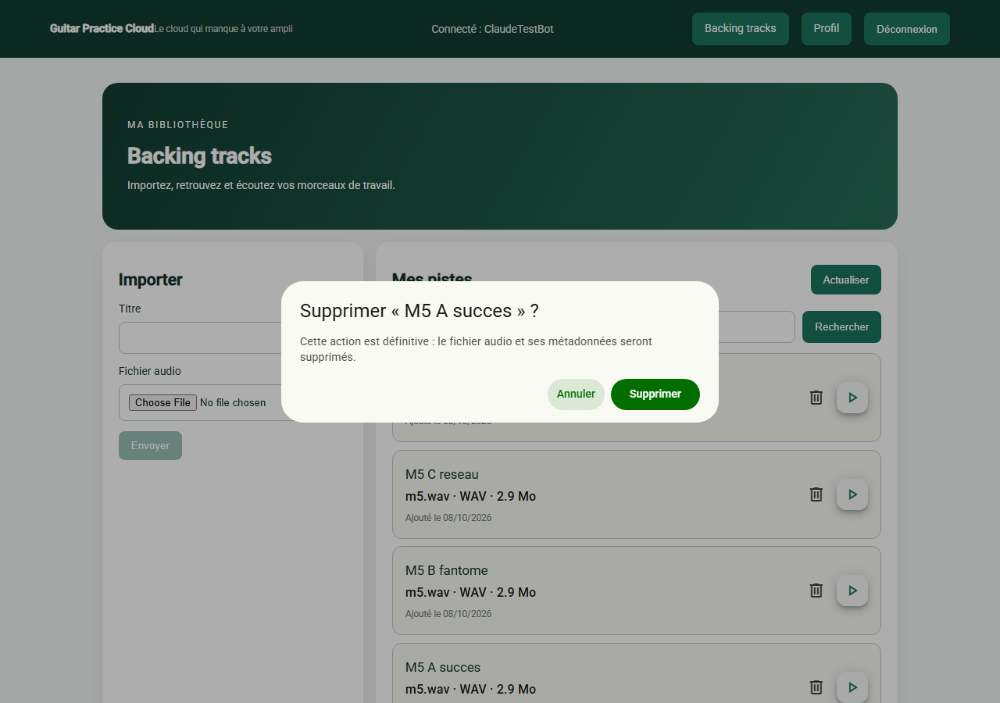

Succès (SnackBar verte) :

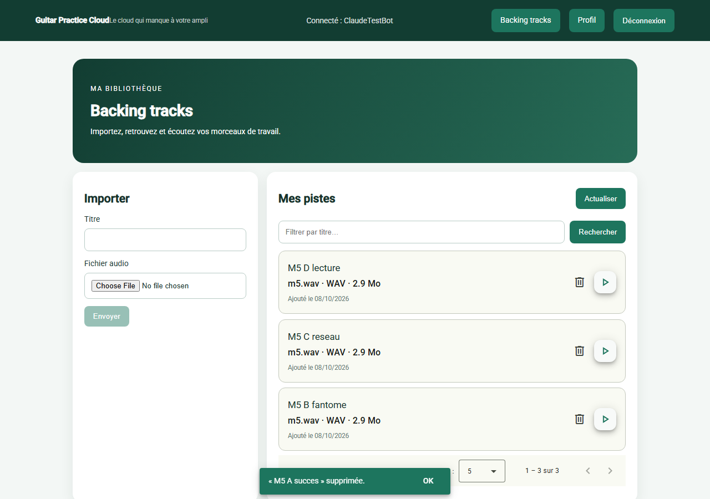

Piste fantôme (404) : supprimée dans un autre onglet, la carte disparaît
et la SnackBar rouge l'explique :

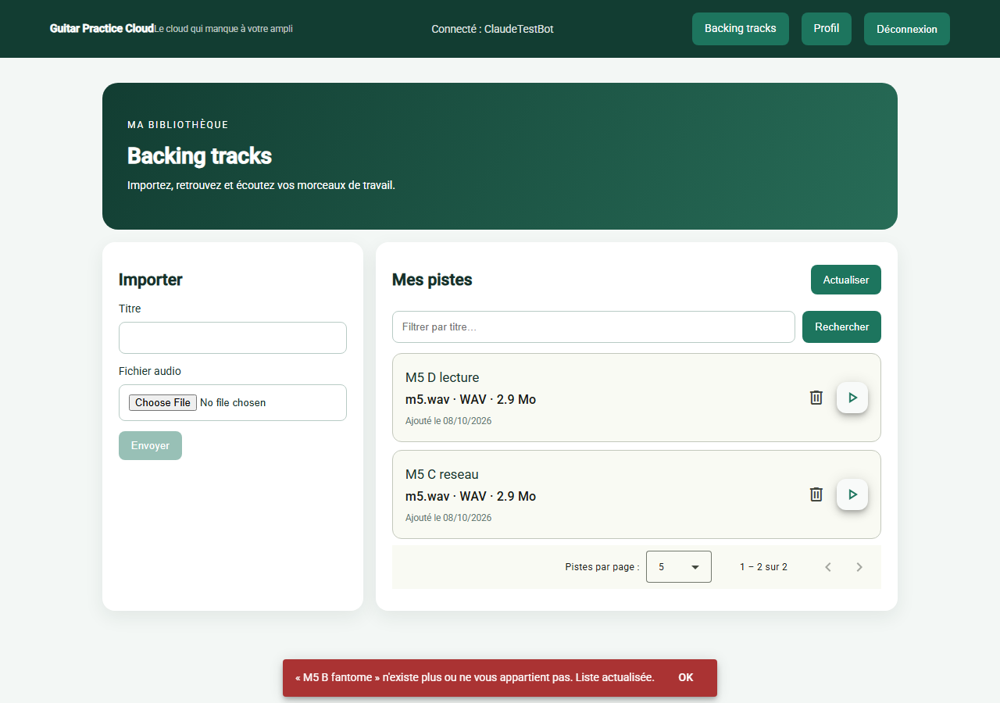

Erreur réseau : la carte reste, message rouge :

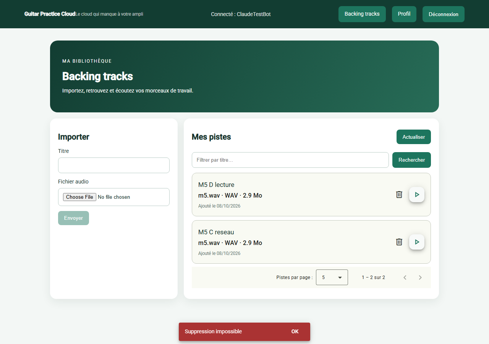

Network après confirmation (08/10/2026) : `DELETE
/api/tracks/6ac7ada1306dcc19e9007e24` → `204 No Content`, suivi du
rechargement de la liste (`tracks?…`). Seuls les en-têtes de réponse
sont visibles : le JWT (en-tête de requête `Authorization`) n'apparaît
pas.

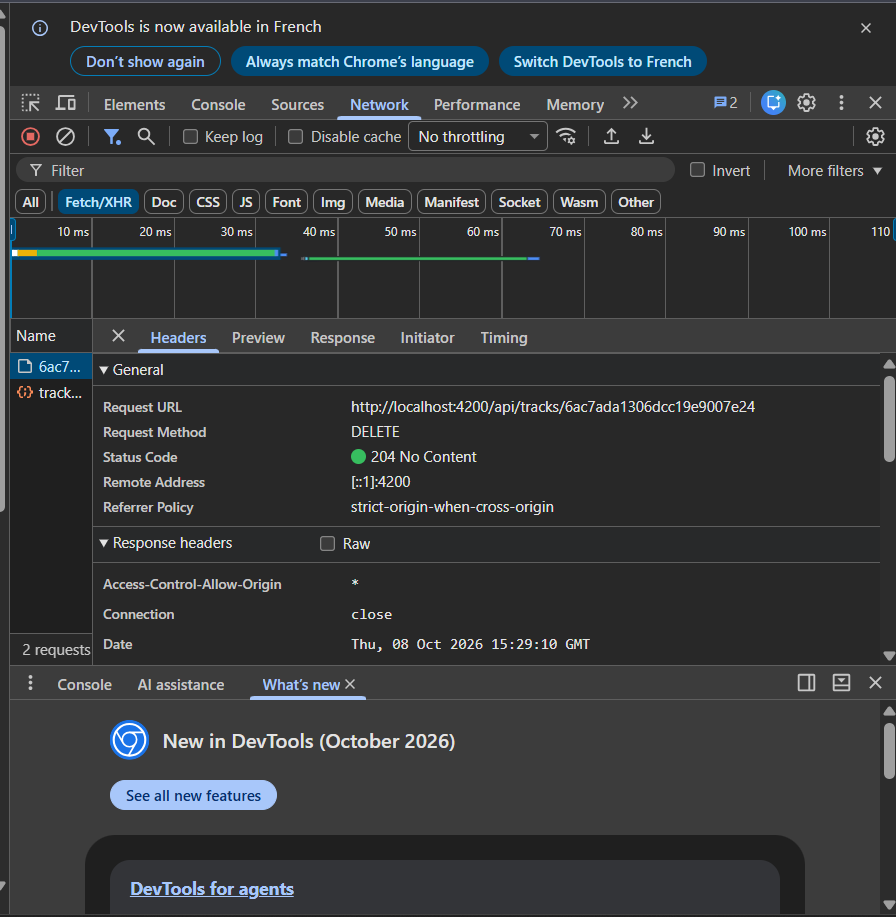

## Mission 6 — Progression de l'upload

> Réalisée le 08/10/2026. Détail de l'échange avec l'IA :
> `../RAPPORT_IA_MODELE.md`, entrée 3.2.

- [x] État "pas d'upload en cours"
- [x] État "upload en cours" avec pourcentage
- [x] État "réussite"
- [x] État "échec"
- [x] Contrôles désactivés pendant l'envoi, pas de double soumission

### Implémentation (08/10/2026)

**Fichiers concernés** : `TrackService.upload()`
(`shared/services/track.service.ts`), `TracksPageComponent`
(`tracks-page.ts` / `.html` / `.css`) et `main.ts`. Pas de changement
backend, pas de changement de `API_CONTRACT.md` (même route
`POST /api/tracks`).

1. **Service** : `upload()` passe les options
   `{ reportUploadProgress: true, observe: 'events' }` à `http.post()`.
   L'Observable ne renvoie plus seulement la piste créée, mais **une suite
   d'événements HTTP** (`HttpEvent<Track>`). Le composant passe toujours
   par le service, jamais directement par `HttpClient`.
2. **Composant** : un nouveau Signal `uploadProgress` (0-100). Le `next` du
   `subscribe` est appelé plusieurs fois, on trie selon `event.type` :
   - `HttpEventType.UploadProgress` → `Math.round(100 * loaded / total)`
     (seulement si `total` est connu, sinon on garderait `NaN`) ;
   - `HttpEventType.Response` → réussite (message, remise à zéro, `load()`) ;
   - les autres événements (`Sent`, `ResponseHeader`) sont ignorés.
3. **Les 4 états**, à partir des Signals existants (gardés car déjà
   utilisés et documentés) :

   | État | Condition | Affichage |
   |---|---|---|
   | Aucun upload | `uploading()` faux, pas de message | formulaire seul |
   | En cours | `uploading()` vrai | `mat-progress-bar` + « Envoi : 42 % », puis « Finalisation… » à 100 % |
   | Réussite | `uploadSuccess()` rempli | message vert, titre et sélecteur de fichier vidés |
   | Échec | `uploadError()` rempli | message rouge, contrôles réactivés, titre conservé pour réessayer |

4. **« Finalisation… » à 100 %** : 100 % veut dire que tous les octets
   sont partis, pas que la piste existe. Le serveur doit encore écrire le
   fichier (Multer) et enregistrer les métadonnées dans MongoDB avant de
   répondre `201`.
5. **Contrôles désactivés** : bouton (`[disabled]`), sélecteur de fichier
   (`[disabled]`) et champ Titre (`title.disable()`/`enable()`, la méthode
   recommandée pour un contrôle de Reactive Forms). La garde
   `if (!this.file || this.uploading()) return;` bloque en plus une
   seconde soumission côté logique.
6. **Sélecteur vidé après succès** (point ajouté au plan) : avant,
   `file` était remis à `undefined` mais le navigateur affichait encore le
   nom du fichier envoyé. `@ViewChild('fileInput')` +
   `nativeElement.value = ''`.

### Bug trouvé : la barre restait à 0 % (08/10/2026)

Première version : build OK, tests unitaires OK, succès de l'envoi OK…
mais la vérification dans un **vrai navigateur** avec réseau ralenti a
montré « Envoi : 0 % » pendant ~9 s, puis succès d'un coup.

**Cause** (vérifiée dans le code source d'`@angular/common` 22.1.4) :
depuis **Angular 22**, `provideHttpClient()` utilise par défaut **l'API
`fetch`** du navigateur, et `fetch` **ne sait pas suivre la progression
d'un envoi** (seulement celle d'un téléchargement). Aucun événement
`UploadProgress` n'était émis. En plus, l'option `reportProgress`
utilisée au départ est **dépréciée depuis la v22**.

**Correction** :
- `main.ts` : `provideHttpClient(withXhr(), withInterceptors([authInterceptor]))`
  → retour à `XMLHttpRequest`, qui remonte la progression (`xhr.upload.onprogress`) ;
- `track.service.ts` : `reportUploadProgress: true` au lieu de
  `reportProgress`. Si quelqu'un retire `withXhr()` plus tard, Angular
  lève une erreur explicite au lieu d'échouer en silence.

`withXhr()` s'applique à **toutes** les requêtes de l'app. Revérifié :
connexion, liste, lecture audio, suppression fonctionnent à l'identique
(l'intercepteur JWT agit de la même façon avec les deux mécanismes). La
colonne **Type** de l'onglet Network affiche bien `xhr`.

**Pourquoi les tests unitaires ne l'auraient pas vu** : le faux backend
de test (`provideHttpClientTesting()`) remplace complètement `fetch` et
XHR ; il renverrait les événements de progression qu'on lui demande. Le
problème venait de l'**assemblage** Angular 22 + navigateur, d'où
l'intérêt de la vérification en navigateur (voir `../Tests.md`).

### Vérifications (08/10/2026)

| Vérification | Attendu | Observé |
|---|---|---|
| Progression (Slow 4G, fichier 3,4 Mo) | le pourcentage monte | ✅ 0 → 99 % par pas de 2-3 %, puis succès (43 s en Slow 4G) |
| Requête dans Network | `POST tracks`, type `xhr`, `201` | ✅ `(pending)` pendant l'envoi, puis `201` |
| Double soumission | une seule requête | ✅ 1 seul `POST` malgré un clic forcé sur le bouton désactivé |
| Contrôles pendant l'envoi | titre, fichier, bouton désactivés | ✅ |
| Réussite | message + titre et sélecteur vidés + liste rechargée | ✅ |
| Échec réseau (connexion réinitialisée, statut 0) | « Échec de l'envoi », contrôles réactivés | ✅ |
| Erreur serveur (400 simulée) | message du backend affiché | ✅ |
| Non-régression (`withXhr()`) | lecture audio + suppression OK | ✅ |
| Console | ni JWT ni mot de passe | ✅ |
| `npm run build` / `npm test` | succès / 15 tests verts | ✅ |

Limite constatée : le mode « Offline » de DevTools ne coupe pas une
requête **déjà partie**, il bloque seulement les nouvelles. L'échec
réseau a donc été simulé par une connexion réinitialisée (harnais
Playwright). Pour un vrai échec en plein envoi : arrêter le backend
pendant un upload ralenti.

### Captures

Upload en cours (Network, Slow 4G) : la requête `tracks` de type `xhr` est
`(pending)` et la barre affiche 14 %.

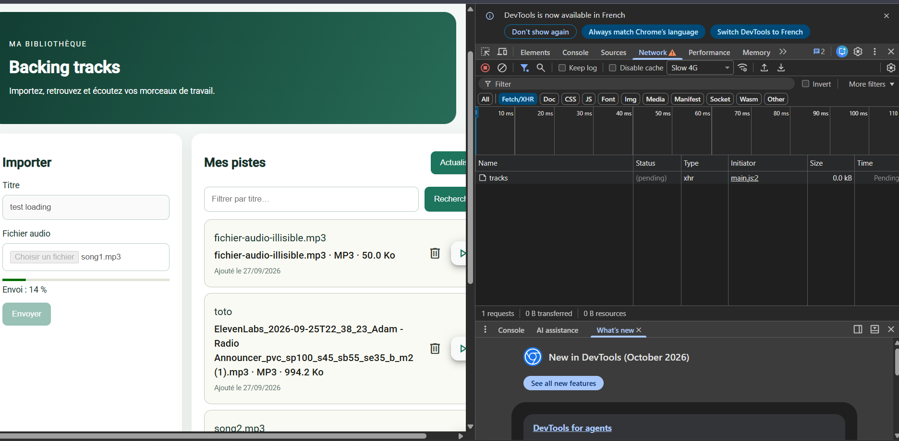

Upload terminé : `201`, 43,36 s en Slow 4G, puis rechargement de la liste
(`tracks?page=1&limit=5`, `200`).

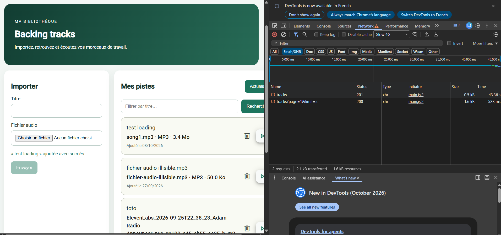

Réussite : message de succès, titre et sélecteur de fichier vidés.

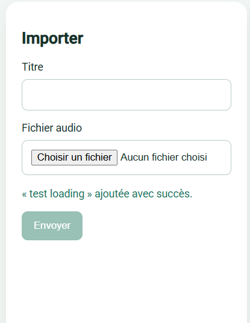

Progression à 36 % (harnais Playwright), contrôles désactivés :

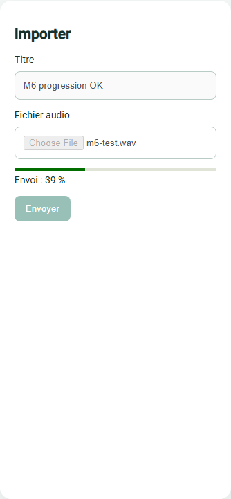

Échec réseau puis erreur serveur (harnais Playwright) :

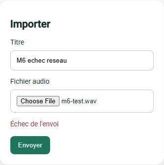
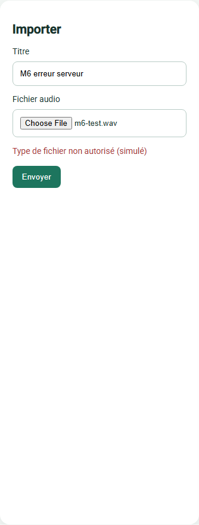

### Pourquoi un upload avec progression ne se traite pas comme une requête à réponse unique

Une requête classique (`http.get`, `http.post` sans option) donne un
Observable qui émet **une seule valeur** : la réponse finale. Le `next`
est appelé une fois, et cette valeur *est* le résultat.

Avec `observe: 'events'` + `reportUploadProgress`, le même Observable
émet **plusieurs valeurs dans le temps** : `Sent`, puis plusieurs
`UploadProgress`, puis `ResponseHeader`, puis `Response`. Conséquences :
- le `next` est appelé plusieurs fois : il faut **trier par
  `event.type`** au lieu de traiter chaque valeur comme le résultat ;
- la **réussite** n'est pas le premier `next` mais uniquement
  l'événement `Response` (c'est lui qui contient la piste créée) ;
- l'interface doit gérer un **état intermédiaire** (le pourcentage) et
  un moment « 100 % mais pas encore de réponse » ;
- le mécanisme HTTP sous-jacent compte : il faut XHR (`withXhr()`), car
  `fetch` ne remonte pas la progression d'un envoi.

## Mission 7 — Tests automatisés

**Approche choisie** : commencer par cette mission en premier (plutôt que
dans l'ordre du sujet), puisque la plupart des autres missions du TP3
étaient déjà partiellement faites pendant le TP2. Méthodologie complète,
inventaire détaillé et règles de travail dans `../Tests.md` (document de
référence, mis à jour au fil du TP3).

Au moins 3 tests parmi la liste du sujet :

- [x] `AuthService.login()` → `POST /api/auth/login` avec le bon corps
- [x] `TrackService.list()` transmet `page`/`limit`
- [x] L'intercepteur ajoute `Authorization` si un token existe
- [x] Le guard redirige un utilisateur sans token
- [x] Le composant affiche une erreur après un échec HTTP — 08/10/2026
- [x] La suppression appelle `DELETE /api/tracks/:id` et recharge la liste — 08/10/2026
- [x] L'upload met à jour la progression et traite l'erreur — 08/10/2026

**7/7 faits (08/10/2026).** Les 3 derniers sont dans
`tracks-page.spec.ts` (10 tests de composant), écrits après
l'implémentation des Missions 5 et 6. Total frontend : 6 fichiers,
25 tests au vert. Le faux backend (`provideHttpClientTesting()`) permet de
simuler les événements de progression (`req.event(...)`) et les erreurs
(`flush` avec un statut, `error(new ProgressEvent('error'))`) ; `MatDialog`
et `MatSnackBar` sont remplacés par des faux sur l'instance du composant.
Tableau attendu / observé complet dans `../Tests.md`.

**État des lieux trouvé avant d'écrire le moindre test** (0:00–0:15 du
déroulé conseillé) : `npm test` frontend ne fonctionnait pas du tout —
`jsdom` manquant et `angular.json` sans configuration `build:development`
(dépendance implicite du target `test`). Les deux corrigés avant de
pouvoir écrire quoi que ce soit.

**Bonus** (motivés par des bugs réels trouvés en TP1/TP2, pas demandés
par le sujet) : `serverErrorMessage()`, `formatFileSize()`,
`formatAudioType()` — exportées depuis `tracks-page.ts` et testées
isolément. Détail dans `../Tests.md`.

### Extension backend (facultative)

- [x] `401` sans JWT — 08/10/2026
- [x] `401` avec JWT invalide (mauvaise signature, expiré, malformé) — 08/10/2026
- [x] Upload sans fichier — 08/10/2026
- [x] Type MIME refusé — 08/10/2026
- [x] Pagination `page`/`limit` — 08/10/2026
- [x] Accès interdit à la piste d'un autre utilisateur — 08/10/2026

Analyse préalable (dans `../Tests.md`) : seul le dernier cas a vraiment
besoin de MongoDB — le middleware `auth` ne vérifie que la signature du
JWT, jamais l'existence de l'utilisateur en base.

**Implémenté le 08/10/2026** (`backend/test/api.test.js`, 8 tests au vert,
sans MongoDB). Pour la pagination et l'accès interdit, les méthodes du
modèle `Track` sont simulées (`mock.method`) : on vérifie que la route
demande bien à la base les pistes de `ownerId = sub du token`, et réagit
correctement à la réponse. Le comportement réel de MongoDB a, lui, été
prouvé par `curl` avec deux comptes (Mission 5). Le code du backend n'a
pas été modifié.

**Vérification croisée** : 5 bugs introduits volontairement (3 frontend,
2 backend) ont chacun fait échouer le test attendu ; code restauré à
l'identique ensuite. Détail dans `../Tests.md`.

## Vérifications finales

- [x] Tests frontend lancés — 5 fichiers, 15 tests, tous au vert
- [x] Tests backend lancés — 2/2 toujours au vert (non modifiés)
- [x] `npm run build` exécuté sans erreur (revérifié après la Mission 6, 08/10/2026)
- [x] Aucune donnée sensible journalisée dans la console — vérifié après les Missions 6 et 5 (08/10/2026)

## Restitution orale — points à savoir expliquer

1. Pourquoi la suppression passe par un service (08/10/2026) : le
   composant gère l'affichage (confirmation, SnackBar, liste) et le service
   gère l'échange HTTP (`DELETE /api/tracks/:id`). Une seule définition de
   l'URL, réutilisable, et testable séparément avec un faux backend
   (`provideHttpClientTesting()`).
2. Comment le backend protège la suppression (08/10/2026) : le
   middleware `auth` vérifie la signature du JWT (`401` sinon), puis
   `findOneAndDelete({ _id, ownerId: req.auth.sub })` ne trouve que les
   pistes du propriétaire du token → `404` pour une piste d'un autre
   utilisateur (sans révéler qu'elle existe). Le guard et l'interface
   Angular sont contournables (`curl`) : ce n'est pas de la sécurité.
3. Comment Angular calcule le pourcentage d'upload (08/10/2026) : le
   navigateur (XHR, `xhr.upload.onprogress`) signale régulièrement combien
   d'octets sont partis (`loaded`) sur le total (`total`) ; Angular en fait
   des événements `HttpEventType.UploadProgress`, et on calcule
   `Math.round(100 * loaded / total)`. Il faut `withXhr()` : `fetch`
   (défaut d'Angular 22) ne fournit pas cette information.
4. Pourquoi les tests HTTP n'ont pas besoin de MongoDB : …
5. Ce que vérifie un test d'intercepteur ou de guard : …
6. Différence test unitaire / test d'intégration (08/10/2026) : le test
   unitaire teste une pièce isolée (ex. `TrackService`) avec des faux
   autour (faux backend HTTP) : rapide, précis, reproductible. Le test
   d'intégration (ou de bout en bout) fait travailler ensemble les vraies
   pièces (navigateur + Angular + backend + MongoDB) : plus lent, mais il
   attrape les erreurs d'assemblage. Exemple réel : le bug `fetch`/XHR de
   la Mission 6, invisible pour un test unitaire.

## Livrables TP3

- [x] Suppression fonctionnelle d'une piste — 08/10/2026
- [x] Progression d'upload (ou état d'upload géré à défaut) — 08/10/2026
- [x] Au moins 3 tests frontend — 4/7 du sujet (Mission 7), constaté le 08/10/2026
- [x] Rapport des tests (attendu vs observé) — `../Tests.md`, section « Rapport des tests », 08/10/2026
- [x] Capture Network suppression + upload — 08/10/2026 (`captures/tp3-mission6-network-upload-*.png`, `captures/tp3-mission5-network-delete.png`)
- [x] `npm run build` exécuté — dernier passage le 08/10/2026 (après les tests)
- [x] `RAPPORT_IA_MODELE.md` à jour — entrées 3.1 à 3.4, au 08/10/2026
