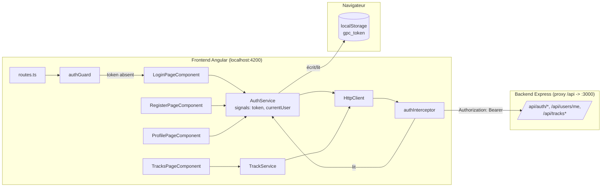
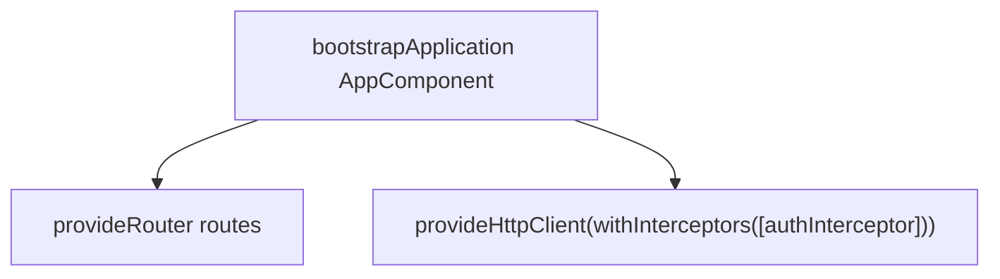
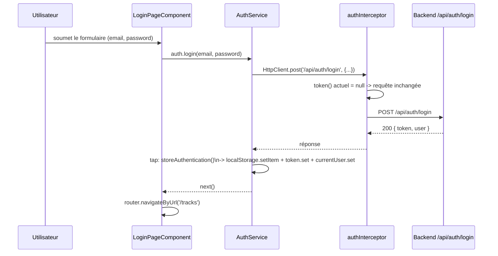
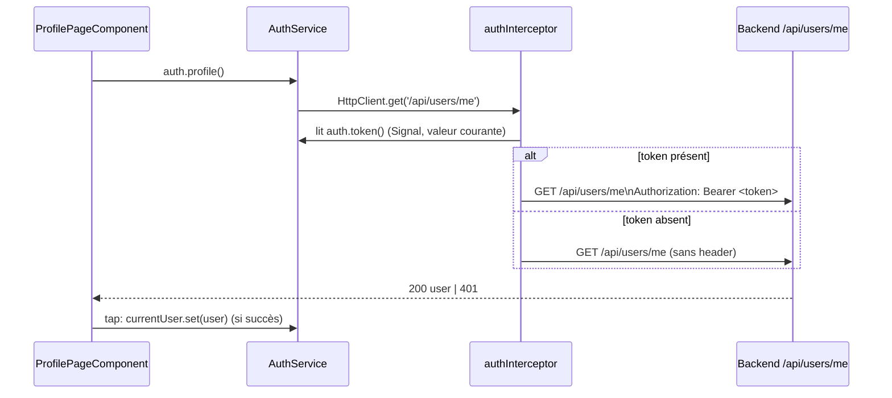
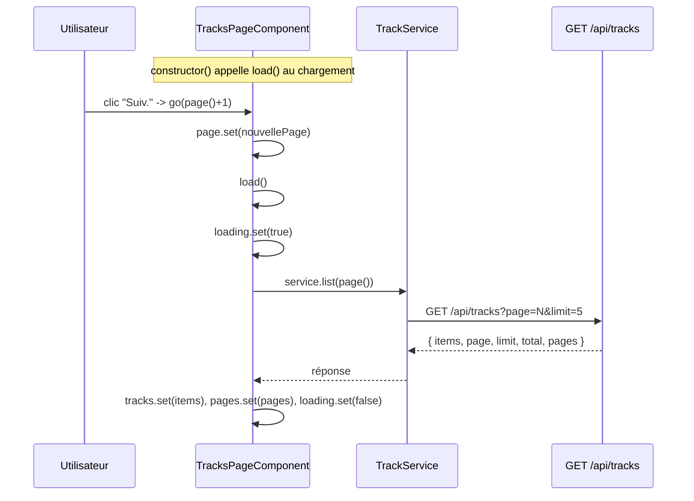
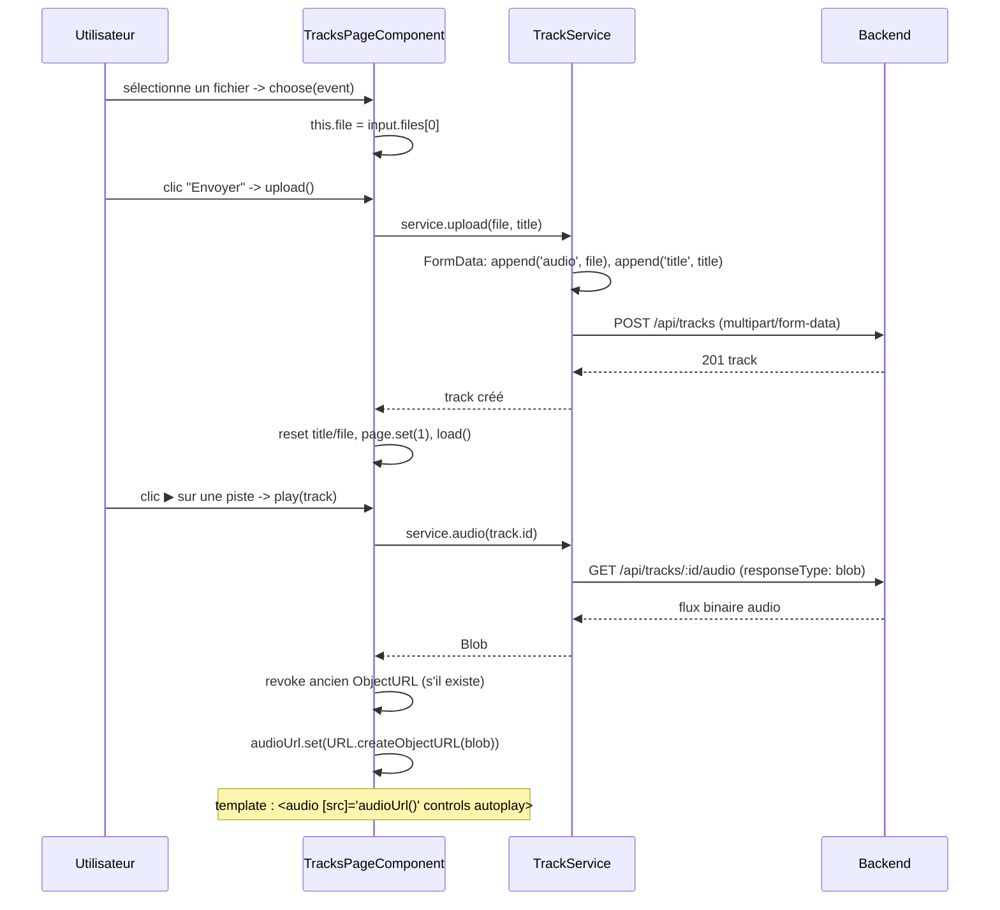

# Analyse du frontend — Guitar Practice Cloud (frontend-starter)

> Généré à partir du code source dans `frontend-starter/src/`. Ce document
> décrit l'architecture Angular actuelle (état de départ, avant TP), les
> workflows, et sert de référence technique mise à jour au fil des missions
> des TP1/TP2/TP3. Pour le backend, voir `backend/analyse.md`.

## 1. Vue d'ensemble

Application **Angular 22** en mode **standalone** (pas de `NgModule`),
consommant l'API décrite dans `backend/analyse.md` et `API_CONTRACT.md`.
L'état de départ fourni ("starter") implémente déjà un socle fonctionnel
minimal pour l'authentification et la bibliothèque de pistes ; les missions
des TP consistent à le compléter, le fiabiliser et l'enrichir (voir
§7 "État par rapport aux missions").

### 1.1 Stack technique

| Domaine | Technologie | Rôle |
|---|---|---|
| Framework | Angular 22 (standalone components) | UI, routage, DI |
| Rendu réactif | Signals (`signal`, pas de `computed`/`effect` pour l'instant) | État local et partagé |
| Formulaires | Reactive Forms (`FormGroup`, `FormControl`) | Saisie inscription/connexion/profil/upload |
| HTTP | `HttpClient` + intercepteur fonctionnel | Appels API, ajout du JWT |
| Routage | `provideRouter`, routes standalone, `CanActivateFn` | Navigation + protection de pages |
| Build/test | Angular CLI 22, Vitest 4 (configuré, aucun test écrit) | `ng serve`, `ng build`, `ng test` |
| Proxy dev | `proxy.conf.json` → `http://localhost:3000` | Évite le CORS en développement (`/api` → backend) |

### 1.2 Arborescence

```text
frontend-starter/
├── proxy.conf.json                  # /api -> http://localhost:3000
├── src/
│   ├── main.ts                      # bootstrap standalone + providers globaux
│   ├── app/
│   │   ├── routes.ts                # déclaration des routes + guards
│   │   ├── components/
│   │   │   ├── app/                 # composant racine (header + <router-outlet>)
│   │   │   ├── login-page/          # formulaire de connexion
│   │   │   ├── register-page/       # formulaire d'inscription
│   │   │   ├── profile-page/        # lecture/édition du profil (protégée)
│   │   │   └── tracks-page/         # bibliothèque : liste, upload, lecture (protégée)
│   │   └── shared/
│   │       ├── guards/auth.guard.ts         # bloque l'accès sans token
│   │       ├── interceptors/auth.interceptor.ts  # ajoute Authorization: Bearer
│   │       ├── models/              # interfaces TS (User, Track, Page<T>, AuthResponse)
│   │       └── services/            # AuthService, TrackService (seuls points d'appel HTTP)
```

### 1.3 Diagramme de composants et flux général



Le flux respecté partout dans le code : **composant → service → HttpClient →
API**. Aucun composant n'injecte `HttpClient` directement — c'est une règle
explicite des sujets de TP, déjà respectée par le starter.

---

## 2. Bootstrap et routage

### 2.1 `main.ts`



Tous les appels HTTP de l'application passent donc systématiquement par
`authInterceptor` (configuration globale, pas de config par service).

### 2.2 Table des routes (`routes.ts`)

| Path | Composant | Protégée (`authGuard`) |
|---|---|---|
| `''` | redirect → `tracks` | — |
| `/login` | `LoginPageComponent` | non |
| `/register` | `RegisterPageComponent` | non |
| `/profile` | `ProfilePageComponent` | oui |
| `/tracks` | `TracksPageComponent` | oui |
| `**` | redirect → `tracks` | — |

`authGuard` (fonctionnel, `CanActivateFn`) vérifie simplement
`auth.token()` (un Signal) : présent → accès autorisé, absent → redirection
vers `/login` via `router.createUrlTree`. **Ce garde ne vérifie toujours
pas que le token est encore valide côté serveur** au moment de la
navigation — mais depuis Mission 1 (TP1, point 10), `authInterceptor`
détecte a posteriori un token rejeté par le backend (`401` sur une requête
qui en portait un) et nettoie/redirige (voir §3.6 et §7). Les deux
mécanismes sont complémentaires : le guard filtre à l'entrée sur la route,
l'intercepteur rattrape un token qui devient invalide pendant la
navigation (expiration, secret changé côté serveur, etc.).

---

## 3. Authentification (côté frontend)

### 3.1 `AuthService` — état et responsabilités

`AuthService` (`providedIn: 'root'`, donc singleton applicatif) centralise :
- deux Signals exposés : `token` (initialisé depuis `localStorage.getItem('gpc_token')`
  au chargement du service) et `currentUser` (initialisé à `null`, rempli
  uniquement après un appel réussi à `/api/auth/*` ou `/api/users/me`) ;
- les méthodes `login`, `register`, `profile`, `update`, `logout` ;
- la persistance du token dans `localStorage` (clé `gpc_token`) via
  `storeAuthentication()`, appelée en `tap()` après un login/register réussi.

### 3.2 Diagramme de séquence — Connexion



En cas d'échec (401), l'`Observable` émet une erreur : `LoginPageComponent`
l'intercepte dans `error: (error) => ...` et affiche `error.error?.message`
(le message JSON renvoyé par le backend) via le Signal `error`.

### 3.3 Diagramme de séquence — Requête protégée (ex. profil)



`authInterceptor` est un **intercepteur fonctionnel** (`HttpInterceptorFn`,
API Angular ≥ 15) : il lit le Signal `token` à chaque requête sortante et
clone la requête avec l'en-tête `Authorization` uniquement s'il existe. Il
s'applique à **toutes** les requêtes HTTP de l'app (y compris login/register,
où le header est simplement absent puisque `token()` vaut `null`). Depuis
Mission 1 (TP1, point 10), il observe aussi la réponse pour détecter un
token rejeté par le backend — détail en §3.6.

### 3.4 Composants d'authentification

| Composant | Formulaire | Champs + validateurs | Comportement |
|---|---|---|---|
| `LoginPageComponent` | `form` (email, password) | `required`, `email` (pas de `minLength` sur le mot de passe : le backend ne vérifie une longueur qu'à l'inscription) | Pré-rempli avec le compte démo ; bouton `[disabled]="form.invalid"` ; message d'erreur par champ sous `email`/`password`, affiché dès `touched \|\| dirty` ; `submit()` bloque aussi si invalide (`markAllAsTouched()`) avant d'appeler `auth.login()`, redirige vers `/tracks` au succès, affiche `error` au 401 |
| `RegisterPageComponent` | `form` (name, email, password) | `required` (+ `email` sur l'email, **+ `minLength(8)`** sur le mot de passe depuis Mission 1 TP1, aligné sur la contrainte du backend) | Bouton `[disabled]="form.invalid"` ; message d'erreur par champ sous `name`/`email`/`password` (`touched \|\| dirty`) ; `submit()` bloque aussi si invalide avant d'appeler `auth.register()`, redirige vers `/profile` au succès |
| `ProfilePageComponent` | `form` (name) | `required` | Chargement automatique au constructeur (`GET /api/users/me` dès l'arrivée sur `/profile`, Mission 1 point 8) ; bouton "Charger mon profil" pour rafraîchir manuellement ; `save()` appelle `auth.update()` (`PUT /api/users/me`) |

### 3.5 `AppComponent` — état de connexion global (header)

Depuis Mission 1 (TP1, point 7), `AppComponent` (`components/app/app.ts`)
n'est plus un simple conteneur de layout : il injecte `AuthService` et
`Router` et pilote l'affichage du header en fonction de l'état
d'authentification, pour toutes les pages (`<router-outlet />` étant son
seul contenu variable).

```ts
constructor() {
  if (this.auth.token()) {
    this.auth.profile().subscribe({ error: () => {} });
  }
}

logout(): void {
  this.auth.logout();
  void this.router.navigateByUrl('/login');
}
```

- **Rechargement du profil au démarrage.** `currentUser` n'est pas
  persisté (contrairement à `token`, relu depuis `localStorage`) : il
  repart à `null` à chaque ouverture de l'app. Le constructeur appelle donc
  `auth.profile()` une fois si un token existe déjà, pour que le header
  puisse afficher qui est connecté dès le chargement, y compris après un
  F5. Le `error: () => {}` reste volontairement minimal ici : la gestion
  globale d'un token invalide/expiré (401) est centralisée dans
  `authInterceptor` depuis le point 10 (§3.6), pas dupliquée à cet endroit.
- **Affichage conditionnel du nav** (`app.html`) : `Connecté : {{ user.name }}`
  visible si `auth.currentUser()` est renseigné ; les liens "Backing
  tracks"/"Profil" et le bouton "Déconnexion" ne s'affichent que si
  `auth.token()` est vrai ; sinon seul le lien "Connexion" reste visible.
- **Style.** Les liens du nav et le bouton "Déconnexion" partagent
  désormais le même rendu visuel (`header nav a, header nav button` dans
  `styles.css`) — unification purement visuelle, `<a>` (navigation) et
  `<button>` (action) restent sémantiquement distincts en HTML.
- **Déconnexion sans requête réseau.** `logout()` ne fait qu'un nettoyage
  client (`localStorage` + Signals) : un JWT est stateless, le backend ne
  garde aucune trace des tokens émis et n'expose aucune route `logout`
  (absente d'`API_CONTRACT.md`). Un token émis avant déconnexion reste donc
  techniquement valide côté serveur jusqu'à son expiration naturelle — pas
  de révocation possible sans mécanisme supplémentaire (hors scope du TP).

### 3.6 Gestion d'un token invalide/expiré (401) — `authInterceptor`

Depuis Mission 1 (TP1, point 10), `authInterceptor` ne se contente plus
d'ajouter le header `Authorization` : il observe aussi la réponse de
**chaque** requête HTTP de l'app.

```ts
return next(authorizedRequest).pipe(
  catchError((error: HttpErrorResponse) => {
    if (token && error.status === 401) {
      auth.logout();
      void router.navigateByUrl('/login');
    }
    return throwError(() => error);
  }),
);
```

- **Condition `token &&`, volontaire.** Un `401` peut aussi survenir sur
  `/api/auth/login` avec un mauvais mot de passe — une requête qui ne
  portait **aucun** token. Sans cette condition, l'intercepteur
  interférerait avec la gestion d'erreur déjà faite localement par
  `login-page.ts` (affichage du message via le Signal `error`). Seul un
  `401` sur une requête qui **portait** un token déclenche le nettoyage —
  cas où le backend vient de rejeter un token censé être valide
  (expiré, signature invalide, etc.).
- **`throwError(() => error)` en fin de pipe** : l'erreur continue de
  remonter jusqu'au composant appelant, qui garde son propre traitement
  s'il en a un (ex. `console.error` local) — l'intercepteur ajoute un
  comportement global, il ne remplace pas la gestion d'erreur existante.
- **Limite de test à connaître** : `auth.token` ne relit `localStorage`
  qu'une seule fois, à la création du service. Modifier `gpc_token` dans
  `localStorage` en direct (DevTools) ne change donc rien tant que l'app
  n'est pas rechargée — toutes les requêtes continuent d'utiliser
  l'ancien token, valide, en mémoire. Pour tester ce mécanisme, il faut
  recharger la page (F5) après avoir corrompu le token, pour que le Signal
  se ré-hydrate depuis la valeur invalide.

---

## 4. Bibliothèque de pistes (`TracksPageComponent`)

### 4.1 `TrackService` — API consommée

| Méthode | Requête HTTP | Utilisation |
|---|---|---|
| `list(page, limit=5)` | `GET /api/tracks?page=&limit=` | Pagination serveur |
| `upload(file, title)` | `POST /api/tracks` (`FormData`: `audio`, `title`) | Envoi d'un fichier audio |
| `audio(id)` | `GET /api/tracks/:id/audio` (`responseType: 'blob'`) | Récupération du binaire audio |

### 4.2 État réactif du composant

Signals exposés par `TracksPageComponent` :
`tracks`, `page`, `pages`, `loading`, `audioUrl`, plus un `FormControl`
`title` et une propriété classique `file?: File` (choix de fichier, pas
encore un Signal).

### 4.3 Diagramme de séquence — Pagination



Chaque changement de page déclenche une **nouvelle requête serveur** (pas de
découpage local d'une liste déjà chargée) — conforme à l'exigence de
Mission 2 du TP2.

### 4.4 Diagramme de séquence — Upload puis lecture



**Pourquoi un `Blob` + `ObjectURL` plutôt qu'une URL directe dans `src`** :
le endpoint `/api/tracks/:id/audio` est **protégé par JWT**. Un attribut
HTML `src="/api/tracks/xxx/audio"` déclenche une requête navigateur qui ne
passe **pas** par `authInterceptor` (celui-ci n'agit que sur les requêtes
faites via `HttpClient`) et n'aurait donc pas l'en-tête `Authorization` →
401. La solution : télécharger le fichier via `HttpClient` (qui, lui, passe
par l'intercepteur), obtenir un `Blob` en mémoire, puis créer une URL locale
temporaire (`blob:...`) que le navigateur peut utiliser directement dans
`<audio src>` sans requête réseau supplémentaire.

---

## 5. Formulaires réactifs — pattern commun

Tous les formulaires suivent le même schéma :

```text
FormGroup/FormControl (typé, nonNullable) --template [formGroup]/formControlName--
  → (ngSubmit) → méthode submit()/save() du composant
  → form.getRawValue() → appel service → .subscribe({next, error})
```

- `nonNullable: true` évite d'avoir `string | null` sur des champs texte
  obligatoires.
- Depuis Mission 1 (TP1, points 1+2) : chaque champ de `login-page` et
  `register-page` affiche son propre message d'erreur (`required`, `email`,
  `minlength`), conditionné par `control.touched || control.dirty` plutôt
  que `touched` seul — ce dernier ne suffisait pas pour un champ pré-rempli
  modifié sans jamais perdre le focus (bug trouvé en test manuel, corrigé).
  Le bouton de soumission est grisé via `[disabled]="form.invalid"`, en plus
  de la garde `if (form.invalid) { markAllAsTouched(); return; }` dans
  `submit()`. L'erreur globale au niveau du formulaire (Signal `error`)
  reste utilisée séparément pour les erreurs renvoyées par le backend
  (ex. `401` au login).

---

## 6. Style, accessibilité, configuration

- CSS minimal par composant (`:host { display: block; max-width: ... }`),
  pas de librairie de composants (Angular Material n'est pas installé —
  c'est une option "AVANCÉ" du TP2).
  Les cards actuelles (`tracks-page.html`) sont de simples `<div class="track">`.
- `proxy.conf.json` redirige `/api` vers `http://localhost:3000` en
  développement (`ng serve --proxy-config proxy.conf.json`), ce qui évite un
  problème CORS et permet d'écrire des chemins relatifs (`/api/...`) dans
  les services au lieu d'une URL absolue.
- Aucun environnement (`environment.ts`) n'est utilisé : l'URL de l'API
  n'est jamais codée en dur côté Angular, tout passe par `/api/...` et le
  proxy (ou, en production, un reverse proxy équivalent).

---

## 7. État actuel par rapport aux missions des TP (repères)

Ce tableau reflète l'état du **starter fourni**, avant toute modification
réalisée pendant les séances. Il sera mis à jour à la fin de chaque mission
réellement complétée.

| Mission | Exigence | État dans le starter |
|---|---|---|
| TP1 · M1 | Formulaires login/register + appels API | ✅ Présent |
| TP1 · M1 | JWT stocké, Signal `currentUser` à jour | ✅ Présent |
| TP1 · M1 | Bouton de déconnexion + nettoyage état | ✅ Fait (Mission 1, point 7) — bouton dans le header (`AppComponent`), redirection vers `/login` après déconnexion |
| TP1 · M1 | Chargement de `/api/users/me` à la demande du profil | ✅ Fait (Mission 1, point 8) — corrigé un faux positif : l'affichage dépendait du Signal `currentUser` déjà rempli par ailleurs (login), sans jamais émettre sa propre requête ; `ProfilePageComponent` appelle désormais `load()` dans son constructeur |
| TP1 · M1 | Gestion d'un 401 → retour `/login` | ✅ Fait (Mission 1, point 10) — `authInterceptor` nettoie l'état et redirige sur un 401 portant un token ; les 401 sans token (login/register) restent gérés localement |
| TP1 · M1 | Messages d'erreur compréhensibles par champ | ✅ Fait (Mission 1, points 1+2) — message par champ, `minLength(8)` sur le mot de passe à l'inscription, bouton désactivé si formulaire invalide |
| TP2 · M2 | Pagination serveur avec Signals (`tracks`,`page`,`pages`,`loading`) | ✅ Présent (mais pas de Signal `error` dédié à la liste) |
| TP2 · M2 | Boutons Préc./Suiv. désactivés aux bornes | ✅ Présent |
| TP2 · M3 | Validation frontend du fichier (type/taille) avant envoi | ❌ Absent |
| TP2 · M3 | État de chargement + anti double-soumission pendant l'upload | ❌ Absent (`upload()` n'a pas d'état `uploading`) |
| TP2 · M3 | Révocation de l'`ObjectURL` à la destruction du composant | ❌ Absent (pas de `ngOnDestroy`) |
| TP2 · M3 | Cards responsives/accessibles avec plus de métadonnées | ⚠️ Basique : titre, nom original, taille — pas de date/format visibles |
| TP3 · M5 | Suppression d'une piste (`DELETE /api/tracks/:id`) | ❌ Absent (pas de méthode `delete()` dans `TrackService`, pas de bouton) |
| TP3 · M6 | Progression d'upload (`reportProgress`, événements HTTP) | ❌ Absent (`upload()` ne suit pas la progression) |
| TP3 · M7 | Tests frontend (services, intercepteur, guard, composants) | ❌ Aucun fichier `*.spec.ts` applicatif (Vitest configuré mais inutilisé) |

---

## 8. Journal des mises à jour de ce document

- **Version initiale** — analyse du starter fourni, avant toute mission.
- **20/09** — Mise à jour après Mission 1 (TP1), points 1+2 : formulaires
  réactifs + validations/messages d'erreur par champ implémentés dans
  `login-page`/`register-page` (§3.4, §5, §7).
- **20/09** — Mise à jour après Mission 1 (TP1), point 7 : bouton de
  déconnexion, affichage de l'utilisateur connecté dans le header et
  rechargement du profil au démarrage, nav conditionnelle selon
  l'authentification (nouveau §3.5, §7).
- **20/09** — Mise à jour après Mission 1 (TP1), points 8+9 : correction
  d'un faux positif sur `ProfilePageComponent` (l'affichage dépendait du
  Signal `currentUser` déjà rempli par le login, sans émettre sa propre
  requête `GET /api/users/me`) — chargement désormais déclenché dans le
  constructeur du composant, à l'arrivée sur `/profile` (§3.4, §7).
- **20/09** — Mise à jour après Mission 1 (TP1), point 10 : `authInterceptor`
  détecte un token rejeté (`401` sur une requête qui en portait un),
  nettoie l'état et redirige vers `/login` (nouveau §3.6, §2.2, §7).
  **Mission 1 (TP1) complète : 10/10 points.**
