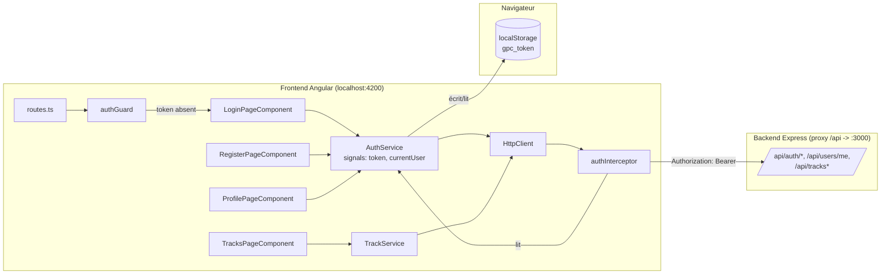
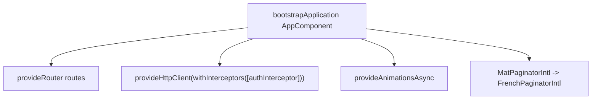
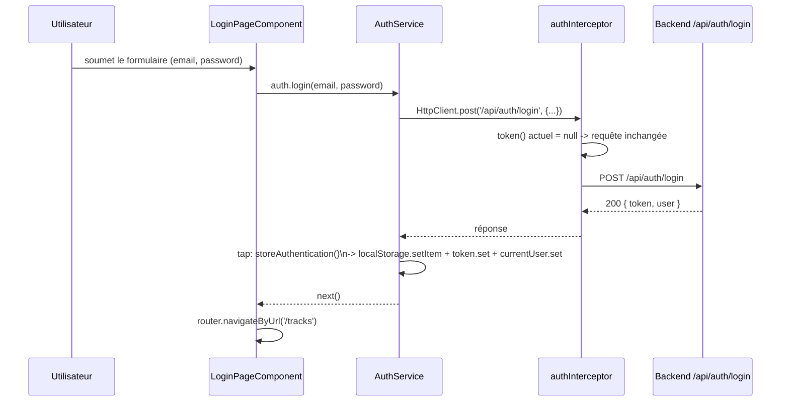
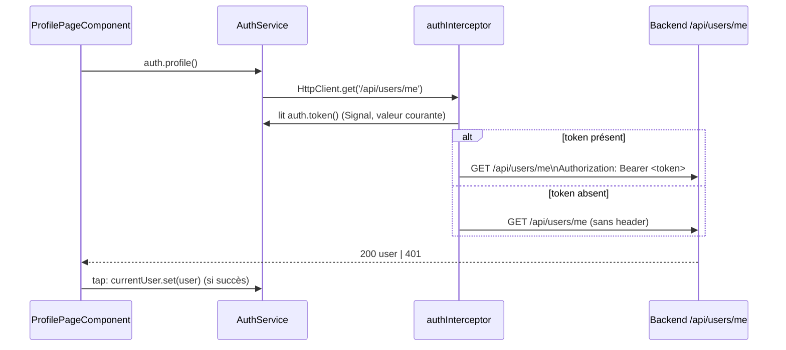
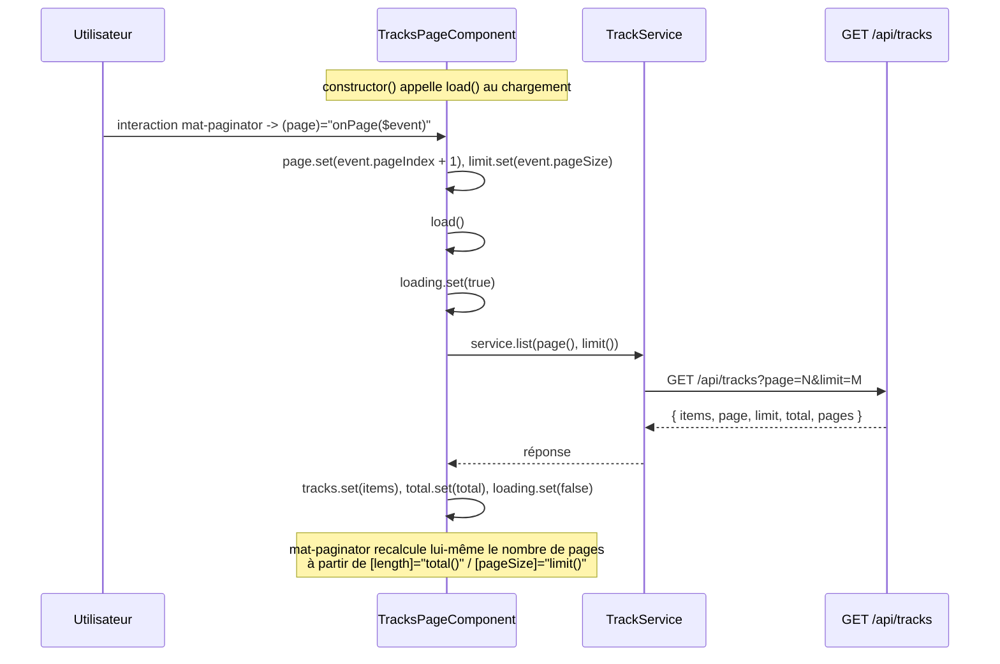
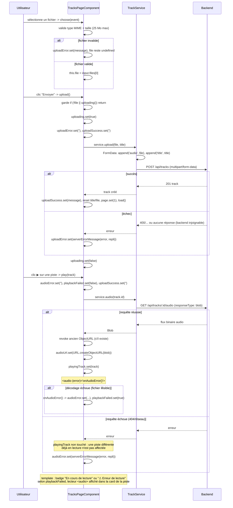

# Analyse du frontend — Guitar Practice Cloud (frontend-starter)

> Généré à partir du code source dans `frontend-starter/src/`. Ce document
> décrit l'architecture Angular actuelle (état de départ, avant TP), les
> workflows, et sert de référence technique mise à jour au fil des missions
> des TP1/TP2/TP3. Pour le backend, voir `backend/analyse.md`.

## 1. Vue d'ensemble

Application **Angular 22** en mode **standalone** (pas de `NgModule`),
consommant l'API décrite dans `backend/analyse.md` et `API_CONTRACT.md`.
L'état de départ fourni ("starter") implémente déjà un socle fonctionnel
minimal pour l'authentification et la bibliothèque de pistes ; les missions
des TP consistent à le compléter, le fiabiliser et l'enrichir (voir
§7 "État par rapport aux missions").

### 1.1 Stack technique

| Domaine | Technologie | Rôle |
|---|---|---|
| Framework | Angular 22 (standalone components) | UI, routage, DI |
| Rendu réactif | Signals (`signal`, pas de `computed`/`effect` pour l'instant) | État local et partagé |
| Formulaires | Reactive Forms (`FormGroup`, `FormControl`) | Saisie inscription/connexion/profil/upload |
| HTTP | `HttpClient` + intercepteur fonctionnel | Appels API, ajout du JWT |
| Routage | `provideRouter`, routes standalone, `CanActivateFn` | Navigation + protection de pages |
| Build/test | Angular CLI 22, Vitest 4 (configuré, aucun test écrit) | `ng serve`, `ng build`, `ng test` |
| Proxy dev | `proxy.conf.json` → `http://localhost:3000` | Évite le CORS en développement (`/api` → backend) |
| Composants UI | Angular Material 22.2.1 + CDK (ajoutés TP2, Mission 3) | `mat-card`, `mat-paginator`, `mat-dialog`, `mat-button`/`mat-icon` — uniquement sur `TracksPageComponent` pour l'instant, thème Material 3 custom (`material-theme.scss`, palette verte) |

### 1.2 Arborescence

```text
frontend-starter/
├── proxy.conf.json                  # /api -> http://localhost:3000
├── src/
│   ├── main.ts                      # bootstrap standalone + providers globaux
│   ├── app/
│   │   ├── routes.ts                # déclaration des routes + guards
│   │   ├── components/
│   │   │   ├── app/                 # composant racine (header + <router-outlet>)
│   │   │   ├── login-page/          # formulaire de connexion
│   │   │   ├── register-page/       # formulaire d'inscription
│   │   │   ├── profile-page/        # lecture/édition du profil (protégée)
│   │   │   └── tracks-page/         # bibliothèque : liste, upload, lecture (protégée)
│   │   └── shared/
│   │       ├── guards/auth.guard.ts         # bloque l'accès sans token
│   │       ├── interceptors/auth.interceptor.ts  # ajoute Authorization: Bearer
│   │       ├── models/              # interfaces TS (User, Track, Page<T>, AuthResponse)
│   │       └── services/            # AuthService, TrackService (seuls points d'appel HTTP)
```

### 1.3 Diagramme de composants et flux général


```mermaid
flowchart LR
    subgraph Angular["Frontend Angular (localhost:4200)"]
        Routes[routes.ts]
        Guard[authGuard]
        Login[LoginPageComponent]
        Register[RegisterPageComponent]
        Profile[ProfilePageComponent]
        Tracks[TracksPageComponent]
        AuthSvc[AuthService\nsignals: token, currentUser]
        TrackSvc[TrackService]
        Interceptor[authInterceptor]
        HttpClient[HttpClient]
    end

    subgraph Browser["Navigateur"]
        LS[(localStorage\ngpc_token)]
    end

    subgraph API["Backend Express (proxy /api -> :3000)"]
        Endpoints[/api/auth/*, /api/users/me,\n/api/tracks*/]
    end

    Routes --> Guard
    Guard -->|token absent| Login
    Login --> AuthSvc
    Register --> AuthSvc
    Profile --> AuthSvc
    Tracks --> TrackSvc
    AuthSvc --> HttpClient
    TrackSvc --> HttpClient
    HttpClient --> Interceptor
    Interceptor -- lit --> AuthSvc
    Interceptor -- "Authorization: Bearer <token>" --> Endpoints
    AuthSvc -- écrit/lit --> LS
```

Le flux respecté partout dans le code : **composant → service → HttpClient →
API**. Aucun composant n'injecte `HttpClient` directement — c'est une règle
explicite des sujets de TP, déjà respectée par le starter.

---

## 2. Bootstrap et routage

### 2.1 `main.ts`


```mermaid
flowchart TD
    A[bootstrapApplication AppComponent] --> B[provideRouter routes]
    A --> C["provideHttpClient(withInterceptors([authInterceptor]))"]
    A --> D[provideAnimationsAsync]
    A --> E["MatPaginatorIntl -> FrenchPaginatorIntl"]
```

Tous les appels HTTP de l'application passent donc systématiquement par
`authInterceptor` (configuration globale, pas de config par service).
`provideAnimationsAsync()` (ajouté TP2, Mission 3) est nécessaire pour les
interactions Angular Material (ripple, transitions de `mat-dialog`,
etc.) ; sans lui ces composants fonctionnent mais sans retour visuel
d'interaction. `MatPaginatorIntl` est surchargé par `FrenchPaginatorIntl`
(`shared/i18n/french-paginator-intl.ts`) : sans ça, `mat-paginator`
affiche ses textes par défaut en anglais ("Items per page:", "0 of 0"),
incohérent avec le reste de l'app — fourni globalement ici plutôt que
localement sur `TracksPageComponent`, pour couvrir tout usage futur de
`mat-paginator` ailleurs sans avoir à y repenser.

### 2.2 Table des routes (`routes.ts`)

| Path | Composant | Protégée (`authGuard`) |
|---|---|---|
| `''` | redirect → `tracks` | — |
| `/login` | `LoginPageComponent` | non |
| `/register` | `RegisterPageComponent` | non |
| `/profile` | `ProfilePageComponent` | oui |
| `/tracks` | `TracksPageComponent` | oui |
| `**` | redirect → `tracks` | — |

`authGuard` (fonctionnel, `CanActivateFn`) vérifie simplement
`auth.token()` (un Signal) : présent → accès autorisé, absent → redirection
vers `/login` via `router.createUrlTree`. **Ce garde ne vérifie toujours
pas que le token est encore valide côté serveur** au moment de la
navigation — mais depuis Mission 1 (TP1, point 10), `authInterceptor`
détecte a posteriori un token rejeté par le backend (`401` sur une requête
qui en portait un) et nettoie/redirige (voir §3.6 et §7). Les deux
mécanismes sont complémentaires : le guard filtre à l'entrée sur la route,
l'intercepteur rattrape un token qui devient invalide pendant la
navigation (expiration, secret changé côté serveur, etc.).

---

## 3. Authentification (côté frontend)

### 3.1 `AuthService` — état et responsabilités

`AuthService` (`providedIn: 'root'`, donc singleton applicatif) centralise :
- deux Signals exposés : `token` (initialisé depuis `localStorage.getItem('gpc_token')`
  au chargement du service) et `currentUser` (initialisé à `null`, rempli
  uniquement après un appel réussi à `/api/auth/*` ou `/api/users/me`) ;
- les méthodes `login`, `register`, `profile`, `update`, `logout` ;
- la persistance du token dans `localStorage` (clé `gpc_token`) via
  `storeAuthentication()`, appelée en `tap()` après un login/register réussi.

### 3.2 Diagramme de séquence — Connexion


```mermaid
sequenceDiagram
    participant U as Utilisateur
    participant C as LoginPageComponent
    participant S as AuthService
    participant I as authInterceptor
    participant API as Backend /api/auth/login

    U->>C: soumet le formulaire (email, password)
    C->>S: auth.login(email, password)
    S->>I: HttpClient.post('/api/auth/login', {...})
    I->>I: token() actuel = null -> requête inchangée
    I->>API: POST /api/auth/login
    API-->>I: 200 { token, user }
    I-->>S: réponse
    S->>S: tap: storeAuthentication()\n-> localStorage.setItem + token.set + currentUser.set
    S-->>C: next()
    C->>C: router.navigateByUrl('/tracks')
```

En cas d'échec (401), l'`Observable` émet une erreur : `LoginPageComponent`
l'intercepte dans `error: (error) => ...` et affiche `error.error?.message`
(le message JSON renvoyé par le backend) via le Signal `error`.

### 3.3 Diagramme de séquence — Requête protégée (ex. profil)


```mermaid
sequenceDiagram
    participant C as ProfilePageComponent
    participant S as AuthService
    participant I as authInterceptor
    participant API as Backend /api/users/me

    C->>S: auth.profile()
    S->>I: HttpClient.get('/api/users/me')
    I->>S: lit auth.token() (Signal, valeur courante)
    alt token présent
        I->>API: GET /api/users/me\nAuthorization: Bearer <token>
    else token absent
        I->>API: GET /api/users/me (sans header)
    end
    API-->>C: 200 user | 401
    C->>S: tap: currentUser.set(user) (si succès)
```

`authInterceptor` est un **intercepteur fonctionnel** (`HttpInterceptorFn`,
API Angular ≥ 15) : il lit le Signal `token` à chaque requête sortante et
clone la requête avec l'en-tête `Authorization` uniquement s'il existe. Il
s'applique à **toutes** les requêtes HTTP de l'app (y compris login/register,
où le header est simplement absent puisque `token()` vaut `null`). Depuis
Mission 1 (TP1, point 10), il observe aussi la réponse pour détecter un
token rejeté par le backend — détail en §3.6.

### 3.4 Composants d'authentification

| Composant | Formulaire | Champs + validateurs | Comportement |
|---|---|---|---|
| `LoginPageComponent` | `form` (email, password) | `required`, `email` (pas de `minLength` sur le mot de passe : le backend ne vérifie une longueur qu'à l'inscription) | Pré-rempli avec le compte démo ; bouton `[disabled]="form.invalid"` ; message d'erreur par champ sous `email`/`password`, affiché dès `touched \|\| dirty` ; `submit()` bloque aussi si invalide (`markAllAsTouched()`) avant d'appeler `auth.login()`, redirige vers `/tracks` au succès, affiche `error` au 401 |
| `RegisterPageComponent` | `form` (name, email, password) | `required` (+ `email` sur l'email, **+ `minLength(8)`** sur le mot de passe depuis Mission 1 TP1, aligné sur la contrainte du backend) | Bouton `[disabled]="form.invalid"` ; message d'erreur par champ sous `name`/`email`/`password` (`touched \|\| dirty`) ; `submit()` bloque aussi si invalide avant d'appeler `auth.register()`, redirige vers `/profile` au succès |
| `ProfilePageComponent` | `form` (name) | `required` | Chargement automatique au constructeur (`GET /api/users/me` dès l'arrivée sur `/profile`, Mission 1 point 8) ; bouton "Charger mon profil" pour rafraîchir manuellement ; `save()` appelle `auth.update()` (`PUT /api/users/me`) |

### 3.5 `AppComponent` — état de connexion global (header)

Depuis Mission 1 (TP1, point 7), `AppComponent` (`components/app/app.ts`)
n'est plus un simple conteneur de layout : il injecte `AuthService` et
`Router` et pilote l'affichage du header en fonction de l'état
d'authentification, pour toutes les pages (`<router-outlet />` étant son
seul contenu variable).

```ts
constructor() {
  if (this.auth.token()) {
    this.auth.profile().subscribe({ error: () => {} });
  }
}

logout(): void {
  this.auth.logout();
  void this.router.navigateByUrl('/login');
}
```

- **Rechargement du profil au démarrage.** `currentUser` n'est pas
  persisté (contrairement à `token`, relu depuis `localStorage`) : il
  repart à `null` à chaque ouverture de l'app. Le constructeur appelle donc
  `auth.profile()` une fois si un token existe déjà, pour que le header
  puisse afficher qui est connecté dès le chargement, y compris après un
  F5. Le `error: () => {}` reste volontairement minimal ici : la gestion
  globale d'un token invalide/expiré (401) est centralisée dans
  `authInterceptor` depuis le point 10 (§3.6), pas dupliquée à cet endroit.
- **Affichage conditionnel du nav** (`app.html`) : `Connecté : {{ user.name }}`
  visible si `auth.currentUser()` est renseigné ; les liens "Backing
  tracks"/"Profil" et le bouton "Déconnexion" ne s'affichent que si
  `auth.token()` est vrai ; sinon seul le lien "Connexion" reste visible.
- **Style.** Les liens du nav et le bouton "Déconnexion" partagent
  désormais le même rendu visuel (`header nav a, header nav button` dans
  `styles.css`) — unification purement visuelle, `<a>` (navigation) et
  `<button>` (action) restent sémantiquement distincts en HTML.
- **Déconnexion sans requête réseau.** `logout()` ne fait qu'un nettoyage
  client (`localStorage` + Signals) : un JWT est stateless, le backend ne
  garde aucune trace des tokens émis et n'expose aucune route `logout`
  (absente d'`API_CONTRACT.md`). Un token émis avant déconnexion reste donc
  techniquement valide côté serveur jusqu'à son expiration naturelle — pas
  de révocation possible sans mécanisme supplémentaire (hors scope du TP).

### 3.6 Gestion d'un token invalide/expiré (401) — `authInterceptor`

Depuis Mission 1 (TP1, point 10), `authInterceptor` ne se contente plus
d'ajouter le header `Authorization` : il observe aussi la réponse de
**chaque** requête HTTP de l'app.

```ts
return next(authorizedRequest).pipe(
  catchError((error: HttpErrorResponse) => {
    if (token && error.status === 401) {
      auth.logout();
      void router.navigateByUrl('/login');
    }
    return throwError(() => error);
  }),
);
```

- **Condition `token &&`, volontaire.** Un `401` peut aussi survenir sur
  `/api/auth/login` avec un mauvais mot de passe — une requête qui ne
  portait **aucun** token. Sans cette condition, l'intercepteur
  interférerait avec la gestion d'erreur déjà faite localement par
  `login-page.ts` (affichage du message via le Signal `error`). Seul un
  `401` sur une requête qui **portait** un token déclenche le nettoyage —
  cas où le backend vient de rejeter un token censé être valide
  (expiré, signature invalide, etc.).
- **`throwError(() => error)` en fin de pipe** : l'erreur continue de
  remonter jusqu'au composant appelant, qui garde son propre traitement
  s'il en a un (ex. `console.error` local) — l'intercepteur ajoute un
  comportement global, il ne remplace pas la gestion d'erreur existante.
- **Limite de test à connaître** : `auth.token` ne relit `localStorage`
  qu'une seule fois, à la création du service. Modifier `gpc_token` dans
  `localStorage` en direct (DevTools) ne change donc rien tant que l'app
  n'est pas rechargée — toutes les requêtes continuent d'utiliser
  l'ancien token, valide, en mémoire. Pour tester ce mécanisme, il faut
  recharger la page (F5) après avoir corrompu le token, pour que le Signal
  se ré-hydrate depuis la valeur invalide.

---

## 4. Bibliothèque de pistes (`TracksPageComponent`)

### 4.1 `TrackService` — API consommée

| Méthode | Requête HTTP | Utilisation |
|---|---|---|
| `list(page, limit=5, title='')` | `GET /api/tracks?page=&limit=&title=` | Pagination serveur + filtre par titre (facultatif, ajouté TP2) |
| `upload(file, title)` | `POST /api/tracks` (`FormData`: `audio`, `title`) | Envoi d'un fichier audio |
| `audio(id)` | `GET /api/tracks/:id/audio` (`responseType: 'blob'`) | Récupération du binaire audio |
| `delete(id)` | `DELETE /api/tracks/:id` | Suppression (Mission 3, améliorations facultatives) |

### 4.2 État réactif du composant

Signals exposés par `TracksPageComponent` :
`tracks`, `page`, `total`, `limit`, `loading`, `error` (ajouté Mission 2,
TP2 — voir ci-dessous), `uploadError`, `uploadSuccess`, `uploading`,
`playingTrack`, `playbackFailed`, `audioError` (ajoutés Mission 3, TP2 —
voir plus bas), `deleteError`, `deletingId` (ajoutés avec la suppression,
Mission 3) et `audioUrl`, plus deux `FormControl` : `title` (formulaire
d'upload) et `titleFilter` (champ de recherche, amélioration facultative
TP2 — à ne pas confondre malgré le nom proche), et une propriété classique
`file?: File` (choix de fichier, pas encore un Signal). Le
Signal `pages` (nombre total de pages, stocké manuellement depuis
`response.pages`) a été remplacé par `total` (nombre total de pistes,
`response.total`) : `mat-paginator` recalcule lui-même le nombre de pages
à partir de `total()`/`limit()`.

**Signal `error` (Mission 2, TP2).** Avant, un échec de `GET /api/tracks`
dans `load()` ne produisait qu'un `console.error`, invisible pour
l'utilisateur — la liste restait affichée telle quelle, potentiellement
obsolète, sans explication. `error = signal('')` est désormais remis à
vide en début de `load()` et rempli (`error.error?.message`, ou un message
par défaut) dans le callback d'erreur ; affiché dans le template juste
sous le bouton "Actualiser" (`@if (error())`, classe `.error` déjà
utilisée en TP1 sur `/login`/`/register`). Comportement volontaire :
`tracks` n'est modifié que dans le callback `next`, donc la dernière liste
connue **reste visible** sous le message d'erreur plutôt que de
disparaître.

### 4.3 Diagramme de séquence — Pagination


```mermaid
sequenceDiagram
    participant U as Utilisateur
    participant C as TracksPageComponent
    participant S as TrackService
    participant API as GET /api/tracks

    Note over C: constructor() appelle load() au chargement
    U->>C: interaction mat-paginator -> (page)="onPage($event)"
    C->>C: page.set(event.pageIndex + 1), limit.set(event.pageSize)
    C->>C: load()
    C->>C: loading.set(true)
    C->>S: service.list(page(), limit())
    S->>API: GET /api/tracks?page=N&limit=M
    API-->>S: { items, page, limit, total, pages }
    S-->>C: réponse
    C->>C: tracks.set(items), total.set(total), loading.set(false)
    Note over C: mat-paginator recalcule lui-même le nombre de pages<br/>à partir de [length]="total()" / [pageSize]="limit()"
```

Chaque changement de page déclenche une **nouvelle requête serveur** (pas de
découpage local d'une liste déjà chargée) — conforme à l'exigence de
Mission 2 du TP2. Depuis l'AVANCÉ Mission 2 (`mat-paginator`, TP2),
l'utilisateur peut aussi changer la taille de page via le menu déroulant
(`[pageSizeOptions]="[5, 10, 20]"`) — ce changement passe par le même
événement `(page)` et déclenche donc aussi une requête fraîche, jamais un
recalcul local.

### 4.4 Diagramme de séquence — Upload puis lecture


```mermaid
sequenceDiagram
    participant U as Utilisateur
    participant C as TracksPageComponent
    participant S as TrackService
    participant API as Backend

    U->>C: sélectionne un fichier -> choose(event)
    C->>C: valide type MIME + taille (25 Mo max)
    alt fichier invalide
        C->>C: uploadError.set(message), file reste undefined
    else fichier valide
        C->>C: this.file = input.files[0]
    end
    U->>C: clic "Envoyer" -> upload()
    C->>C: garde if (!file || uploading()) return
    C->>C: uploading.set(true)
    C->>C: uploadError.set(''), uploadSuccess.set('')
    C->>S: service.upload(file, title)
    S->>S: FormData: append('audio', file), append('title', title)
    S->>API: POST /api/tracks (multipart/form-data)
    alt succès
        API-->>S: 201 track
        S-->>C: track créé
        C->>C: uploadSuccess.set(message), reset title/file, page.set(1), load()
    else échec
        API-->>S: 400/... ou aucune réponse (backend injoignable)
        S-->>C: erreur
        C->>C: uploadError.set(serverErrorMessage(error, repli))
    end
    C->>C: uploading.set(false)

    U->>C: clic ▶ sur une piste -> play(track)
    C->>C: audioError.set(''), playbackFailed.set(false), uploadSuccess.set('')
    C->>S: service.audio(track.id)
    S->>API: GET /api/tracks/:id/audio (responseType: blob)
    alt requête réussie
        API-->>S: flux binaire audio
        S-->>C: Blob
        C->>C: revoke ancien ObjectURL (s'il existe)
        C->>C: audioUrl.set(URL.createObjectURL(blob))
        C->>C: playingTrack.set(track)
        Note over C: <audio (error)="onAudioError()">
        alt décodage échoue (fichier illisible)
            C->>C: onAudioError() -> audioError.set(...), playbackFailed.set(true)
        end
    else requête échoue (404/réseau)
        API-->>S: erreur
        S-->>C: erreur
        Note over C: playingTrack non touché : une piste différente<br/>déjà en lecture n'est pas affectée
        C->>C: audioError.set(serverErrorMessage(error, repli))
    end
    Note over C: template : badge "En cours de lecture" ou "⚠ Erreur de lecture"<br/>selon playbackFailed, lecteur <audio> affiché dans la card de la piste
```

**Validation frontend du fichier (Mission 3, TP2).** `choose()` reproduit
côté client les mêmes règles que `backend/src/app.js` (constantes
`ALLOWED_AUDIO_TYPES` : les 6 mêmes types MIME que le `Set allowed` du
backend, et `MAX_FILE_SIZE` : 25 Mo). Si le fichier échoue l'une des deux
règles, `this.file` n'est **pas** renseigné (reste `undefined`) et le
Signal `uploadError` est rempli avec un message dédié — le bouton
"Envoyer" (`[disabled]="!file || uploading()"`) reste donc désactivé sans
logique supplémentaire. Cette validation est un confort d'UX : elle ne
remplace jamais `fileFilter`/`limits.fileSize` côté backend, seul rempart
réel puisque le frontend est entièrement contournable (ex. `curl` direct
sur `POST /api/tracks`).

**État de chargement + anti double-soumission (Mission 3, TP2).** Signal
`uploading`, mis à `true` au début de `upload()` et à `false` dans les
deux callbacks (`next`/`error`). La garde
`if (!this.file || this.uploading()) return;` en tête de `upload()` et le
`[disabled]="!file || uploading()"` du bouton partagent la **même**
condition côté logique et côté UI — évite une double soumission par clic
répété pendant qu'une requête est déjà en cours, sans deux logiques à
synchroniser séparément.

**Message de succès + erreurs serveur, et bug "Failed to fetch" corrigé
(Mission 3, TP2).** `uploadSuccess` (nouveau) et `uploadError` (réutilisé,
déjà présent pour la validation de fichier) sont remplis respectivement
dans les callbacks `next`/`error` de `upload()`, et vidés au début de
chaque tentative. Un bug a été trouvé pendant le test avec le backend
coupé : le code faisait confiance à `error.error?.message` dans tous les
cas, ce qui laissait fuiter un message technique du navigateur
(`TypeError: Failed to fetch`) plutôt qu'un message applicatif quand
**aucune réponse** n'arrivait du serveur. Correction, factorisée en
fonction utilitaire :

```ts
function serverErrorMessage(error: HttpErrorResponse, fallback: string): string {
  return error.status > 0 ? (error.error?.message ?? fallback) : fallback;
}
```

`error.status === 0` signale une absence totale de réponse HTTP (backend
injoignable) — dans ce cas, `error.error` est une erreur technique
(`ProgressEvent`/`TypeError` selon le navigateur), pas le JSON `{ message }`
applicatif renvoyé par le backend sur une vraie erreur (`400`, etc.). Cette
fonction est utilisée à la fois par `upload()` **et par `load()`**
(Mission 2), qui avait la même faille latente non encore observée.

`uploadSuccess` est en plus vidé en tout début de `load()` **et** de
`play()` — donc dès qu'une autre action se produit sur la page
(Actualiser, pagination, lecture), pas seulement au prochain envoi. Ça a
nécessité de réordonner `upload()` : `this.load()` est appelé **avant**
`this.uploadSuccess.set(...)`, sinon le vidage en tout début de `load()`
effacerait le message qu'on vient tout juste de fixer.

**Affichage du morceau en cours de lecture (Mission 3, TP2).** Signal
`playingTrack` stockant la **piste entière** (pas juste son id), rempli
dans le callback `next` de `play()` en même temps que `audioUrl` (donc
toujours cohérent avec ce qui est réellement chargé). Choix de stocker
la piste plutôt qu'un id : évite d'avoir à la rechercher dans `tracks()`,
qui est paginé et pourrait ne plus contenir la piste jouée si la page a
changé entre-temps. Deux affichages dérivés, tous deux dans la **card de
la piste concernée** (pas un bloc global sous la liste, cf. ajustement
UX plus bas) : un badge sous le titre (`@if (track.id ===
playingTrack()?.id)`) — texte, pas seulement une couleur, pour rester
perceptible avec un lecteur d'écran — et le lecteur `<audio>` lui-même.

**Erreur audio compréhensible + Signal `playbackFailed` (Mission 3,
TP2).** Deux sources d'erreur distinctes : l'échec de la requête HTTP
(`GET /api/tracks/:id/audio`, catché dans `subscribe()`, message posé
via `serverErrorMessage()`) et l'échec de **décodage** par le
navigateur, détecté via l'événement natif `(error)` de l'élément
`<audio>` (`onAudioError()`) — un fichier peut être téléchargé avec
succès (le `Blob` arrive) sans pour autant être un audio valide.

Un piège trouvé en testant avec un fichier volontairement illisible :
`playingTrack` est rempli dès que le `Blob` est téléchargé (avant même
de savoir si le navigateur peut le lire), donc le badge "En cours de
lecture" restait affiché même en cas d'échec de décodage. Solution :
**`playbackFailed`, un Signal séparé de `playingTrack`**, mis à `true`
uniquement par `onAudioError()` — jamais par un échec HTTP, car celui-ci
concerne une tentative sur une piste qui **n'a pas** pu remplacer
`playingTrack` ; si une piste différente jouait déjà, elle ne doit pas
être faussement marquée en erreur par l'échec d'un clic sur une autre
piste. Le badge choisit entre les deux textes selon `playbackFailed()`.

**Pourquoi un `Blob` + `ObjectURL` plutôt qu'une URL directe dans `src`** :
le endpoint `/api/tracks/:id/audio` est **protégé par JWT**. Un attribut
HTML `src="/api/tracks/xxx/audio"` déclenche une requête navigateur qui ne
passe **pas** par `authInterceptor` (celui-ci n'agit que sur les requêtes
faites via `HttpClient`) et n'aurait donc pas l'en-tête `Authorization` →
401. La solution : télécharger le fichier via `HttpClient` (qui, lui, passe
par l'intercepteur), obtenir un `Blob` en mémoire, puis créer une URL locale
temporaire (`blob:...`) que le navigateur peut utiliser directement dans
`<audio src>` sans requête réseau supplémentaire.

**Révocation à la destruction du composant (Mission 3, TP2).** `play()`
révoque déjà l'ObjectURL **précédente** à chaque nouvelle lecture, mais
la **dernière** créée restait en mémoire si l'utilisateur quittait
`/tracks` sans relire une autre piste — `URL.createObjectURL` garde le
`Blob` référencé indépendamment du cycle de vie du composant Angular.
`TracksPageComponent implements OnDestroy` ; `ngOnDestroy()` révoque
`audioUrl()` s'il existe encore. Vérifié en pratique : récupérer l'URL
du lecteur, changer de route, puis tenter un `fetch()` dessus depuis la
console — échoue (`TypeError: Failed to fetch`) si la révocation a bien
eu lieu.

**Cards responsives et accessibles, avec Angular Material (Mission 3,
TP2).** Chaque piste est un `<mat-card appearance="outlined" class="track">`,
dans une `<ul class="tracks">`/`<li>` sémantique (métadonnées : titre,
nom original, format lisible via `formatAudioType()`, taille lisible via
`formatFileSize()`, date via `DatePipe`). Structure interne volontairement
simplifiée (un seul `mat-card-content` en flex-row plutôt que
`mat-card-header`/`mat-card-actions` séparés, qui laissaient un grand
vide vertical — paddings Material empilés). Bouton de lecture en
`mat-mini-fab` ; sa couleur est fixée explicitement (`.play-fab`,
`!important`) plutôt que via `color="primary"`, car la palette Material
générée à partir de `mat.$green-palette` ne correspond pas exactement au
vert de marque (`#1d755e`).

**Lecteur audio dans la card, pas dans un bloc global (ajustement UX,
Mission 3, TP2).** Le lecteur `<audio>` est affiché **dans la card de la
piste concernée**, pas dans un bloc partagé sous la liste :
```html
@if (track.id === playingTrack()?.id && audioUrl()) {
  <audio class="track-audio" [src]="audioUrl()" controls autoplay (error)="onAudioError()"></audio>
}
```
Fonctionne avec les Signals globaux existants (`playingTrack`,
`audioUrl`) sans Signal par piste : chaque `@if` compare l'id de sa
propre piste à `playingTrack()?.id`, donc un seul lecteur s'affiche
jamais à la fois, peu importe le nombre de cards dans la liste.

**Suppression avec confirmation (améliorations facultatives, Mission 3,
TP2).** `TrackService.delete(id)` (`DELETE /api/tracks/:id`). Confirmation
via `MatDialog.open()` sur un `<ng-template>` local (pas de composant
séparé) plutôt qu'un `window.confirm()`, cohérent avec le reste de la
page en Material. Après un `204` : nettoyage du lecteur si la piste
supprimée était celle en cours de lecture (`URL.revokeObjectURL` +
remise à vide de `audioUrl`/`playingTrack`), recul d'une page si c'était
la dernière piste d'une page non-1, puis `load()` dans tous les cas —
regroupe dans la même implémentation les deux points facultatifs du
sujet "suppression avec confirmation" et "rafraîchissement après
suppression", qui décrivent en réalité la même action.

**Filtre par titre (amélioration facultative, TP2) — premier changement
backend de la session.** `title` ajouté en paramètre optionnel de
`GET /api/tracks` (`backend/src/app.js`), recherche par sous-chaîne
insensible à la casse (`$regex`/`$options: "i"` Mongo), combinée au
filtre `ownerId` existant ; entrée échappée via `escapeRegExp()` avant
injection dans la regex (sécurité : éviter qu'un motif spécial ne
matche tout ou ne fasse exploser le temps de calcul côté serveur).
`API_CONTRACT.md` mis à jour dans la même modification.
`TrackService.list(page, limit, title)` ajoute `title` aux query params
seulement s'il est non vide. Signal `titleFilter`, méthode
`applyFilter()` (remet `page` à 1 avant de recharger).

**Piège trouvé et corrigé : `ngSubmit` sans `FormsModule`/`[formGroup]`.**
Premier essai avec `<form (ngSubmit)="applyFilter()">` : la recherche ne
filtrait jamais, alors que la requête partait bien (sans `title`,
confirmé via DevTools Network). `ngSubmit` n'est fourni que par `NgForm`
(`FormsModule`) ou `FormGroupDirective` (`[formGroup]`,
`ReactiveFormsModule`, non utilisé ici) — le composant n'important que
`ReactiveFormsModule` sans `[formGroup]` sur ce `<form>`, ni l'une ni
l'autre directive ne s'y attachait. `(ngSubmit)` ne se liait donc à rien
côté Angular ; le clic déclenchait la soumission **native** du
navigateur, qui rechargeait toute l'application (perdant le champ de
recherche) — d'où la requête sans filtre observée, en réalité un tout
nouveau chargement initial post-rechargement, pas un vrai appel à
`applyFilter()`. Corrigé en supprimant le `<form>` : `(keyup.enter)` sur
l'input et `(click)` sur le bouton appellent directement `applyFilter()`,
sans aucune soumission de formulaire.

---

## 5. Formulaires réactifs — pattern commun

Tous les formulaires suivent le même schéma :

```text
FormGroup/FormControl (typé, nonNullable) --template [formGroup]/formControlName--
  → (ngSubmit) → méthode submit()/save() du composant
  → form.getRawValue() → appel service → .subscribe({next, error})
```

- `nonNullable: true` évite d'avoir `string | null` sur des champs texte
  obligatoires.
- Depuis Mission 1 (TP1, points 1+2) : chaque champ de `login-page` et
  `register-page` affiche son propre message d'erreur (`required`, `email`,
  `minlength`), conditionné par `control.touched || control.dirty` plutôt
  que `touched` seul — ce dernier ne suffisait pas pour un champ pré-rempli
  modifié sans jamais perdre le focus (bug trouvé en test manuel, corrigé).
  Le bouton de soumission est grisé via `[disabled]="form.invalid"`, en plus
  de la garde `if (form.invalid) { markAllAsTouched(); return; }` dans
  `submit()`. L'erreur globale au niveau du formulaire (Signal `error`)
  reste utilisée séparément pour les erreurs renvoyées par le backend
  (ex. `401` au login).

---

## 6. Style, accessibilité, configuration

- CSS minimal par composant (`:host { display: block; max-width: ... }`),
  pas de librairie de composants (Angular Material n'est pas installé —
  c'est une option "AVANCÉ" du TP2).
  Les cards actuelles (`tracks-page.html`) sont de simples `<div class="track">`.
- `proxy.conf.json` redirige `/api` vers `http://localhost:3000` en
  développement (`ng serve --proxy-config proxy.conf.json`), ce qui évite un
  problème CORS et permet d'écrire des chemins relatifs (`/api/...`) dans
  les services au lieu d'une URL absolue.
- Aucun environnement (`environment.ts`) n'est utilisé : l'URL de l'API
  n'est jamais codée en dur côté Angular, tout passe par `/api/...` et le
  proxy (ou, en production, un reverse proxy équivalent).

---

## 7. État actuel par rapport aux missions des TP (repères)

Ce tableau reflète l'état du **starter fourni**, avant toute modification
réalisée pendant les séances. Il sera mis à jour à la fin de chaque mission
réellement complétée.

| Mission | Exigence | État dans le starter |
|---|---|---|
| TP1 · M1 | Formulaires login/register + appels API | ✅ Présent |
| TP1 · M1 | JWT stocké, Signal `currentUser` à jour | ✅ Présent |
| TP1 · M1 | Bouton de déconnexion + nettoyage état | ✅ Fait (Mission 1, point 7) — bouton dans le header (`AppComponent`), redirection vers `/login` après déconnexion |
| TP1 · M1 | Chargement de `/api/users/me` à la demande du profil | ✅ Fait (Mission 1, point 8) — corrigé un faux positif : l'affichage dépendait du Signal `currentUser` déjà rempli par ailleurs (login), sans jamais émettre sa propre requête ; `ProfilePageComponent` appelle désormais `load()` dans son constructeur |
| TP1 · M1 | Gestion d'un 401 → retour `/login` | ✅ Fait (Mission 1, point 10) — `authInterceptor` nettoie l'état et redirige sur un 401 portant un token ; les 401 sans token (login/register) restent gérés localement |
| TP1 · M1 | Messages d'erreur compréhensibles par champ | ✅ Fait (Mission 1, points 1+2) — message par champ, `minLength(8)` sur le mot de passe à l'inscription, bouton désactivé si formulaire invalide |
| TP2 · M2 | Pagination serveur avec Signals (`tracks`,`page`,`total`,`loading`) | ✅ Présent (déjà dans le starter) |
| TP2 · M2 | Signal `error` dédié à la liste, affiché à l'utilisateur | ✅ Fait (Mission 2) — absent du starter, ajouté avec affichage dans `tracks-page.html` |
| TP2 · M2 | Boutons Préc./Suiv. désactivés aux bornes | ✅ Présent (remplacés par `mat-paginator`, AVANCÉ, qui gère ça nativement) |
| TP2 · M2 AVANCÉ | Paginator Angular Material | ✅ Fait — `<mat-paginator>`, Signal `total` ajouté, `pages`/`go()` supprimés ; `FrenchPaginatorIntl` pour l'i18n (textes anglais par défaut, trouvé via le harnais de test Playwright) |
| TP2 · M3 | Validation frontend du fichier (type/taille) avant envoi | ✅ Fait (Mission 3) — mêmes règles que le backend (`ALLOWED_AUDIO_TYPES`, `MAX_FILE_SIZE` dans `tracks-page.ts`), Signal `uploadError` affiché |
| TP2 · M3 | État de chargement + anti double-soumission pendant l'upload | ✅ Fait (Mission 3) — Signal `uploading`, garde `if (!file \|\| uploading())`, bouton désactivé pendant l'envoi |
| TP2 · M3 | Message de succès + affichage des erreurs serveur (upload) | ✅ Fait (Mission 3) — Signal `uploadSuccess`, `uploadError` réutilisé ; bug "Failed to fetch" corrigé (`serverErrorMessage()`, appliqué aussi à `load()`) |
| TP2 · M3 | Affichage du morceau en cours de lecture | ✅ Fait (Mission 3) — Signal `playingTrack` (piste entière), badge + lecteur `<audio>` dans la card de la piste |
| TP2 · M3 | Erreur audio compréhensible | ✅ Fait (Mission 3) — Signal `audioError` (échec HTTP ou décodage natif via `onAudioError()`) ; Signal `playbackFailed` distinct pour ne pas propager l'échec à une piste différente déjà en lecture |
| TP2 · M3 | Révocation de l'`ObjectURL` à la destruction du composant | ✅ Fait (Mission 3) — `TracksPageComponent implements OnDestroy`, révoque `audioUrl()` s'il existe |
| TP2 · M3 | Cards responsives/accessibles avec plus de métadonnées | ✅ Fait (Mission 3) — refonte avec Angular Material (`mat-card`), format/taille/date lisibles |
| Facultatif | Suppression d'une piste (`DELETE /api/tracks/:id`) + confirmation | ✅ Fait — `TrackService.delete()`, confirmation via `MatDialog`, rafraîchissement + nettoyage du lecteur regroupés dans la même implémentation |
| Facultatif | Filtre par titre | ✅ Fait — paramètre `title` sur `GET /api/tracks` (premier changement backend de la session), Signal `titleFilter` |
| TP3 · M6 | Progression d'upload (`reportProgress`, événements HTTP) | ❌ Absent (`upload()` ne suit pas la progression) |
| TP3 · M7 | Tests frontend (services, intercepteur, guard, composants) | ❌ Aucun fichier `*.spec.ts` applicatif (Vitest configuré mais inutilisé) |

---

## 8. Journal des mises à jour de ce document

- **Version initiale** — analyse du starter fourni, avant toute mission.
- **20/09** — Mise à jour après Mission 1 (TP1), points 1+2 : formulaires
  réactifs + validations/messages d'erreur par champ implémentés dans
  `login-page`/`register-page` (§3.4, §5, §7).
- **20/09** — Mise à jour après Mission 1 (TP1), point 7 : bouton de
  déconnexion, affichage de l'utilisateur connecté dans le header et
  rechargement du profil au démarrage, nav conditionnelle selon
  l'authentification (nouveau §3.5, §7).
- **20/09** — Mise à jour après Mission 1 (TP1), points 8+9 : correction
  d'un faux positif sur `ProfilePageComponent` (l'affichage dépendait du
  Signal `currentUser` déjà rempli par le login, sans émettre sa propre
  requête `GET /api/users/me`) — chargement désormais déclenché dans le
  constructeur du composant, à l'arrivée sur `/profile` (§3.4, §7).
- **20/09** — Mise à jour après Mission 1 (TP1), point 10 : `authInterceptor`
  détecte un token rejeté (`401` sur une requête qui en portait un),
  nettoie l'état et redirige vers `/login` (nouveau §3.6, §2.2, §7).
  **Mission 1 (TP1) complète : 10/10 points.**
- **24/09** — Mise à jour après Mission 2 (TP2, branche `TP2`) : la
  pagination serveur était déjà conforme dans le starter ; ajout du Signal
  `error` (absent) sur `TracksPageComponent`, affiché à l'utilisateur en
  cas d'échec de `GET /api/tracks` (§4.2, §7).
- **27/09** — Mise à jour après Mission 3 (TP2), points 1+2 : validation
  frontend du fichier (type/taille, mêmes règles que le backend) et
  Signal `uploadError` ajoutés dans `choose()` (§4.2, §4.4, §7).
- **27/09** — Mise à jour après Mission 3 (TP2), points 3+4 : Signal
  `uploading` ajouté dans `upload()`, garde anti double-soumission
  partagée entre la logique et le bouton (§4.2, §4.4, §7).
- **27/09** — Mise à jour après Mission 3 (TP2), points 5+6 : Signal
  `uploadSuccess` ajouté, `uploadError` réutilisé pour les erreurs
  serveur ; bug "Failed to fetch" corrigé (`serverErrorMessage()`,
  appliqué aussi à `load()`) (§4.2, §4.4, §7).
- **27/09** — Mise à jour après Mission 3 (TP2) : Signal `playingTrack`
  ajouté, badge "En cours de lecture" dans la liste + titre au-dessus du
  lecteur `<audio>` (§4.2, §4.4, §7).
- **27/09** — Mise à jour après Mission 3 (TP2) : Signaux `audioError` et
  `playbackFailed` ajoutés (erreur HTTP vs erreur de décodage natif de
  `<audio>`) ; `uploadSuccess` désormais vidé par `load()`/`play()` en
  plus de `choose()`/`upload()` (§4.2, §4.4, §7).
- **27/09** — Mise à jour après Mission 3 (TP2) : `TracksPageComponent`
  implémente `OnDestroy`, révoque l'`ObjectURL` restante à la
  destruction du composant (§4.4, §7). **10/11 points de la Mission 3
  traités**, seules les cards responsives restent à faire.
- **08/10** — Mise à jour majeure après Mission 3 (TP2), dernier point +
  AVANCÉ + facultatifs : installation d'**Angular Material** (`@angular/material`,
  `@angular/cdk`, `@angular/animations`, `provideAnimationsAsync()`,
  `material-theme.scss` palette verte) ; refonte des cards en `mat-card`
  (§1.1, §2.1, §4.2, §4.4) ; `mat-paginator` remplace le pager fait maison
  (Signal `total` ajouté, `pages`/`go()` supprimés, §4.2, §4.3) ;
  suppression de piste avec confirmation `MatDialog` + rafraîchissement
  (§4.4) ; lecteur `<audio>` déplacé dans la card de la piste plutôt
  qu'un bloc global (§4.4). **Mission 3 (TP2) complète : 11/11 points**,
  AVANCÉ Paginator et 2 améliorations facultatives faits en plus.
- **08/10** — Amélioration facultative "filtre par titre" : paramètre
  `title` ajouté à `GET /api/tracks` côté backend (**premier changement
  backend de la session**, voir `backend/analyse.md`), Signal
  `titleFilter` + `applyFilter()` côté frontend. Bug `ngSubmit` sans
  `FormsModule`/`[formGroup]` trouvé et corrigé (§4.2, §4.4, §7).
- **08/10** — Mise en place d'un harnais de test automatisé (Playwright,
  hors dépôt projet, dans le scratchpad de session) + `curl` pour les
  tests API directs. Bug trouvé dès le premier test : `mat-paginator` en
  anglais par défaut — corrigé avec `FrenchPaginatorIntl`, fourni dans
  `main.ts` (§2.1, §7).
